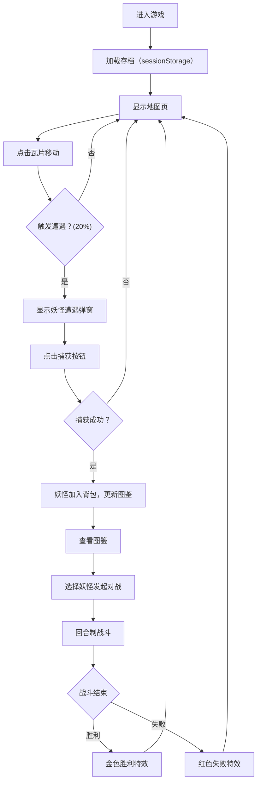

## 1. 产品概述

基于地理位置的口袋妖怪图鉴收集对战应用，玩家在虚拟地图上探索、收集口袋妖怪并与其他玩家对战的轻量级游戏体验。

- 核心价值：提供沉浸式的妖怪收集和对战体验，通过探索地图、收集稀有妖怪、策略对战带来游戏乐趣
- 目标用户：口袋妖怪系列爱好者，轻量级网页游戏玩家

## 2. 核心功能

### 2.1 用户角色

| 角色 | 注册方式 | 核心权限 |
|------|----------|----------|
| 玩家 | 无需注册，自动创建本地存档 | 地图探索、妖怪捕获、图鉴收集、妖怪对战 |

### 2.2 功能模块

1. **地图探索**：8x8 虚拟地图，瓦片网格系统，玩家角色移动，野生妖怪遭遇
2. **妖怪捕获**：遭遇野生妖怪时显示妖怪信息，计算捕获成功率，背包管理（最多6只）
3. **图鉴系统**：20只妖怪数据，三种显示状态（已捕获、已见过、未发现），详情查看
4. **对战系统**：回合制战斗，伤害计算，HP 条实时更新，胜负判定与特效展示
5. **数据持久化**：玩家位置、背包、图鉴状态通过 sessionStorage 存储

### 2.3 页面详情

| 页面名称 | 模块名称 | 功能描述 |
|-----------|-------------|---------------------|
| 地图页 | 地图网格 | 渲染 8x8 瓦片地图，支持草地、水域、岩石三种地形 |
| 地图页 | 玩家移动 | 点击非水域瓦片移动，20% 概率触发野生妖怪遭遇 |
| 地图页 | 遭遇系统 | 遭遇时显示妖怪信息和捕获按钮，捕获成功率动态计算 |
| 图鉴页 | 妖怪网格 | 20只妖怪卡片网格布局，三种显示状态区分 |
| 图鉴页 | 详情弹窗 | 点击卡片显示妖怪详细属性、星级、能力值 |
| 对战页 | 战斗界面 | 双方妖怪头像、HP 条、攻击按钮，回合制战斗逻辑 |
| 对战页 | 结果展示 | 胜负弹窗，金色胜利特效（粒子飘散）/红色失败特效 |
| 导航栏 | 页面切换 | 顶部导航栏，切换地图、图鉴、对战页面 |

## 3. 核心流程

## 4. 用户界面设计

### 4.1 设计风格

- **主题**：深色主题，主背景色 #1A1A2E，卡片背景色 #16213E，文字颜色 #E0E0E0
- **配色**：
  - 草地：#7EC850，水域：#4A90D9，岩石：#9B9B9B
  - 草属性标签：#78C850，火属性标签：#F08030，水属性标签：#6890F0
  - HP条：#FF4444，攻击条：#FF8C00，防御条：#4488FF
  - 星星：#FFD700，胜利弹窗：#FFD700，失败弹窗：#FF4444
- **按钮**：圆角 8px，点击时 scale 0.95 按下动画（0.15秒），悬停时背景色 #0F3460（0.2秒过渡）
- **字体**：选用简洁现代的无衬线字体，建立清晰的层级关系
- **布局**：卡片式布局，顶部导航栏，主内容区居中展示
- **图标**：使用 emoji 表情作为妖怪头像和属性图标

### 4.2 页面设计概述

| 页面名称 | 模块名称 | UI 元素 |
|-----------|-------------|----------|
| 地图页 | 地图网格 | 8x8 瓦片（64x64px），2px 深灰 #555555 边框，三种地形颜色区分 |
| 地图页 | 玩家角色 | 32x32px 蓝色箭头，0.2秒淡入移动动画 |
| 地图页 | 遭遇弹窗 | 半透明深色遮罩，妖怪信息展示，捕获按钮 |
| 地图页 | 捕获动画 | 0.5秒闪光动画 |
| 图鉴页 | 妖怪卡片 | 宽 140px，圆角 12px，阴影 elevation 2，交错 0.1秒滑入动画 |
| 图鉴页 | 状态区分 | 已捕获全彩，已见过半透明（opacity 0.4），未发现问号剪影 |
| 详情弹窗 | 属性展示 | 100px 圆形头像，黄色星级，水平条显示 HP/攻击/防御 |
| 详情弹窗 | 进入动画 | 从下方 0.5秒上滑淡入 |
| 对战页 | 战斗界面 | 双方妖怪头像，HP 条 0.3秒弹性动画，攻击按钮 |
| 对战页 | 结果特效 | 胜利金色弹窗 + 粒子飘散，失败红色弹窗 |

### 4.3 响应式

- 桌面端优先设计，自适应布局
- 地图区域保持固定尺寸，确保瓦片显示清晰
- 图鉴网格支持响应式换行，在小屏幕上自动调整列数
- 触摸设备优化，确保点击区域足够大

### 4.4 动画性能

- 所有动画保持 60fps
- 地图点击响应不超过 100ms
- 对战计算在 5ms 内完成
- 使用 CSS transform 和 opacity 实现高性能动画
