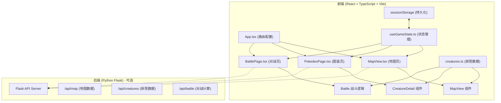
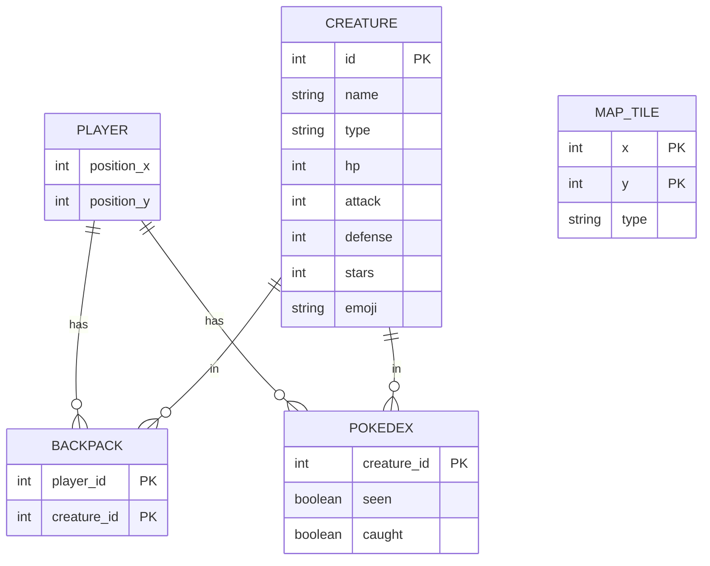

## 1. 架构设计



## 2. 技术描述

- **前端框架**：React 18 + TypeScript + Vite
- **状态管理**：useReducer + useCallback + sessionStorage（自定义 Hook useGameState）
- **路由**：react-router-dom v6
- **动画**：framer-motion
- **HTTP 客户端**：axios（用于后端 API 调用）
- **后端**：Python Flask（提供地图数据与妖怪数据管理 API，可选，前端内置 Mock 数据）
- **构建工具**：Vite
- **包管理器**：npm

## 3. 路由定义

| 路由 | 页面 | 组件 | 描述 |
|-------|---------|--------|------|
| / | 地图页 | MapView | 虚拟地图探索、妖怪捕获 |
| /pokedex | 图鉴页 | PokedexPage | 查看所有妖怪收集状态和详情 |
| /battle | 对战页 | BattlePage | 回合制妖怪对战 |

## 4. API 定义（后端 Python Flask）

### 4.1 TypeScript 类型定义

```typescript
// 妖怪类型
interface Creature {
  id: number;
  name: string;
  type: 'grass' | 'fire' | 'water';
  hp: number;
  attack: number;
  defense: number;
  stars: number;
  emoji: string;
}

// 图鉴状态
interface PokedexEntry {
  id: number;
  seen: boolean;
  caught: boolean;
}

// 玩家状态
interface PlayerState {
  position: { x: number; y: number };
  backpack: number[]; // 妖怪 ID 列表，最多 6 个
  pokedex: PokedexEntry[];
  currentEncounter: number | null; // 当前遭遇的妖怪 ID
}

// 瓦片类型
type TileType = 'grass' | 'water' | 'rock';

// 对战状态
interface BattleState {
  playerCreature: Creature | null;
  enemyCreature: Creature | null;
  playerHp: number;
  enemyHp: number;
  currentTurn: 'player' | 'enemy';
  battleLog: string[];
  isOver: boolean;
  winner: 'player' | 'enemy' | null;
}
```

### 4.2 Flask API 端点

```python
# 获取地图数据
GET /api/map
Response: {
  "tiles": [["grass", "water", ...], ...],  # 8x8 地图
  "size": 8
}

# 获取所有妖怪列表
GET /api/creatures
Response: {
  "creatures": [
    {"id": 1, "name": "妙蛙种子", "type": "grass", "hp": 45, "attack": 49, "defense": 49, "stars": 1, "emoji": "🌱"},
    ...
  ]
}

# 获取单个妖怪
GET /api/creatures/<id>
Response: {
  "creature": {...}
}

# 计算对战伤害
POST /api/battle/calculate
Request: {
  "attacker": {"attack": 49},
  "defender": {"defense": 49}
}
Response: {
  "damage": 12
}
```

## 5. 数据模型

### 5.1 ER 图



### 5.2 前端数据结构

```typescript
// creatures.ts 中的静态数据
const CREATURES: Creature[] = [
  { id: 1, name: '妙蛙种子', type: 'grass', hp: 45, attack: 49, defense: 49, stars: 1, emoji: '🌱' },
  { id: 2, name: '妙蛙草', type: 'grass', hp: 60, attack: 62, defense: 63, stars: 2, emoji: '🌿' },
  { id: 3, name: '妙蛙花', type: 'grass', hp: 80, attack: 82, defense: 83, stars: 3, emoji: '🌸' },
  { id: 4, name: '小火龙', type: 'fire', hp: 39, attack: 52, defense: 43, stars: 1, emoji: '🔥' },
  { id: 5, name: '火恐龙', type: 'fire', hp: 58, attack: 64, defense: 58, stars: 2, emoji: '🦎' },
  { id: 6, name: '喷火龙', type: 'fire', hp: 78, attack: 84, defense: 78, stars: 3, emoji: '🐉' },
  { id: 7, name: '杰尼龟', type: 'water', hp: 44, attack: 48, defense: 65, stars: 1, emoji: '🐢' },
  { id: 8, name: '卡咪龟', type: 'water', hp: 59, attack: 63, defense: 80, stars: 2, emoji: '💧' },
  { id: 9, name: '水箭龟', type: 'water', hp: 79, attack: 83, defense: 100, stars: 3, emoji: '🌊' },
  // ... 更多妖怪，总共 20 只
];

// 地图数据（8x8）
const MAP_TILES: TileType[][] = [
  ['grass', 'grass', 'rock', 'grass', 'water', 'water', 'grass', 'grass'],
  ['grass', 'grass', 'grass', 'grass', 'water', 'grass', 'grass', 'grass'],
  ['grass', 'rock', 'grass', 'grass', 'grass', 'grass', 'rock', 'grass'],
  ['grass', 'grass', 'grass', 'water', 'water', 'grass', 'grass', 'grass'],
  ['rock', 'grass', 'grass', 'water', 'water', 'grass', 'grass', 'rock'],
  ['grass', 'grass', 'grass', 'grass', 'grass', 'grass', 'grass', 'grass'],
  ['grass', 'rock', 'grass', 'grass', 'rock', 'grass', 'grass', 'grass'],
  ['grass', 'grass', 'grass', 'rock', 'grass', 'grass', 'grass', 'grass'],
];

// 初始游戏状态
const INITIAL_STATE: GameState = {
  position: { x: 0, y: 0 },
  backpack: [],
  pokedex: CREATURES.map(c => ({ id: c.id, seen: false, caught: false })),
  currentEncounter: null,
};
```

## 6. 项目结构

```
auto184/
├── .trae/
│   └── documents/
│       ├── PRD.md
│       └── TECH_ARCHITECTURE.md
├── api/                    # 后端 Python Flask（可选）
│   └── app.py
├── index.html
├── package.json
├── tsconfig.json
├── vite.config.js
└── src/
    ├── main.tsx
    ├── App.tsx
    ├── components/
    │   ├── MapView.tsx
    │   ├── CreatureDetail.tsx
    │   ├── Navbar.tsx
    │   └── Backpack.tsx
    ├── pages/
    │   ├── MapPage.tsx
    │   ├── PokedexPage.tsx
    │   └── BattlePage.tsx
    ├── hooks/
    │   └── useGameState.ts
    └── data/
        └── creatures.ts
```

## 7. 核心算法

### 7.1 捕获成功率计算
```
捕获成功率 = 50% + (目标剩余 HP / 最大 HP) * 30%
例如：HP 剩余 50% 的妖怪，捕获成功率 = 50% + 50% * 30% = 65%
```

### 7.2 伤害计算公式
```
伤害 = 攻击方攻击值 * 0.5 - 防御方防御值 * 0.3 + 随机浮动(-2 到 +2)
最小伤害 = 1（如果计算结果小于1）
```

### 7.3 遭遇概率
每次移动后，生成 0-1 随机数，小于 0.2 时触发遭遇（20% 概率）

### 7.4 动画实现
- 使用 framer-motion 的 animate 组件实现所有过渡动画
- 地图瓦片点击：使用 transform: translate 实现平滑移动
- HP 条变化：使用 spring 弹性动画（type: "spring", stiffness: 300, damping: 30）
- 图鉴卡片：使用 staggerChildren 实现交错动画
