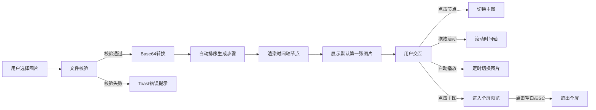

## 1. 产品概述

插画创作过程时间轴展示网页应用，为画师提供从线稿到成品的完整创作过程展示能力。解决现有图集工具只能简单排列图片、缺少对比浏览和过程叙事能力的问题。

- 目标用户：在线艺术社区中的插画师、创作者
- 核心价值：以时间轴叙事方式展示创作全过程，增强作品的故事性和观赏性
- 市场定位：面向艺术创作者的专业作品展示工具

## 2. 核心功能

### 2.1 用户角色
| 角色 | 注册方式 | 核心权限 |
|------|----------|----------|
| 访客用户 | 无需注册 | 上传图片、浏览时间轴、使用所有功能 |

### 2.2 功能模块
1. **图片上传模块**：多图上传、文件校验、自动排序、错误提示
2. **时间轴导航模块**：水平时间轴、节点交互、拖拽滚动、滚轮滚动
3. **图片展示模块**：主图展示、淡入切换动画、加载状态、缩放适配
4. **自动播放模块**：自动切换图片、节点放大动画、播放/暂停控制
5. **全屏预览模块**：全屏查看、背景遮罩、退出交互

### 2.3 页面详情
| 页面名称 | 模块名称 | 功能描述 |
|----------|----------|----------|
| 主页面 | 顶部标题区 | 应用标题、文件上传按钮 |
| 主页面 | 主图展示区 | 当前选中图片展示、步骤名称、点击进入全屏 |
| 主页面 | 渐变分隔条 | 视觉分隔、半透明渐变效果 |
| 主页面 | 时间轴导航区 | 节点列表、拖拽滚动、自动播放按钮 |
| 全屏预览 | 遮罩层 | 半透明黑色背景、点击退出 |
| 全屏预览 | 图片展示 | 居中显示、按比例适配 |
| Toast提示 | 错误提示 | 上传失败时的错误信息展示 |

## 3. 核心流程

用户上传图片 → 系统校验并排序 → 生成时间轴节点 → 用户点击/拖拽切换 → 主图区域展示对应图片 → 可选择自动播放模式 → 点击主图进入全屏预览

## 4. 用户界面设计

### 4.1 设计风格
- **主色调**：深色主题，背景 #121212，面板 #1e1e1e
- **强调色**：#1a73e8（蓝色），用于高亮节点和按钮
- **文本色**：主文本 #e0e0e0，标题 #ffffff
- **按钮风格**：圆角 8px，悬停亮度提升 10%，点击缩放反馈
- **字体**：系统默认无衬线字体，标题 28px bold
- **布局风格**：上下分层，主图区域居中，时间轴固定底部
- **动效风格**：0.3秒 ease-in-out 过渡，framer-motion 实现淡入缩放

### 4.2 页面设计概述
| 页面名称 | 模块名称 | UI元素 |
|----------|----------|--------|
| 主页面 | 顶部标题区 | 标题文本、上传按钮 |
| 主页面 | 主图展示区 | 图片容器、加载占位、步骤名称 |
| 主页面 | 渐变分隔条 | 8px高度、从上到下渐变 |
| 主页面 | 时间轴区 | 节点圆形、连接线、滚动容器、播放按钮 |
| 全屏预览 | 遮罩层 | 半透明黑色背景 |
| 全屏预览 | 图片 | 居中显示、最大适配 |

### 4.3 响应式
- 桌面端优先设计
- 断点：768px
- 移动端适配：主图占满宽度、时间轴高度降至 80px、节点直径 16px
- 触摸优化：滚轮滚动变为触摸滑动

### 4.4 动画与交互
- 图片切换：fade（0.3秒）+ scale（1.0→1.05）
- 节点切换：颜色过渡 0.3秒 ease-in-out
- 自动播放节点放大：1.2倍 持续 0.2秒
- 按钮点击：0.1秒缩放反馈
- 滚动同步：0.3秒延迟切换主图
