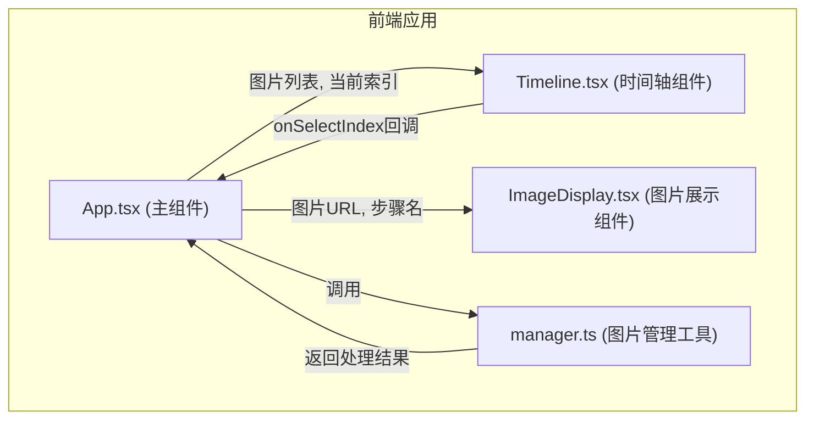

## 1. 架构设计



## 2. 技术描述

- 前端框架：React 18 + TypeScript 5
- 构建工具：Vite 5
- 动画库：framer-motion 11
- 状态管理：React useState / useRef（轻量级，无需状态管理库）
- 样式方案：原生CSS + CSS变量
- 图标：lucide-react

## 3. 项目结构

```
src/
├── App.tsx              # 主应用组件，全局状态管理
├── main.tsx             # 应用入口
├── index.css            # 全局样式
├── components/
│   ├── Timeline.tsx     # 水平时间轴组件
│   └── ImageDisplay.tsx # 主图片展示组件
├── utils/
│   └── manager.ts       # 图片管理工具模块
└── types/
    └── index.ts         # 类型定义
```

## 4. 组件说明

### 4.1 App.tsx
- 职责：管理全局状态（图片列表、当前选中索引、播放状态）
- Props：无
- 状态：
  - `images: ImageItem[]` - 图片列表
  - `selectedIndex: number` - 当前选中索引
  - `isPlaying: boolean` - 自动播放状态
  - `showToast: boolean` - Toast显示状态
  - `toastMessage: string` - Toast消息
- 方法：
  - `handleUpload` - 处理文件上传
  - `handleSelectIndex` - 处理选中索引变化
  - `togglePlay` - 切换自动播放
- 调用关系：引入 manager.ts，渲染 Timeline 和 ImageDisplay 组件

### 4.2 Timeline.tsx
- 职责：渲染水平时间轴，处理节点交互和滚动
- Props：
  - `images: ImageItem[]` - 图片列表
  - `selectedIndex: number` - 当前选中索引
  - `onSelectIndex: (index: number) => void` - 选中回调
  - `isPlaying: boolean` - 播放状态
  - `onTogglePlay: () => void` - 播放切换回调
- 状态：
  - `isDragging: boolean` - 是否正在拖拽
  - `startX: number` - 拖拽起始X坐标
  - `scrollLeft: number` - 起始滚动位置
- 方法：
  - `handleWheel` - 处理滚轮滚动
  - `handleMouseDown` - 处理鼠标按下（开始拖拽）
  - `handleMouseMove` - 处理鼠标移动（拖拽中）
  - `handleMouseUp` - 处理鼠标抬起（结束拖拽）
  - `handleTouchStart/Move/End` - 触摸事件处理
- 调用关系：被 App.tsx 调用，通过回调通知父组件

### 4.3 ImageDisplay.tsx
- 职责：展示当前选中的图片，处理加载状态和全屏预览
- Props：
  - `imageUrl: string` - 图片URL
  - `stepName: string` - 步骤名称
- 状态：
  - `isLoading: boolean` - 图片加载状态
  - `isFullscreen: boolean` - 全屏状态
- 方法：
  - `handleImageLoad` - 图片加载完成
  - `toggleFullscreen` - 切换全屏
  - `handleKeydown` - 键盘事件（ESC退出）
- 调用关系：被 App.tsx 调用

### 4.4 manager.ts
- 职责：图片文件处理、校验、转换、排序
- 导出函数：
  - `validateFile(file: File): boolean` - 文件校验
  - `fileToBase64(file: File): Promise<string>` - 文件转Base64
  - `sortImages(files: File[]): File[]` - 图片排序
  - `generateStepName(index: number): string` - 生成步骤名称
  - `processFiles(files: FileList): Promise<ImageItem[]>` - 批量处理文件

## 5. 数据模型

### 5.1 类型定义

```typescript
interface ImageItem {
  id: string;
  name: string;
  url: string;
  stepName: string;
  order: number;
}
```

## 6. 性能优化

- 使用 requestAnimationFrame 优化动画循环
- 图片预加载和缓存
- 节流处理滚动事件
- 使用 CSS transform 而非 top/left 实现动画
- 大图加载显示 loading 占位
- 避免布局抖动（reflow）
