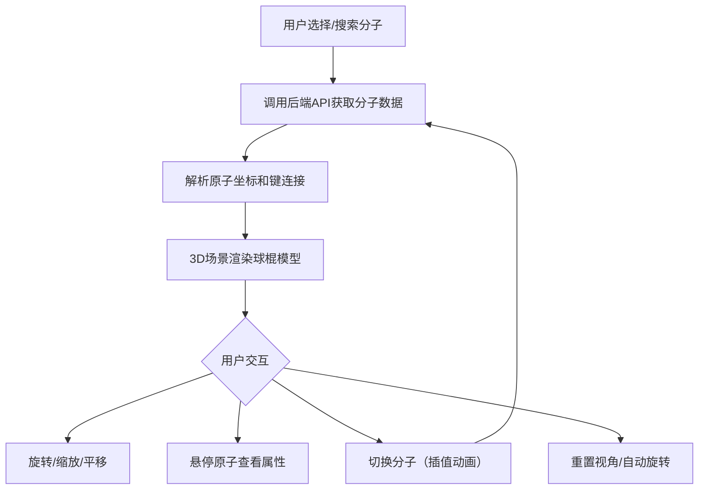

## 1. 产品概述

三维化学分子结构交互查看应用，提供分子库浏览、搜索、3D球棍模型展示和原子属性实时查看功能。面向化学学习者、研究人员和教学场景，帮助用户直观理解分子三维结构。

## 2. 核心功能

### 2.1 功能模块

1. **分子查看界面**：左侧分子列表、中间3D场景、右侧属性面板

### 2.2 页面详情

| 页面名称 | 模块名称 | 功能描述 |
|---------|---------|---------|
| 分子查看界面 | 分子列表面板 | 展示至少8个预设分子卡片，含搜索筛选、防抖300ms、点击选择动画 |
| 分子查看界面 | 3D球棍模型场景 | 原子球体+化学键圆柱渲染，支持旋转/缩放/平移，原子悬停发光效果，视角重置与自动旋转 |
| 分子查看界面 | 属性面板 | 显示分子式、分子量、结构描述，悬停原子时显示元素符号/序号/坐标 |

## 3. 核心流程

用户从左侧分子列表选择或搜索分子 → 前端调用后端API获取原子坐标和键数据 → 3D场景以球棍模型渲染分子 → 用户可旋转/缩放/平移查看 → 鼠标悬停原子查看属性 → 右侧面板实时更新信息

## 4. 用户界面设计

### 4.1 设计风格

- 深色主题：背景#1a1a2e，文字#e0e0e0
- 主题色：#4ecdc4
- 3D场景背景渐变：#0f0c29 → #302b63
- 原子颜色：碳#909090、氧#ff0000、氮#3050f8、氢#ffffff、硫#ffff30、磷#ff8000
- 化学键颜色：#cccccc
- 卡片样式：浅灰#f5f5f5，圆角12px，240×60px
- 字体：系统字体栈

### 4.2 页面设计概览

| 页面名称 | 模块名称 | UI元素 |
|---------|---------|--------|
| 分子查看界面 | 分子列表面板 | 搜索框(圆角20px)、分子卡片(悬停上移3px+阴影加深)、选中卡片左侧3px主题色条+0.3s展开动画 |
| 分子查看界面 | 3D场景 | 渐变背景、半透明网格地面、右上角重置按钮(靶心图标32px)、自动旋转滑块开关 |
| 分子查看界面 | 属性面板 | 分子式、分子量、结构描述、原子悬停信息(格式: C(2): x=1.23, y=0.45, z=-0.67) |

### 4.3 响应式设计

- 桌面端：左320px + 中间自适应 + 右280px
- 768px以下：左右面板折叠为顶部标签页，3D场景全屏

### 4.4 3D场景指引

- 环境：深色渐变背景营造科学感氛围
- 光照：环境光+方向光组合，确保原子颜色清晰可辨
- 相机：透视相机，默认距离适中，支持OrbitControls旋转/缩放/平移
- 交互：原子悬停发光圈(透明度0.3，半径+0.1单位)，0.2s淡出
- 动画：分子切换0.8s线性插值，自动旋转2圈/分钟
- 性能：50fps以上交互帧率，切换时≥30fps
