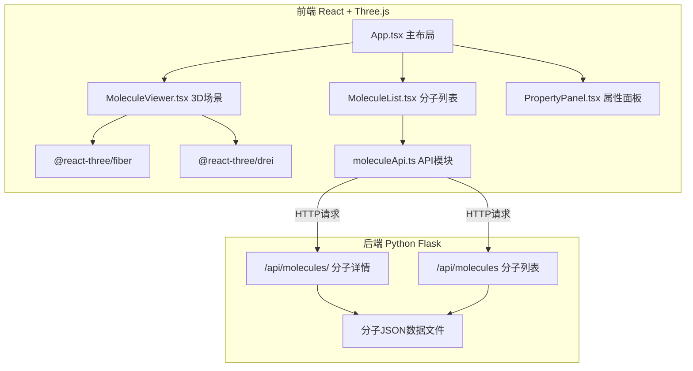

## 1. 架构设计



## 2. 技术说明

- 前端：React 18 + TypeScript + Three.js + @react-three/fiber + @react-three/drei + Vite
- 状态管理：React useState/useRef（组件内状态），无全局状态库
- HTTP客户端：axios
- 动画：framer-motion（UI动画），Three.js插值（3D过渡动画）
- 后端：Python Flask + flask-cors
- 数据：JSON文件存储分子坐标与键数据

## 3. 路由定义

| 路由 | 用途 |
|------|------|
| / | 分子查看主界面（单页应用） |

## 4. API定义

### 4.1 获取分子列表

- **GET** `/api/molecules`
- 响应：
```typescript
interface MoleculeListItem {
  id: string;
  name: string;
  formula: string;
}
// 响应: MoleculeListItem[]
```

### 4.2 获取分子详情

- **GET** `/api/molecules/:id`
- 响应：
```typescript
interface Atom {
  element: string;
  x: number;
  y: number;
  z: number;
}

interface Bond {
  atom1: number;
  atom2: number;
  order: number;
}

interface MoleculeDetail {
  id: string;
  name: string;
  formula: string;
  molecularWeight: number;
  description: string;
  atoms: Atom[];
  bonds: Bond[];
}
```

## 5. 服务端架构

Flask单文件应用，直接读取JSON文件返回数据，无数据库层。

## 6. 数据模型

分子数据以JSON文件存储在 `backend/data/` 目录下，每个分子一个文件，包含原子坐标、键连接和元数据。预设分子包括：咖啡因、阿司匹林、葡萄糖、水、乙醇、苯、甲烷、氨共8个分子。
