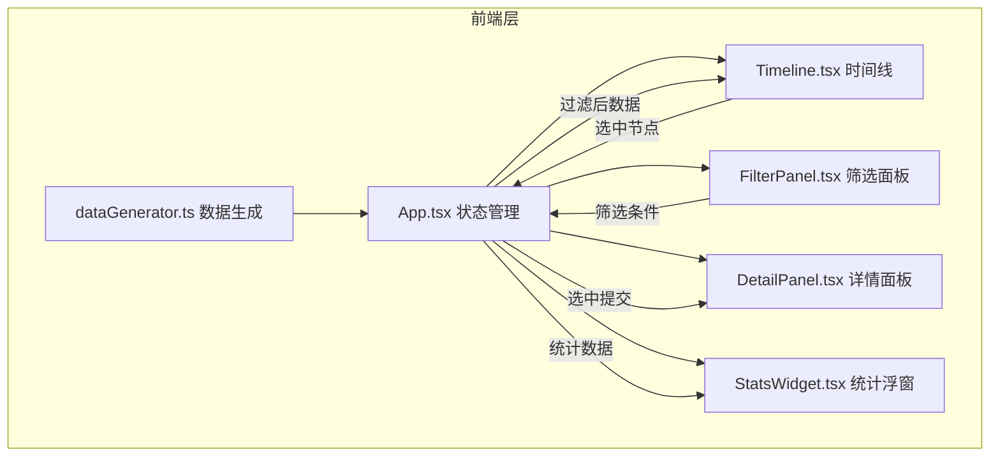
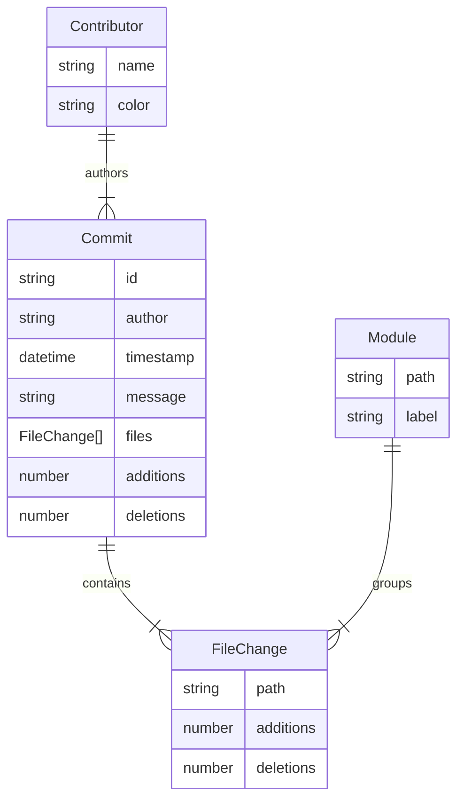

## 1. 架构设计



## 2. 技术说明
- 前端：React 18 + TypeScript + Vite
- 样式：CSS Modules + CSS自定义属性（深色主题色彩系统）
- 状态管理：Zustand（管理筛选条件和选中节点）
- 动画：CSS transitions + requestAnimationFrame（数字翻转）
- 初始化工具：vite-init（react-ts模板）
- 无后端，纯前端模拟数据

## 3. 路由定义
无路由，单页应用。

## 4. 数据模型

### 4.1 数据模型定义



### 4.2 TypeScript 类型定义

```typescript
interface Commit {
  id: string;
  author: string;
  timestamp: number;
  message: string;
  files: FileChange[];
  additions: number;
  deletions: number;
}

interface FileChange {
  path: string;
  additions: number;
  deletions: number;
}

interface FilterState {
  authors: string[];
  dateRange: [number, number];
  modules: string[];
}

interface Stats {
  totalCommits: number;
  contributorCount: number;
  totalAdditions: number;
  totalDeletions: number;
}
```

## 5. 文件结构

```
├── package.json
├── vite.config.js
├── tsconfig.json
├── index.html
├── src/
│   ├── dataGenerator.ts    # 数据生成与过滤
│   ├── store.ts            # Zustand状态管理
│   ├── types.ts            # TypeScript类型定义
│   ├── App.tsx             # 主应用组件
│   ├── index.tsx           # 入口
│   ├── styles/
│   │   └── global.css      # 全局样式+CSS变量
│   └── components/
│       ├── Timeline.tsx    # 时间线主组件
│       ├── DetailPanel.tsx # 详情面板
│       ├── FilterPanel.tsx # 筛选面板
│       └── StatsWidget.tsx # 统计浮窗
```
