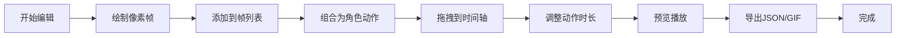

## 1. 产品概述
像素剧本工坊是一款面向独立游戏制作人和像素动画爱好者的在线逐帧动画剧本编辑工具，用户可快速设计角色动作并组合成连贯的像素剧情短片。

- 核心价值：降低像素动画制作门槛，提供从角色设计到剧本编排的一站式解决方案
- 目标用户：独立游戏开发者、像素艺术爱好者、动画学习者

## 2. 核心功能

### 2.1 功能模块
1. **角色与动作编辑器**：64x64像素画布、预设颜色画笔、帧列表管理、拖拽排序
2. **时间轴与剧本组合**：多轨道时间轴、动作拖拽排列、长度调整、循环播放
3. **剧本导出与分享**：JSON序列化、GIF导出、加载保存项目

### 2.2 页面详情
| 页面名称 | 模块名称 | 功能描述 |
|-----------|-------------|---------------------|
| 主编辑器 | 画布绘制区 | 64x64像素画布，支持鼠标绘制，4种预设颜色 |
| 主编辑器 | 帧列表 | 缩略图展示、拖拽排序、删除帧、添加帧 |
| 主编辑器 | 舞台预览 | 800x400px舞台，实时渲染动画效果 |
| 主编辑器 | 时间轴 | 多轨道布局，动作条拖拽调整，颜色区分角色类型 |
| 主编辑器 | 播放控制 | 播放/暂停按钮，进度条，帧率调整 |
| 主编辑器 | 导出面板 | JSON导入导出，GIF导出配置，加载动画 |

## 3. 核心流程
用户创建新项目 → 绘制角色帧并添加到帧列表 → 组合帧形成动作 → 将动作拖拽到时间轴轨道 → 调整动作时长和顺序 → 预览动画效果 → 导出JSON或GIF文件

## 4. 用户界面设计

### 4.1 设计风格
- 整体风格：复古像素游戏UI，像素化边框和按钮
- 主色调：黑色#1A1A1A、白色#EAEAEA、点缀色蓝色#4A90D9
- 角色轨道颜色：玩家#4A90D9、敌人#D94A4A、道具#6DBF6B
- 画笔颜色：红#FF4444、蓝#4488FF、黄#FFCC00、灰#888888
- 字体：等宽粗体无衬线字体
- 按钮：像素风格边框，按下时有凹陷效果
- 过渡动画：所有交互0.2-0.3秒平滑过渡

### 4.2 页面设计概述
| 页面名称 | 模块名称 | UI元素 |
|-----------|-------------|-------------|
| 主编辑器 | 画布区 | 64x64网格画布，像素化光标，画笔选择器 |
| 主编辑器 | 帧列表 | 60x60px圆角缩略图，悬停放大1.1倍，拖拽手柄 |
| 主编辑器 | 舞台区 | 800x400px深灰#222222背景，居中渲染 |
| 主编辑器 | 时间轴 | 40px高轨道，可拉伸动作条，帧刻度 |
| 主编辑器 | 控制面板 | 像素风格按钮，滑块，数字输入框 |

### 4.3 响应性
- 桌面端优先设计，固定画布和舞台尺寸
- 时间轴区域支持水平滚动
- 帧列表支持垂直滚动

## 5. 性能要求
- 画布操作和播放流畅度30fps以上
- 支持至少200帧的编辑
- GIF导出内存占用不超过500MB
- 缩略图生成快速高效
