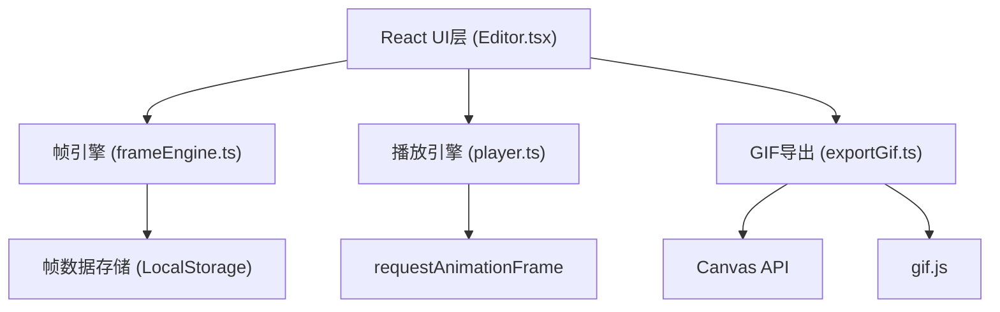

## 1. 架构设计



## 2. 技术描述

### 2.1 前端技术栈
- **框架**: React 18 + TypeScript
- **构建工具**: Vite 5
- **动画库**: framer-motion
- **GIF生成**: gif.js
- **状态管理**: React useState/useReducer (组件内状态)

### 2.2 核心依赖
- react: ^18.2.0
- react-dom: ^18.2.0
- framer-motion: ^10.16.0
- gif.js: ^0.2.0
- typescript: ^5.2.0
- vite: ^5.0.0
- @vitejs/plugin-react: ^4.2.0
- @types/react: ^18.2.0
- @types/react-dom: ^18.2.0
- @types/node: ^20.8.0

## 3. 模块职责

### 3.1 frameEngine.ts - 帧数据处理引擎
- 帧数据结构定义（PixelFrame, CharacterAction, Track）
- 帧的创建、存储、删除、重排序
- 帧数据的序列化/反序列化（JSON格式）
- 生成帧缩略图
- 提供回调接口与Editor组件通信

### 3.2 player.ts - 动画播放引擎
- 使用requestAnimationFrame实现高帧率播放
- 支持帧率设置（默认12fps）
- 提供play/pause/stop/setFps方法
- 多轨道合成播放逻辑
- 返回当前帧索引和播放进度

### 3.3 exportGif.ts - GIF导出模块
- 使用Canvas API绘制每一帧
- 集成gif.js库生成GIF文件
- 支持帧率选择（8/12/24fps）
- 支持循环次数设置（1-∞）
- 输出Blob并触发浏览器下载

### 3.4 Editor.tsx - 主编辑器组件
- 画布绘制逻辑（鼠标事件处理）
- 帧列表渲染与拖拽交互
- 舞台区域动画渲染
- 时间轴轨道管理
- 播放控制UI
- 导出面板UI
- 全局状态管理

## 4. 数据模型

### 4.1 核心类型定义

```typescript
// 单个像素帧
interface PixelFrame {
  id: string;
  width: number;
  height: number;
  pixels: number[][]; // 0=透明, 1=红, 2=蓝, 3=黄, 4=灰
  createdAt: number;
}

// 角色动作
interface CharacterAction {
  id: string;
  name: string;
  characterType: 'player' | 'enemy' | 'item';
  frames: PixelFrame[];
  frameDuration: number; // 每帧持续时间（帧单位）
}

// 时间轴轨道
interface Track {
  id: string;
  characterType: 'player' | 'enemy' | 'item';
  clips: TrackClip[];
}

// 轨道上的动作片段
interface TrackClip {
  id: string;
  actionId: string;
  startFrame: number;
  duration: number;
}

// 项目数据
interface ProjectData {
  version: string;
  name: string;
  actions: CharacterAction[];
  tracks: Track[];
  fps: number;
}
```

### 4.2 颜色映射
```typescript
const COLORS = {
  0: 'transparent',
  1: '#FF4444', // 红
  2: '#4488FF', // 蓝
  3: '#FFCC00', // 黄
  4: '#888888', // 灰
};
```

## 5. 项目结构

```
pixel-script-workshop/
├── index.html
├── package.json
├── tsconfig.json
├── vite.config.ts
└── src/
    ├── main.tsx
    ├── Editor.tsx
    ├── frameEngine.ts
    ├── player.ts
    ├── exportGif.ts
    └── types.ts (可选，类型定义集中存放)
```

## 6. 关键实现方案

### 6.1 画布绘制优化
- 使用离屏Canvas预渲染像素数据
- 绘制时只更新变化的像素区域
- 鼠标事件使用节流优化

### 6.2 拖拽实现
- 原生HTML5 Drag and Drop API用于帧排序
- 自定义拖拽指示器和视觉反馈
- 拖拽过程中使用framer-motion做过渡动画

### 6.3 动画播放性能
- requestAnimationFrame驱动渲染循环
- 根据fps计算帧切换时机
- 多轨道帧数据预计算缓存
- 舞台渲染使用CSS transform提升性能

### 6.4 GIF导出内存控制
- 逐帧处理，避免一次性加载所有帧到内存
- 使用Blob流式处理
- 可配置的导出质量参数
