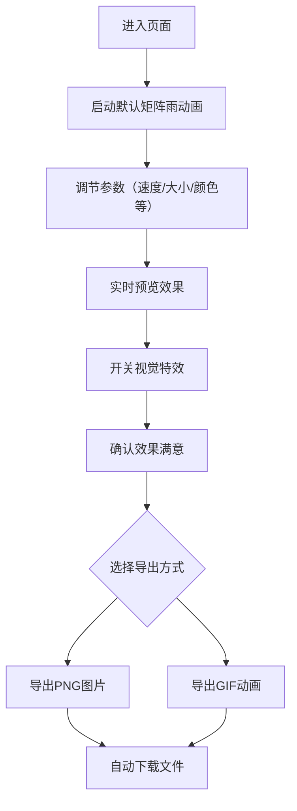

## 1. 产品概述

代码雨矩阵特效生成器是一款基于Web的动画创作工具，允许用户实时创建和定制类似《黑客帝国》风格的字符矩阵下落动画。

- 主要用途：为设计师、开发者和爱好者提供交互式的字符雨特效生成和导出平台
- 解决问题：无需编写代码即可创建高品质的矩阵雨动画，支持实时参数调节和多格式导出
- 目标用户：视觉设计师、前端开发者、数字艺术爱好者、内容创作者
- 产品价值：降低特效制作门槛，提供即时视觉反馈，支持静态图片和动态GIF导出

## 2. 核心功能

### 2.1 用户角色

| 角色 | 注册方式 | 核心权限 |
|------|----------|----------|
| 访客用户 | 无需注册 | 使用所有特效调节功能，导出PNG和GIF |

### 2.2 功能模块

1. **矩阵雨动画画布**：全屏字符粒子系统，支持60fps流畅渲染
2. **参数控制面板**：实时调节速度、大小、颜色、密度、透明度、帧率
3. **视觉特效叠加**：字符闪烁效果、拖尾渐隐效果
4. **导出功能**：PNG图片快照、60帧GIF动画导出

### 2.3 页面详情

| 页面名称 | 模块名称 | 功能描述 |
|-----------|-------------|---------------------|
| 主页面 | 动画画布 | Canvas渲染字符雨粒子系统，占满视口，支持响应式缩放 |
| 主页面 | 控制面板 | 半透明浮层，包含6个参数调节器、特效开关、导出按钮 |
| 主页面 | 导出模块 | 调用Canvas API截图、GIF.js编码动画并自动下载 |

## 3. 核心流程

用户进入页面后，默认启动矩阵雨动画。通过右侧控制面板调节参数，所有更改实时反映在画布上。开启/关闭视觉特效后立即生效。完成创作后，可选择导出PNG快照或录制60帧GIF动画。

## 4. 用户界面设计

### 4.1 设计风格

- **主色调**：深色背景 #0A0A0A，字符绿色 #00FF00（可切换主题）
- **配色方案**：赛博朋克暗色极简风，高对比度霓虹色点缀
- **按钮样式**：矩形按钮 120x40px，圆角6px，主题色填充，悬停亮度+15%，点击缩放0.95倍
- **滑块样式**：轨道浅灰 #444444，滑块按钮使用当前主题色，0.2秒颜色过渡
- **字体**：无衬线等宽字体，标签14px，明亮色文字 #E0E0E0
- **布局风格**：画布全屏，控制面板右侧固定悬浮，可折叠展开

### 4.2 页面设计概述

| 页面名称 | 模块名称 | UI元素 |
|-----------|-------------|-------------|
| 主页面 | 动画画布 | Canvas全屏覆盖，深色背景，字符绿色渐变，流畅下落动画 |
| 主页面 | 控制面板 | 半透明背景 rgba(20,20,20,0.9)，圆角12px，阴影elevation 8，宽度300px |
| 主页面 | 控制项 | 6个滑块控件（带数值显示）、主题切换按钮组、特效开关、导出按钮 |
| 主页面 | 折叠按钮 | 控制面板边缘箭头按钮，0.3秒ease-out展开/收起动画 |

### 4.3 响应式设计

- **桌面端（≥768px）**：控制面板固定右侧，宽度300px，纵向布局
- **移动端（<768px）**：控制面板改为底部固定横条，高度180px，横向滚动布局
- **触摸优化**：滑块和按钮增大触摸区域，最小44x44px可点击区域

### 4.4 动效设计

- 面板展开/收起：0.3秒 ease-out 过渡动画
- 滑块颜色切换：0.2秒 平滑过渡
- 按钮悬停：亮度提升15%，过渡0.15秒
- 按钮点击：缩放至0.95倍，回弹0.1秒
- 字符闪烁：每帧随机1%字符变为白色，持续1帧
- 拖尾效果：透明度从0.8衰减到0，持续8帧
