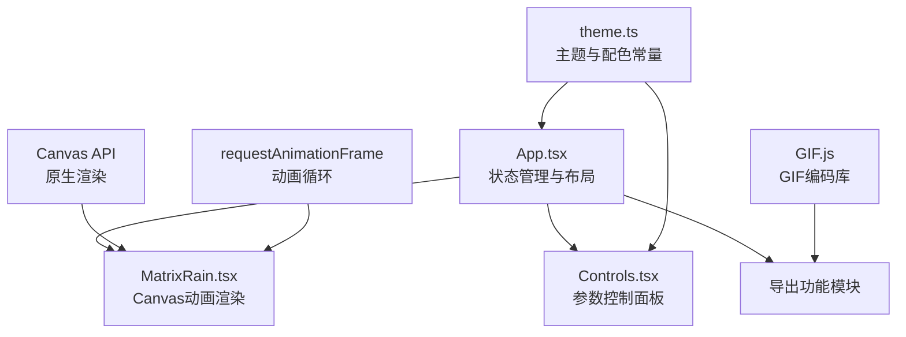

## 1. 架构设计



## 2. 技术描述

- **前端框架**：React 18 + TypeScript 5
- **构建工具**：Vite 5 + @vitejs/plugin-react
- **动画库**：framer-motion（UI过渡动画）
- **渲染技术**：HTML5 Canvas 2D API + requestAnimationFrame
- **GIF编码**：gif.js（客户端GIF生成）
- **状态管理**：React useState/useRef（轻量级，无需额外状态库）

### 核心技术栈说明：

| 技术 | 版本 | 用途 |
|------|------|------|
| react | ^18.2.0 | UI框架 |
| react-dom | ^18.2.0 | DOM渲染 |
| framer-motion | ^11.0.0 | UI动画过渡 |
| typescript | ^5.4.0 | 类型安全 |
| vite | ^5.2.0 | 构建工具 |
| @vitejs/plugin-react | ^4.2.0 | React Vite插件 |
| gif.js | ^0.2.0 | 客户端GIF编码 |
| @types/react | ^18.2.0 | React类型定义 |
| @types/react-dom | ^18.2.0 | ReactDOM类型定义 |
| @types/node | ^20.11.0 | Node类型定义 |
| @types/gif.js | ^0.2.0 | GIF.js类型定义 |

## 3. 项目文件结构

```
e:\solo\SoloAutoDemo\tasks\auto191\
├── package.json          # 依赖配置与脚本
├── index.html            # HTML入口
├── tsconfig.json         # TypeScript配置（严格模式）
├── vite.config.js        # Vite构建配置
├── src/
│   ├── App.tsx           # 主组件：状态管理、布局、导出
│   ├── MatrixRain.tsx    # 核心动画：Canvas渲染、粒子系统
│   ├── Controls.tsx      # 控制面板：参数调节UI
│   └── theme.ts          # 主题常量、配色方案
└── .trae/
    └── documents/
        ├── PRD.md
        └── TECH_ARCHITECTURE.md
```

## 4. 数据类型定义

### 动画参数类型

```typescript
// 主题类型
interface Theme {
  name: string;
  primary: string;      // 主色
  secondary: string;    // 次色（渐变色）
  hex: string;          // 十六进制主色值
}

// 动画配置类型
interface AnimationConfig {
  speedMultiplier: number;     // 速度倍率 0.5-3
  fontSize: number;            // 字符大小 8-32px
  colorTheme: Theme;           // 当前主题
  columnSpacing: number;       // 列间距 10-60px
  backgroundOpacity: number;   // 背景透明度 0.1-1.0
  fps: 30 | 60;                // 帧率目标
  enableBlink: boolean;        // 闪烁效果开关
  enableTrail: boolean;        // 拖尾效果开关
}

// 粒子（列）类型
interface Column {
  x: number;           // X坐标
  y: number;           // 当前Y坐标
  speed: number;       // 下落速度 px/帧
  chars: string[];     // 该列字符数组
  charCount: number;   // 字符数量
  trailOpacity: number[]; // 拖尾透明度数组
}
```

## 5. 核心算法设计

### 5.1 字符雨渲染算法

```
初始化:
  1. 获取视口尺寸，设置Canvas分辨率
  2. 根据列间距计算列数 = 视口宽度 / 列间距
  3. 为每列生成随机下落速度（1-20px/帧 × 速度倍率）
  4. 为每列预生成随机ASCII字符（32-126）

动画循环 (requestAnimationFrame):
  每帧执行:
    1. 绘制半透明背景（实现拖尾效果）
    2. 遍历所有列:
       a. 更新Y坐标 += speed × speedMultiplier
       b. 若Y超出视口底部，重置到顶部并生成新字符
       c. 绘制该列所有字符（带渐变和透明度）
       d. 若启用闪烁，随机1%字符设为白色
       e. 若启用拖尾，应用透明度衰减
    3. 控制帧率（30/60fps）通过时间戳判断
```

### 5.2 GIF导出算法

```
导出流程:
  1. 获取当前Canvas尺寸
  2. 创建GIF实例，设置:
     - 宽高 = Canvas尺寸
     - 重复 = 0（无限循环）
     - 质量 = 10
     - 延迟 = 1000 / 当前fps
  3. 连续渲染60帧，每帧添加到GIF
  4. 完成编码后生成Blob并触发下载
```

## 6. 性能优化策略

1. **Canvas分层**：使用离屏Canvas预渲染字符，减少重复绘制
2. **帧率控制**：通过时间戳间隔控制30/60fps切换，避免过度渲染
3. **对象池复用**：Column对象复用，避免频繁GC
4. **批处理绘制**：尽量减少fillText调用，批量处理同色字符
5. **requestAnimationFrame**：利用浏览器原生动画调度，后台标签页自动降频
6. **设备像素比适配**：正确处理HiDPI屏幕，避免过度绘制
7. **节流防抖**：参数调节使用requestAnimationFrame合并更新
