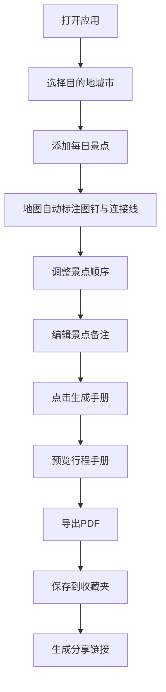

## 1. 产品概述

旅行行程规划与手册生成应用，帮助旅行爱好者在可视化地图上规划行程路线、记录每日景点，并一键生成精美的A4竖版PDF旅行手册，解决传统纸质笔记易丢失、规划缺乏视觉辅助、分享不便三大痛点。目标用户为热爱旅行的年轻人和自由行爱好者。

## 2. 核心功能

### 2.1 用户角色

| 角色 | 注册方式 | 核心权限 |
|------|----------|----------|
| 普通用户 | 无需注册 | 规划行程、生成手册、保存收藏（本地存储，最多20份）、分享链接 |

### 2.2 功能模块

1. **行程规划页**：城市选择、日程管理、地图标注、景点添加与排序
2. **手册生成页**：行程手册预览、PDF导出、备注编辑
3. **收藏夹页**：已保存行程的网格展示、分享功能、链接复制

### 2.3 页面详情

| 页面名称 | 模块名称 | 功能描述 |
|----------|----------|----------|
| 行程规划页 | 城市选择器 | 搜索或拖拽选择目的地城市，预设10个国内热门旅游城市 |
| 行程规划页 | 日程卡片列表 | 左侧可滚动区域，最多7天行程，每天最多4个景点，支持排序 |
| 行程规划页 | 交互式地图 | 右侧Mapbox地图，彩色图钉标注景点，贝塞尔曲线连接线实时更新 |
| 行程规划页 | 景点弹出卡片 | 点击图钉显示景点名称、推荐游玩时长、建议交通方式 |
| 手册生成页 | 封面编辑 | 目的地城市名 + 用户自定义行程名称（最多30字符） |
| 手册生成页 | 备注编辑 | 每个景点可编辑备注（每条不超过200字符） |
| 手册生成页 | PDF导出 | 一键生成A4竖版PDF，带波浪形加载动画（1.5秒） |
| 收藏夹页 | 收藏网格 | 网格布局展示已保存行程卡片（280×360px） |
| 收藏夹页 | 分享功能 | 生成24小时有效一次性链接，复制时绿色对勾旋转动画 |

## 3. 核心流程

用户打开应用 → 选择目的地城市 → 在地图上添加每日景点 → 调整景点顺序 → 编辑备注信息 → 点击"生成手册" → 预览并导出PDF → 保存到收藏夹 → 分享给好友

## 4. 用户界面设计

### 4.1 设计风格

- **主色**：#FF8C42（暖橙色，旅行活力感）
- **辅色**：#2EC4B6（青绿色，地图与自然感）
- **背景色**：#FDF6EE（暖米色，纸张质感）
- **按钮风格**：圆角半径8px，按下缩放0.95（50ms）
- **字体**：标题使用 Playfair Display（优雅旅行杂志感），正文使用 Noto Sans SC（中文友好）
- **布局**：顶部固定导航栏 + 左右分栏编辑区
- **图标配色**：按天区分，7天7色（#FF6B6B、#4ECDC4、#45B7D1、#96CEB4、#FFEAA7、#DDA0DD、#98D8C8）

### 4.2 页面设计概览

| 页面名称 | 模块名称 | UI元素 |
|----------|----------|--------|
| 行程规划页 | 导航栏 | 高64px，毛玻璃效果 backdrop-filter:blur(8px)，背景rgba(253,246,238,0.85) |
| 行程规划页 | 日程卡片列表 | 左侧35%，可滚动，卡片左边框4px实线（当天色），最小高度80px，圆角8px，间距12px |
| 行程规划页 | 交互式地图 | 右侧65%，Mapbox地图，最小高度500px |
| 行程规划页 | 景点弹出卡片 | 图钉点击弹出，含名称、游玩时长、交通方式 |
| 手册生成页 | 封面预览 | A4竖版，城市名+行程名称 |
| 手册生成页 | 导出按钮 | 波浪形加载动画1.5秒，渐变#667eea→#764ba2 |
| 收藏夹页 | 收藏卡片 | 280×360px，圆角12px，阴影elevation 2，悬停elevation 6+上移4px，过渡0.3s ease-out |
| 收藏夹页 | 分享按钮 | 复制成功绿色对勾旋转0.4秒 |

### 4.3 响应式设计

- 桌面端：左右分栏布局（35%/65%）
- 移动端：自动切换上下布局，地图高度调整为300px
- 导航栏固定顶部，内容区域自适应滚动

### 4.4 页面加载动画

- 主标题和导航栏从顶部向下滑入（0.6秒 ease-out）
- 日程卡片依次从左侧滑入（每张间隔0.1秒）
- 按钮统一按下缩放反馈（scale 0.95，50ms）

## 5. 性能要求

- 地图标记点超过10个时，平移和缩放响应应在100ms以内
- PDF生成时需提供加载动画反馈
- 分享链接有效期24小时
