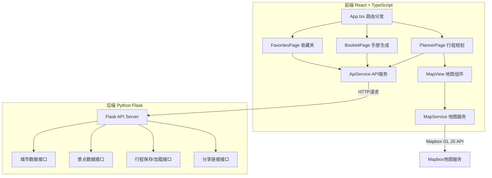
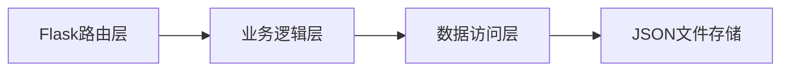
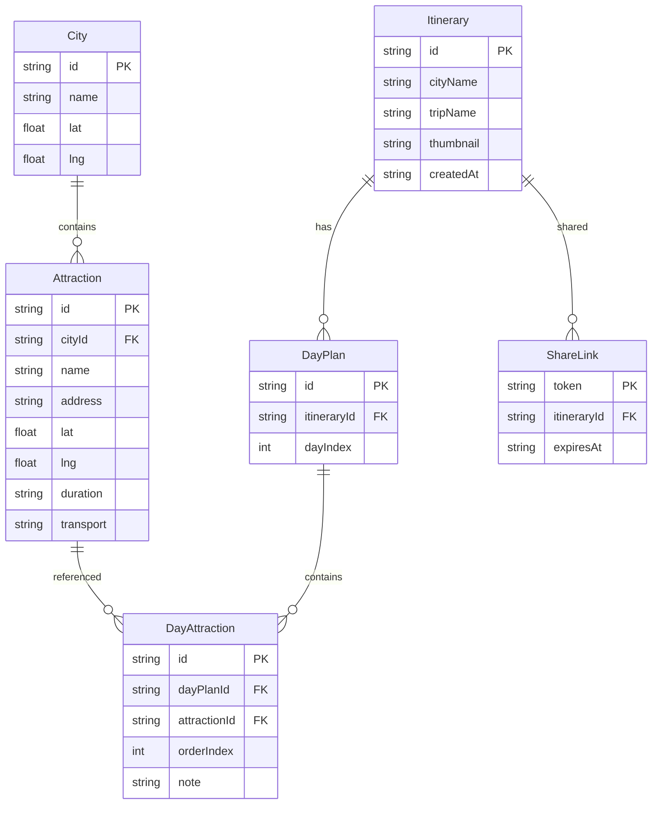

## 1. 架构设计



## 2. 技术说明

- **前端**：React 18 + TypeScript + Vite + Tailwind CSS
- **初始化工具**：vite-init (react-ts 模板)
- **后端**：Python Flask (提供城市数据、景点数据、保存/加载、分享链接API)
- **数据库**：本地JSON文件存储（行程数据、收藏数据），无需外部数据库
- **地图**：Mapbox GL JS
- **PDF生成**：jsPDF + html2canvas
- **动画**：Framer Motion
- **路由**：react-router-dom
- **HTTP客户端**：axios

## 3. 路由定义

| 路由 | 用途 |
|------|------|
| / | 行程规划主页，城市选择与地图标注 |
| /booklet | 行程手册生成与导出页面 |
| /favorites | 收藏夹页面，网格展示已保存行程 |

## 4. API定义

### 4.1 获取城市列表

```typescript
GET /api/cities
Response: {
  cities: Array<{
    id: string;
    name: string;
    lat: number;
    lng: number;
  }>
}
```

### 4.2 搜索景点

```typescript
GET /api/attractions?cityId={cityId}&keyword={keyword}
Response: {
  attractions: Array<{
    id: string;
    name: string;
    address: string;
    lat: number;
    lng: number;
    duration: string;
    transport: string;
  }>
}
```

### 4.3 保存行程

```typescript
POST /api/itineraries
Body: {
  cityName: string;
  tripName: string;
  days: Array<{
    dayIndex: number;
    attractions: Array<{
      id: string;
      name: string;
      address: string;
      lat: number;
      lng: number;
      duration: string;
      transport: string;
      note: string;
    }>
  }>;
  thumbnail: string;
}
Response: {
  id: string;
  createdAt: string;
}
```

### 4.4 获取行程列表

```typescript
GET /api/itineraries
Response: {
  itineraries: Array<{
    id: string;
    cityName: string;
    tripName: string;
    days: number;
    createdAt: string;
    thumbnail: string;
  }>
}
```

### 4.5 获取行程详情

```typescript
GET /api/itineraries/:id
Response: {
  id: string;
  cityName: string;
  tripName: string;
  days: Array<{...}>;
  createdAt: string;
  thumbnail: string;
}
```

### 4.6 删除行程

```typescript
DELETE /api/itineraries/:id
Response: { success: boolean }
```

### 4.7 生成分享链接

```typescript
POST /api/share
Body: { itineraryId: string }
Response: {
  link: string;
  expiresAt: string;
}
```

### 4.8 获取分享行程

```typescript
GET /api/share/:token
Response: {
  cityName: string;
  tripName: string;
  days: Array<{...}>;
}
```

## 5. 服务器架构图



## 6. 数据模型

### 6.1 数据模型定义



### 6.2 数据初始化

预设10个国内热门旅游城市及其景点数据：
- 北京、上海、成都、杭州、西安、重庆、丽江、厦门、大理、三亚
- 每个城市预设5-8个热门景点，包含经纬度、推荐游玩时长、建议交通方式
