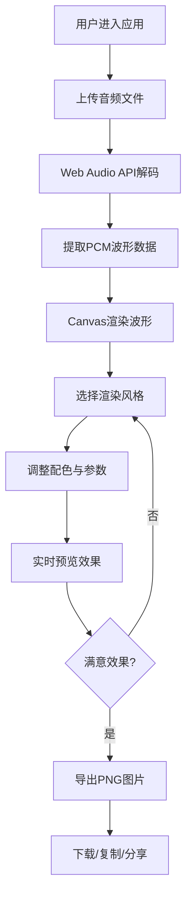

## 1. 产品概述

WavePoster 是一款为独立音乐人和播客创作者打造的音频波形可视化海报生成工具，解决创作者在社交媒体分享时缺乏直观、美观且可定制音频可视化封面图的痛点。

- 目标用户：独立音乐人、播客创作者、音频内容生产者
- 核心价值：快速将音频转化为视觉化海报，支持多种风格和配色，一键导出分享

## 2. 核心功能

### 2.1 功能模块

1. **波形编辑器页面**：音频上传、波形渲染、风格定制、参数调节、导出分享

### 2.2 页面详情

| 页面名称 | 模块名称 | 功能描述 |
|-----------|-------------|---------------------|
| 波形编辑器 | 音频上传模块 | 支持拖拽或点击上传WAV/MP3文件（≤20MB），使用Web Audio API实时解码提取波形数据 |
| 波形编辑器 | Canvas渲染模块 | 响应式Canvas画布，支持4种渲染风格：柱状波形、声波曲线、频谱热力图、粒子流波形 |
| 波形编辑器 | 风格控制面板 | 风格切换、配色方案选择（霓虹暗色/极简白/渐变色/复古胶片）、波形灵敏度、背景模糊度、波纹粗细滑块 |
| 波形编辑器 | 导出分享模块 | 800x400 PNG导出（含水印）、下载到本地、复制到剪贴板、生成分享链接、保存JSON模板 |

## 3. 核心流程

## 4. 用户界面设计

### 4.1 设计风格
- **主背景色**：#1A1A2E（深色太空蓝）
- **卡片背景**：#16213E（深蓝卡片）
- **控件背景**：#0F3460（交互控件蓝）
- **主题强调色**：#E94560（珊瑚红），悬停时 #FF6B6B
- **字体**：monospace等宽字体家族，字号14px
- **控件圆角**：8px
- **按钮动效**：点击缩放至0.95，过渡0.15s

### 4.2 页面设计概述

| 页面名称 | 模块名称 | UI元素 |
|-----------|-------------|-------------|
| 波形编辑器 | 顶部标题区 | 品牌Logo、应用名称、简短说明 |
| 波形编辑器 | 上传区域 | 虚线边框拖拽区、上传图标、文件格式说明 |
| 波形编辑器 | Canvas画布区 | 四周24px留白、默认高度300px、响应式宽度 |
| 波形编辑器 | 底部控制栏 | 固定60px高度，横向排列风格/配色/滑块/导出按钮 |
| 波形编辑器 | 响应式适配 | <600px时控制栏纵向排列，画布高度200px |

### 4.3 响应式
- 桌面优先设计，宽度≥600px时控制栏横向排列
- 移动端（<600px）控制栏纵向堆叠，画布高度降至200px
- 所有控件触摸友好，最小点击区域44x44px

### 4.4 配色方案详情

| 配色名称 | 主色 | 副色 | 背景色 |
|---------|------|------|--------|
| 霓虹暗色 | #00F5FF | #FF00FF | #0D0D0D |
| 极简白 | #1A1A1A | #666666 | #FFFFFF |
| 渐变色 | #FF6B6B | #4ECDC4 | #1A1A2E |
| 复古胶片 | #D4A574 | #8B4513 | #2C1810 |
