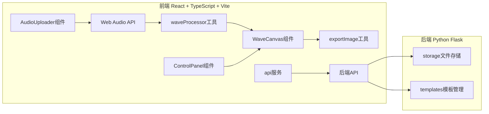
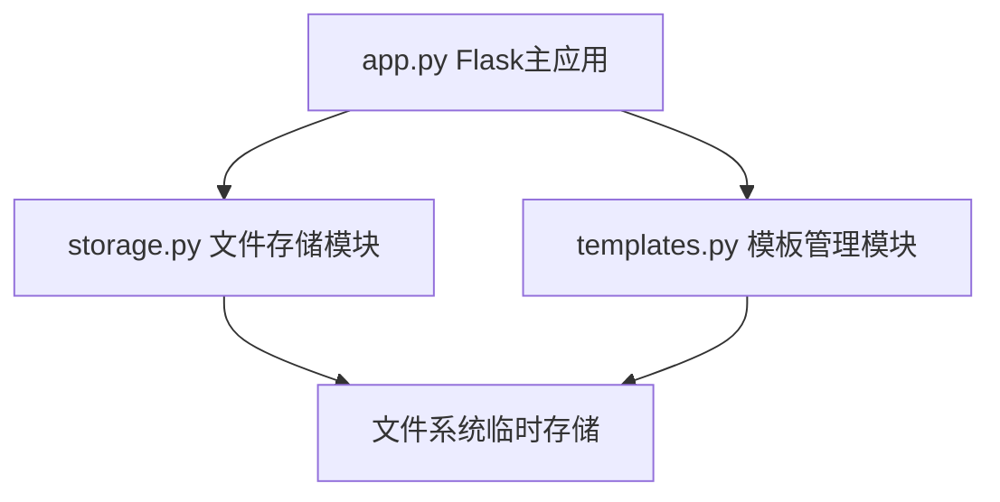
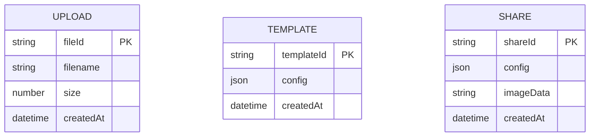

## 1. 架构设计



## 2. 技术描述

- **前端框架**：React 18 + TypeScript + Vite
- **前端样式**：原生CSS（深色主题，monospace字体）
- **动画库**：framer-motion（微交互动效）
- **HTTP客户端**：axios
- **路由**：react-router-dom
- **后端框架**：Python Flask
- **后端依赖**：Flask、flask-cors

## 3. 路由定义

| 路由 | 用途 |
|-------|---------|
| / | 波形编辑器主页面 |

## 4. API 定义

### 4.1 文件上传

```typescript
POST /api/upload
Request: FormData { file: File }
Response: { fileId: string, filename: string }
```

### 4.2 模板保存

```typescript
POST /api/templates
Request: { config: WavePosterConfig }
Response: { templateId: string }
```

### 4.3 模板读取

```typescript
GET /api/templates/:templateId
Response: WavePosterConfig
```

### 4.4 生成分享链接

```typescript
POST /api/share
Request: { config: WavePosterConfig, imageData: string }
Response: { shareUrl: string, shareId: string }
```

### 4.5 类型定义

```typescript
type WaveStyle = 'bars' | 'wave' | 'spectrum' | 'particles';
type ColorScheme = 'neon' | 'minimal' | 'gradient' | 'retro';

interface WavePosterConfig {
  style: WaveStyle;
  colorScheme: ColorScheme;
  sensitivity: number; // 1-10
  blurRadius: number; // 0-8
  lineWidth: number; // 1-6
}

interface AudioWaveData {
  peaks: number[];
  sampleRate: number;
  duration: number;
}
```

## 5. 服务器架构图



## 6. 数据模型

### 6.1 数据模型定义



## 7. 项目文件结构

```
├── package.json
├── index.html
├── tsconfig.json
├── vite.config.js
├── public/
├── src/
│   ├── main.tsx
│   ├── App.tsx
│   ├── components/
│   │   ├── AudioUploader.tsx
│   │   ├── WaveCanvas.tsx
│   │   └── ControlPanel.tsx
│   ├── utils/
│   │   ├── waveProcessor.ts
│   │   └── exportImage.ts
│   ├── services/
│   │   └── api.ts
│   └── types.ts
└── backend/
    ├── app.py
    ├── templates.py
    ├── storage.py
    └── requirements.txt
```
