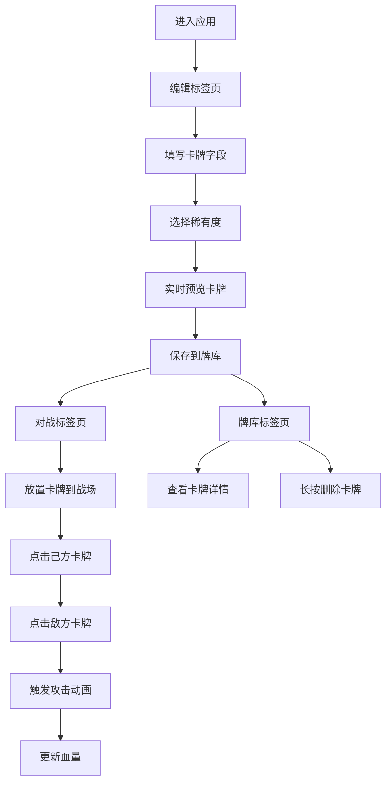

## 1. 产品概述

本产品是一款面向桌游爱好者的卡牌设计与虚拟对战工具，解决实体桌游卡牌设计中手绘速度慢、无法快速迭代测试平衡性的痛点。用户可以快速生成自定义卡牌并立即进行虚拟对战测试。

- **核心目标**：提供卡牌设计、对战模拟、牌库管理一站式服务，加速桌游卡牌的迭代测试流程
- **目标用户**：桌游设计师、卡牌游戏爱好者、桌游测试人员
- **市场价值**：大幅缩短卡牌设计周期，降低测试成本，提升平衡性调整效率

## 2. 核心功能

### 2.1 用户角色

| 角色 | 注册方式 | 核心权限 |
|------|----------|----------|
| 普通用户 | 无需注册，本地存储 | 创建卡牌、进行对战、管理牌库 |

### 2.2 功能模块

1. **卡牌编辑器**：字段拖拽布局、稀有度选择、实时预览、Canvas渐变渲染
2. **战斗模拟器**：3x3网格战场、卡牌放置、攻击交互、动画效果、血量更新
3. **牌库管理**：本地存储、缩略图展示、详情查看、长按删除、滑出动画

### 2.3 页面详情

| 页面名称 | 模块名称 | 功能描述 |
|---------|----------|----------|
| 卡牌编辑器 | 字段模板区 | 5个字段（名称、生命值、攻击力、技能、稀有度）可拖拽到卡牌预览上 |
| 卡牌编辑器 | 卡牌预览区 | 300x420px卡牌，实时更新，Canvas绘制渐变背景，圆角8px |
| 卡牌编辑器 | 稀有度选择 | 下拉选择，普通/稀有/史诗/传说，对应渐变色徽章 |
| 战斗模拟器 | 战场网格 | 3x3网格，每格80x80px，淡灰色虚线边框 |
| 战斗模拟器 | 攻击交互 | 点击己方卡牌再点击敌方卡牌触发攻击，闪光路径动画 |
| 战斗模拟器 | 血量更新 | 数字变化时缩放过渡动画，0.15秒 |
| 牌库管理 | 侧边栏 | 250px宽深色侧边栏，本地存储卡牌列表 |
| 牌库管理 | 缩略图 | 80x112px缩略图，圆角4px，带阴影 |
| 牌库管理 | 详情弹窗 | 点击放大查看，半透明黑色背景 |
| 牌库管理 | 删除交互 | 长按显示删除选项，向右滑出渐隐动画0.3秒 |

## 3. 核心流程

用户进入应用后，默认在卡牌编辑标签页，填写卡牌字段并选择稀有度，实时预览生成的卡牌效果。满意后可保存到本地牌库，切换到对战标签页，将卡牌拖入3x3战场进行对战测试，也可在牌库标签页管理已保存的卡牌。

## 4. 用户界面设计

### 4.1 设计风格

- **主色调**：深色背景 #1A1A2E，文字 #EAEAEA
- **强调色**：标签高亮 #E94560，网格线 #E0E0E0，牌库背景 #2C3E50
- **稀有度配色**：普通 #B0B0B0，稀有 #4A90D9，史诗 #9B59B6，传说 #F39C12
- **按钮风格**：圆角矩形，hover状态有轻微缩放和阴影变化
- **字体**：采用现代无衬线字体，标题加粗，正文清晰可读
- **布局风格**：左侧280px功能菜单，右侧主操作区，三标签页切换
- **图标风格**：简洁线性图标，与暗色主题协调

### 4.2 页面设计概述

| 页面名称 | 模块名称 | UI元素 |
|---------|----------|--------|
| 主应用 | 标签导航 | 圆角矩形标签，选中底部2px高亮条 #E94560，切换淡入0.2秒 |
| 卡牌编辑器 | 字段列表 | 可拖拽字段项，带输入框/下拉菜单 |
| 卡牌编辑器 | 卡牌预览 | 居中展示，300x420px，Canvas渐变背景，圆角8px |
| 卡牌编辑器 | 生成按钮 | 醒目位置，点击触发生成逻辑 |
| 战斗模拟器 | 战场网格 | 3x3布局，每格80x80px，虚线边框 |
| 战斗模拟器 | 攻击动画 | 白色半透明闪光路径，0.2秒 |
| 战斗模拟器 | 血量数字 | 缩放过渡动画，0.15秒 |
| 牌库管理 | 侧边栏 | 250px宽，#2C3E50背景，内部滚动 |
| 牌库管理 | 缩略图卡片 | 80x112px，圆角4px，轻阴影 |
| 牌库管理 | 详情弹窗 | 居中，半透明黑 #00000080 遮罩 |
| 牌库管理 | 删除动画 | 向右滑出并渐隐，0.3秒 |

### 4.3 响应性

- 采用桌面端优先设计，主操作区自适应剩余宽度
- 侧边栏固定宽度，内部内容可滚动
- 触摸设备优化长按删除交互
- 所有动画确保60FPS流畅运行

### 4.4 动画性能要求

- 攻击动画：使用transform和opacity属性，确保GPU加速
- 弹窗过渡：使用framer-motion的AnimatePresence
- 血量变化：scale属性过渡，0.15秒完成先缩后放
- 删除动画：translateX和opacity组合，0.3秒滑出渐隐
- 标签切换：opacity淡入效果，0.2秒
