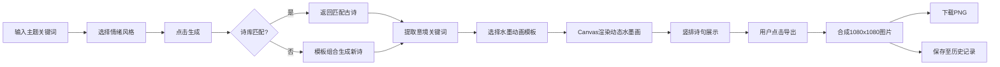

## 1. 产品概述
墨韵诗画 - AI个性化诗歌生成与动态水墨插画网页应用，为用户提供兼具文学美感与视觉冲击力的意境图文内容，解决社交分享时缺乏个性化诗意图文的问题。

- 核心价值：将传统诗词文化与现代数字艺术结合，一键生成诗画一体的分享内容
- 目标用户：喜欢传统文化、追求审美表达的社交分享用户、文案创作者、设计爱好者
- 市场定位：轻量级创意工具，无需专业技能即可生成高品质诗意图文

## 2. 核心功能

### 2.1 功能模块
1. **诗歌生成模块**：主题关键词输入、情绪风格选择、一键生成古诗、竖排书法展示
2. **动态水墨画模块**：Canvas水墨动画引擎、多种意境模板、水墨晕染与笔触效果、云水流动动画
3. **图文合成与分享模块**：诗画叠加合成、1080x1080方形输出、PNG导出下载
4. **历史收藏模块**：本地存储历史作品、卡片式展示列表、详情查看与重新导出

### 2.2 页面详情
| 页面名称 | 模块名称 | 功能描述 |
|-----------|-------------|---------------------|
| 主页 | 诗歌生成模块 | 主题输入框（限10字）、5种情绪风格选择色块、生成按钮、宣纸背景竖排诗句展示 |
| 主页 | 动态水墨画模块 | Canvas画布渲染、水墨晕染效果、笔触感模拟、云水流动动画 |
| 主页 | 图文合成模块 | 诗句叠加水墨画布、导出PNG按钮、合成预览 |
| 历史页 | 历史收藏模块 | 卡片列表展示、悬停上浮效果、点击查看详情、重新导出 |

## 3. 核心流程
用户输入主题关键词 → 选择情绪风格 → 点击生成按钮 → 系统匹配诗库或模板生成四行七字古诗 → 提取意境关键词 → 选择对应水墨动画模板 → 右侧Canvas渲染动态水墨画 → 诗句竖排展示于宣纸背景 → 用户点击导出 → 合成1080x1080图片 → 下载PNG文件 → 自动保存至本地历史记录

## 4. 用户界面设计

### 4.1 设计风格
- **主色调**：米白 #F5F0E8（背景底色）
- **文字色**：深灰 #333333
- **强调色**：赭石 #8B4513（按钮边框、分割线）
- **情绪色块**：
  - 快乐 #FFD93D
  - 悲伤 #6C5B7B
  - 励志 #6CAC74
  - 诙谐 #FF6492
  - 哲理 #4A90D9
- **按钮样式**：圆角20px，文字白色#FFFFFF，背景渐变从#8B4513到#A0522D，悬停发光（box-shadow 0 0 10px rgba(139, 69, 19, 0.5)）
- **字体**：标题使用毛笔手写体（Ma Shan Zheng Google Font），正文使用serif字体，诗句使用书法字体
- **布局**：左右分栏布局，左栏350px固定宽度，右栏自适应填充
- **边框**：水墨画区域使用传统云纹样式CSS边框

### 4.2 页面设计概览
| 页面名称 | 模块名称 | UI元素 |
|-----------|-------------|-------------|
| 主页 | 诗歌生成模块 | 输入框、风格色块、生成按钮、宣纸纹理背景、竖排诗句、逐字渐显动画 |
| 主页 | 动态水墨画模块 | Canvas画布、云纹边框、水墨晕染、笔触效果、云水流动动画 |
| 主页 | 导出模块 | 导出按钮、合成预览 |
| 历史页 | 历史收藏模块 | 卡片网格、悬停上浮、详情弹窗、重新导出 |

### 4.3 响应式设计
- 桌面端（≥768px）：左右分栏布局，左栏350px，右栏自适应
- 移动端（<768px）：上下堆叠布局，诗歌模块在上，水墨画在下
- 触摸优化：增大按钮点击区域，调整卡片尺寸

### 4.4 动画与交互
- 诗句逐字渐显动画：每0.1秒显示一个字（framer-motion）
- 卡片悬停效果：上浮4px，0.3秒过渡
- 按钮悬停：发光效果
- 水墨动画：水墨晕染扩散、毛笔随机路径、云水缓慢流动（0.3-0.5像素/帧）
