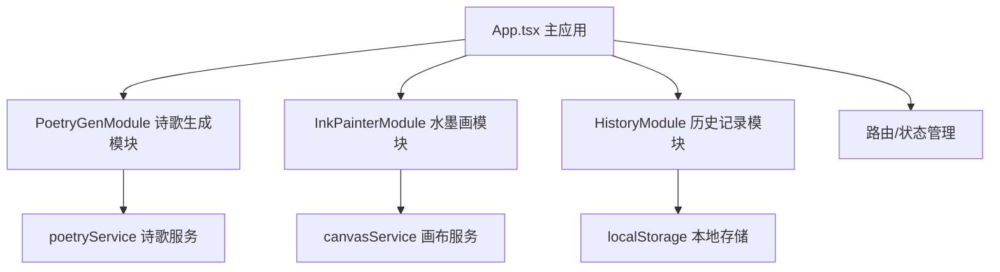

## 1. 架构设计
纯前端React应用，采用模块化架构，各功能模块独立封装，通过props和state进行数据交互。



## 2. 技术选型
- **前端框架**：React 18 + TypeScript
- **构建工具**：Vite
- **动画库**：framer-motion
- **HTTP客户端**：axios（预留，当前纯前端）
- **状态管理**：React useState/useEffect（轻量场景）
- **样式方案**：CSS Modules / 内联样式
- **字体**：Google Fonts（Ma Shan Zheng 毛笔字体）
- **图片处理**：Canvas API + toBlob导出

## 3. 项目文件结构
```
/
├── package.json          # 项目依赖与脚本
├── index.html            # 入口HTML
├── tsconfig.json         # TypeScript配置（严格模式）
├── vite.config.js        # Vite构建配置
└── src/
    ├── App.tsx           # 主应用组件（布局与路由）
    └── modules/
        ├── PoetryGenerator/
        │   ├── PoetryGenModule.tsx    # 诗歌生成UI模块
        │   └── poetryService.ts       # 诗歌匹配与生成逻辑
        ├── InkPainter/
        │   ├── InkPainterModule.tsx   # 水墨画Canvas模块
        │   └── canvasService.ts       # Canvas动画渲染引擎
        └── History/
            └── HistoryModule.tsx      # 历史记录模块
```

## 4. 核心模块设计

### 4.1 诗歌生成模块（PoetryGenerator）
**文件**：`poetryService.ts`, `PoetryGenModule.tsx`

**类型定义**：
```typescript
interface Poetry {
  id: string;
  title: string;
  lines: string[];    // 四行诗句
  theme: string;      // 主题关键词
  mood: MoodType;     // 情绪风格
  imagery: string[];  // 意境关键词
}

type MoodType = 'happy' | 'sad' | 'inspiring' | 'humorous' | 'philosophical';
```

**核心功能**：
- 内置50首古风短诗数据库
- 主题关键词匹配算法（关键词相似度匹配）
- 模板生成四行七字诗句（当无匹配时）
- 情绪风格与诗句的关联映射

### 4.2 动态水墨画模块（InkPainter）
**文件**：`canvasService.ts`, `InkPainterModule.tsx`

**类型定义**：
```typescript
interface InkTemplate {
  id: string;
  name: string;
  imageryType: string;  // 对应意境类型：山水/花鸟/人物/节令
  render: (ctx: CanvasRenderingContext2D, time: number) => void;
}

interface Particle {
  x: number;
  y: number;
  vx: number;
  vy: number;
  alpha: number;
  size: number;
}
```

**核心算法**：
- 水墨晕染：径向渐变 + alpha叠加模拟墨汁扩散
- 笔触感：随机贝塞尔路径模拟毛笔走势
- 云水动画：粒子系统，移动速度0.3-0.5像素/帧
- 10种水墨风格模板

### 4.3 历史收藏模块（History）
**文件**：`HistoryModule.tsx`

**数据结构**：
```typescript
interface HistoryItem {
  id: string;
  theme: string;
  mood: MoodType;
  poetry: Poetry;
  imagery: string[];
  thumbnail: string;    // base64缩略图
  imageData: string;    // base64完整图片
  createdAt: number;
}
```

**存储方式**：localStorage

### 4.4 图文合成模块
**实现方式**：
- 创建离屏Canvas，尺寸1080x1080
- 先绘制水墨画背景
- 再绘制半透明白色文字背景
- 最后绘制竖排书法字体诗句
- 通过canvas.toBlob()导出PNG

## 5. 性能优化
- **动画帧率**：使用requestAnimationFrame，目标45FPS+
- **Canvas优化**：分层渲染，静态元素缓存，减少重绘区域
- **内存管理**：及时清理动画帧，避免内存泄漏
- **导出优化**：toBlob异步导出，目标1秒内完成
- **响应式**：移动端降低粒子数量保证性能

## 6. 数据模型

### 6.1 诗歌数据模型
```typescript
interface Poetry {
  id: string;
  title: string;
  lines: [string, string, string, string];  // 四行七字
  theme: string[];                          // 主题标签
  mood: MoodType;                           // 情绪分类
  imagery: ImageryType[];                   // 意境类型
}

type MoodType = 'happy' | 'sad' | 'inspiring' | 'humorous' | 'philosophical';
type ImageryType = 'landscape' | 'flower-bird' | 'figure' | 'seasonal';
```

### 6.2 历史记录模型
```typescript
interface HistoryRecord {
  id: string;
  theme: string;
  mood: MoodType;
  poetryLines: string[];
  imageryType: string;
  imageDataUrl: string;  // 1080x1080合成图
  createdAt: number;     // 时间戳
}
```
