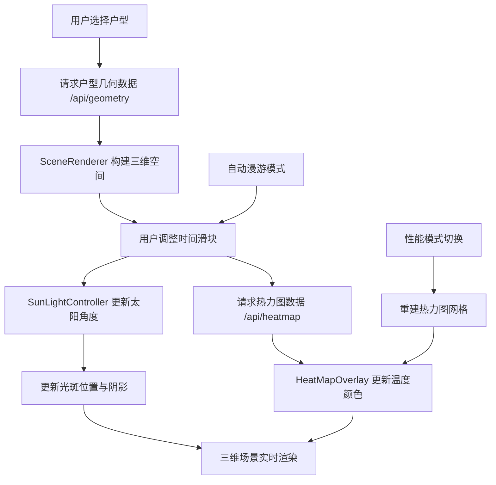

## 1. 产品概述

三维室内光热分布模拟应用——面向建筑与室内设计师的网页端实时交互工具，通过三维可视化呈现不同朝向户型在全天各时段的自然光分布与温度热力图，帮助设计师快速评估采光与热舒适度，无需安装复杂模拟软件。

- 目标用户：建筑设计师、室内设计师、房产开发者
- 核心价值：将专业级光照热力分析搬入浏览器，零安装、即时交互、实时反馈

## 2. 核心功能

### 2.1 功能模块

1. **主页面**：三维场景渲染区、户型选择面板、时间控制面板、热力图开关、性能模式选择

### 2.2 页面详情

| 页面名称 | 模块名称 | 功能描述 |
|----------|----------|----------|
| 主页面 | 户型选择面板 | 3个户型卡片（朝南/朝东/朝北），展示缩略图与名称，点击切换场景并重置时间 |
| 主页面 | 三维场景区域 | Three.js渲染的三维户型空间，含地板、墙面、窗户、光斑投射与热力图覆盖 |
| 主页面 | 时间控制滑块 | 水平滑块6:00-20:00步长0.5h，实时更新太阳位置与热力图，轨道渐变色 |
| 主页面 | 自动漫游模式 | 播放/暂停按钮，自动递增时间6:00→20:00→6:00，45±5秒完成循环 |
| 主页面 | 热力图切换 | 右侧开关，控制热力图显示/隐藏，0.5秒渐变淡入淡出 |
| 主页面 | 性能模式选择 | 左上角下拉菜单（高性能64x64/节能32x32），右上角实时FPS显示 |

## 3. 核心流程

用户打开应用 → 默认加载朝南户型 → 场景渲染三维空间 → 用户可通过以下路径交互：
1. 切换户型 → 请求户型几何数据 → 重建三维场景 → 重置时间为12:00
2. 拖动时间滑块 → 请求热力图数据 → 更新太阳位置与光斑 → 更新温度热力图颜色
3. 点击自动漫游 → 时间自动递增 → 持续更新光影与热力图 → 循环播放
4. 切换热力图显示 → 覆盖层淡入/淡出
5. 切换性能模式 → 重建热力图网格分辨率 → 调整更新频率



## 4. 用户界面设计

### 4.1 设计风格

- 主题：深色科技感，建筑专业工具
- 主色：#1A1A2E（深蓝黑背景）、#0F3460（面板深蓝）
- 强调色：#E94560（交互高亮）、#4CAF50（开启状态）
- 字体：系统无衬线字体，14px，颜色#E0E0E0
- 控件：统一8px圆角，悬停0.15白色透明叠加，0.2秒过渡
- 布局：顶部导航60px + 左侧面板240px + 中间3D场景 + 右侧面板280px + 底部滑块80px

### 4.2 页面设计详情

| 页面名称 | 模块名称 | UI元素 |
|----------|----------|--------|
| 主页面 | 顶部导航栏 | 高60px，背景#16213E，底部阴影2px，应用标题 |
| 主页面 | 左侧户型面板 | 宽240px，背景#0F3460，磨砂玻璃blur(8px)，圆角0 16px 16px 0，3个户型卡片 |
| 主页面 | 户型卡片 | 缩略图128x96px圆角8px，悬停上移3px/0.3s，名称标签 |
| 主页面 | 中间3D场景 | 自适应填满剩余空间，Three.js画布 |
| 主页面 | 右侧控制面板 | 宽280px，背景#0F3460，磨砂玻璃blur(8px)，圆角16px 0 0 16px，含热力图开关 |
| 主页面 | 底部滑块区域 | 高80px，背景#1A1A2E，分隔线#2A2A4E，渐变轨道滑块 |
| 主页面 | FPS显示 | 右上角，白色14px，半透明背景#00000044，圆角4px |
| 主页面 | 性能模式下拉 | 左上角，8px圆角，深色下拉菜单 |

### 4.3 响应式

- 桌面优先设计，视口≥768px完整布局
- 移动端（<768px）：左侧面板折叠为悬浮按钮（40px圆形，#E94560，右下角），右侧面板宽度自适应

### 4.4 三维场景指引

- 环境：室内场景，暗色环境光（#1a1a2e 0.3强度）+ 方向光模拟太阳
- 光照：太阳方向光根据时间计算方位角与仰角，SpotLight模拟窗户光斑，ShadowMap 2048px
- 相机：透视相机，45°俯视角度，OrbitControls支持旋转/缩放
- 焦点元素：光斑投射区域、热力图温度渐变
- 交互：OrbitControls旋转/缩放/平移，时间滑块控制光影变化
- 性能预算：节能模式≥15FPS，高性能≥30FPS，初始加载<1秒

## 5. 数据流向

```
[Flask后端] ──/api/geometry──→ [GeometryAPI.ts] ──→ [SceneRenderer.ts] → Three.js场景
[Flask后端] ──/api/heatmap──→ [HeatMapAPI.ts] ──→ [HeatMapOverlay.ts] → 温度颜色网格
[UI时间滑块] ──→ [SunLightController.ts] → 方向光位置/阴影
[App.tsx状态] ──→ 协调所有模块数据传递
```
