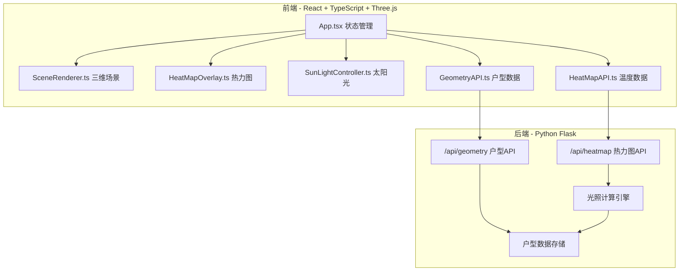
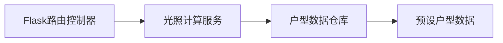

## 1. 架构设计



## 2. 技术说明

- **前端**: React 18 + TypeScript + Three.js + @react-three/fiber + @react-three/drei + framer-motion + axios + Vite
- **初始化工具**: Vite (react-ts模板)
- **后端**: Python Flask + flask-cors
- **数据库**: 无数据库，使用内存数据（预设3个户型数据）
- **状态管理**: React useState/useRef（项目规模适中，无需外部状态库）

## 3. 路由定义

| 路由 | 用途 |
|------|------|
| / | 主页面，包含三维场景与所有控制面板 |

## 4. API定义

### 4.1 户型几何数据 API

**请求**: `GET /api/geometry?houseId={south|east|north}`

**响应**:
```typescript
interface GeometryResponse {
  houseId: string;
  vertices: number[];       // 地板平面顶点坐标 [x1,z1, x2,z2, ...]
  walls: WallData[];        // 墙面数据
  windows: WindowData[];    // 窗户位置数据
}

interface WallData {
  start: [number, number];  // 墙起点 [x, z]
  end: [number, number];    // 墙终点 [x, z]
  height: number;           // 墙高
  hasWindow: boolean;       // 是否含窗
}

interface WindowData {
  wallIndex: number;        // 所在墙索引
  position: [number, number, number]; // 窗户中心位置 [x, y, z]
  width: number;
  height: number;
}
```

### 4.2 热力图数据 API

**请求**: `GET /api/heatmap?houseId={south|east|north}&time={8.5}`

**响应**:
```typescript
interface HeatmapResponse {
  houseId: string;
  time: number;
  resolution: number;       // 网格分辨率 (32 或 64)
  temperatures: number[][]; // resolution x resolution 温度归一化值 [0,1]
}
```

## 5. 后端架构



### 后端模块说明

- **app.py**: Flask应用入口，注册路由，启动服务
- **geometry.py**: 户型数据服务，返回3个预设户型的几何数据
- **heatmap.py**: 热力图计算服务，根据户型朝向和时间计算温度分布
- **solar.py**: 太阳位置计算，根据时间和朝向计算方位角、仰角和光照强度

## 6. 文件结构与调用关系

```
项目根目录/
├── package.json                    # 前端依赖与脚本
├── vite.config.js                  # Vite构建配置
├── tsconfig.json                   # TypeScript配置
├── index.html                      # 入口HTML
├── server/                         # Flask后端
│   ├── app.py                      # Flask入口，注册蓝图与CORS
│   ├── geometry.py                 # /api/geometry 路由
│   ├── heatmap.py                  # /api/heatmap 路由
│   └── solar.py                    # 太阳位置计算工具
└── src/
    ├── main.tsx                    # React入口
    ├── App.tsx                     # 主组件，状态管理与模块组装
    ├── App.css                     # 全局样式
    ├── modules/
    │   ├── scene/
    │   │   ├── SceneRenderer.ts    # 三维场景初始化与渲染
    │   │   ├── HeatMapOverlay.ts   # 热力图覆盖层生成与更新
    │   │   └── SunLightController.ts # 太阳光源位置与阴影控制
    │   └── api/
    │       ├── GeometryAPI.ts      # 户型几何数据请求
    │       └── HeatMapAPI.ts       # 温度场数据请求
    └── vite-env.d.ts              # Vite类型声明
```

### 数据流向

1. **户型加载流**: App.tsx(用户选择) → GeometryAPI.ts(发送请求) → Flask /api/geometry → SceneRenderer.ts(构建三维场景)
2. **热力图更新流**: App.tsx(时间变化) → HeatMapAPI.ts(发送请求) → Flask /api/heatmap → HeatMapOverlay.ts(更新颜色)
3. **光照更新流**: App.tsx(时间变化) → SunLightController.ts(计算太阳角度) → 更新Three.js光源位置与阴影
4. **UI交互流**: App.tsx管理全局状态，通过props传递到各子组件

## 7. 性能策略

- 热力图数据预取：拖动滑块时批量请求相邻时间点数据
- 几何数据缓存：GeometryAPI缓存已请求的户型数据
- 可变分辨率：节能模式32x32，高性能模式64x64
- FPS监控：requestAnimationFrame计算实时帧率
- ShadowMap: 2048px分辨率，PCFSoftShadowMap柔化边缘
