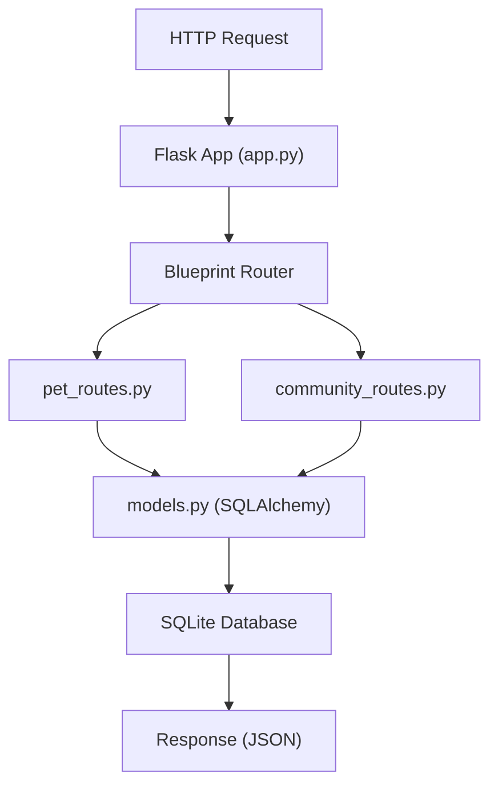
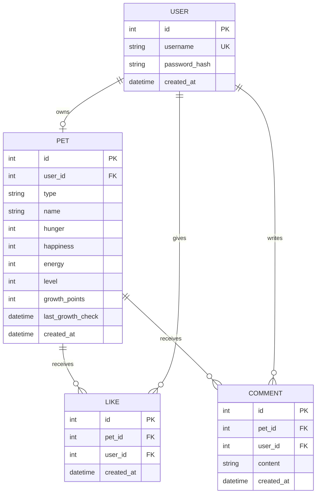

## 1. 架构设计


## 2. 技术描述

- **前端**：React 18 + TypeScript + Vite + React Router DOM + Axios
- **构建工具**：Vite 5.x
- **状态管理**：React Hooks (useState, useEffect) + 本地存储
- **后端**：Python Flask 3.x + Flask-SQLAlchemy + flask-cors
- **数据库**：SQLite 3（文件数据库，无需额外服务）
- **API 协议**：RESTful API + JSON

## 3. 路由定义

| 路由 | 页面 | 用途 |
|------|------|------|
| /login | LoginPage | 用户登录页面 |
| /register | RegisterPage | 新用户注册页面 |
| /pet | PetPage | 宠物主页，宠物养成操作 |
| /community | CommunityPage | 社区广场，浏览互动 |

## 4. API 定义

### 4.1 类型定义

```typescript
interface User {
  id: number;
  username: string;
  createdAt: string;
}

interface Pet {
  id: number;
  userId: number;
  type: 'cat' | 'dog' | 'dragon' | 'rabbit' | 'fox';
  name: string;
  hunger: number;
  happiness: number;
  energy: number;
  level: number;
  growthPoints: number;
  lastGrowthCheck: string;
  createdAt: string;
}

interface Like {
  id: number;
  petId: number;
  userId: number;
  createdAt: string;
}

interface Comment {
  id: number;
  petId: number;
  userId: number;
  username: string;
  content: string;
  createdAt: string;
}

interface PetCardData extends Pet {
  likeCount: number;
  commentCount: number;
  username: string;
}
```

### 4.2 接口列表

| 方法 | 路径 | 请求 | 响应 |
|------|------|------|------|
| POST | /api/register | { username, password } | { userId, pet, message } |
| POST | /api/login | { username, password } | { userId, pet, message } |
| GET | /api/pet/:user_id | - | { pet } |
| POST | /api/pet/:user_id/feed | - | { pet, message } |
| POST | /api/pet/:user_id/play | - | { pet, message } |
| POST | /api/pet/:user_id/rest | - | { pet, message } |
| POST | /api/pet/:user_id/growth | - | { pet, levelUp, message } |
| GET | /api/community/pets?page=1&size=20 | - | { pets: PetCardData[], total } |
| POST | /api/pet/:pet_id/like | { userId } | { likeCount, message } |
| GET | /api/pet/:pet_id/comments | - | { comments: Comment[] } |
| POST | /api/pet/:pet_id/comment | { userId, content } | { comment, message } |

## 5. 服务器架构



## 6. 数据模型

### 6.1 ER 图



### 6.2 数据初始化

- 数据库由 Flask-SQLAlchemy 自动创建（`db.create_all()`）
- 宠物类型预设：猫、狗、龙、兔、狐，注册时随机分配
- 宠物初始状态：hunger=80, happiness=80, energy=80, level=1
- 状态衰减：每秒各属性减少 0.1 点（前端模拟 + 后端同步）
- 成长计算：每日0点根据三项状态平均值发放成长点数
- 升级阈值：level * 100 点成长值
