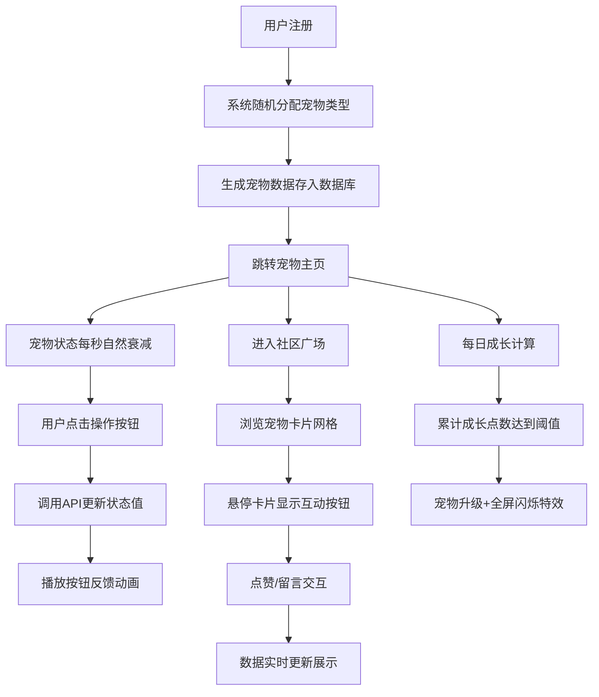

## 1. 产品概述

在线虚拟宠物养成社区是一款面向年轻用户的休闲养成类Web应用，用户可以领养专属虚拟宠物，通过日常互动维持宠物状态，并与社区其他用户的宠物进行社交互动。

- 核心价值：提供轻松治愈的养成体验，结合社交元素增加用户粘性
- 目标用户：喜欢休闲养成游戏、喜爱虚拟宠物的年轻群体
- 市场定位：轻量级Web端虚拟宠物社交平台

## 2. 核心功能

### 2.1 用户角色

| 角色 | 注册方式 | 核心权限 |
|------|---------|---------|
| 普通用户 | 用户名密码注册 | 领养宠物、宠物养成、社区浏览、点赞留言 |

### 2.2 功能模块

1. **注册登录**：用户账号注册与登录，注册时自动分配宠物
2. **宠物主页**：宠物形象展示、状态监控、互动操作（喂食/玩耍/休息）
3. **社区广场**：宠物卡片网格展示、点赞互动、留言社交
4. **成长系统**：每日成长计算、等级提升、形象进化

### 2.3 页面详情

| 页面名称 | 模块名称 | 功能描述 |
|---------|---------|----------|
| 登录页 | 登录表单 | 用户名密码登录，跳转注册 |
| 注册页 | 注册表单 | 新用户注册，自动创建随机类型宠物 |
| 宠物主页 | 宠物形象区 | CSS绘制的宠物形象，根据状态播放对应动画 |
| 宠物主页 | 状态面板 | 饥饿、快乐、精力三项状态条，实时更新 |
| 宠物主页 | 操作按钮 | 喂食、玩耍、休息三个胶囊按钮，点击反馈动画 |
| 宠物主页 | 成长信息 | 等级显示、成长进度条、升级特效 |
| 社区广场 | 卡片网格 | 虚拟滚动的宠物卡片网格，懒加载优化 |
| 社区广场 | 互动面板 | 卡片悬停显示点赞/留言按钮，留言弹窗展示 |
| 社区广场 | 留言面板 | 按时间倒序排列的留言列表，支持发表新留言 |

## 3. 核心流程

## 4. 用户界面设计

### 4.1 设计风格

- **主色调**：柔和粉蓝 #B3D9FF、珊瑚粉 #FFB3B3、奶油白 #FFF8E7
- **按钮样式**：圆角胶囊形状，hover时有轻微抬起效果和颜色变化
- **字体**：标题使用圆润可爱的中文字体，正文使用清晰易读的无衬线字体
- **布局风格**：卡片式布局，大圆角设计，柔和阴影
- **视觉元素**：渐变背景（浅蓝到浅粉）、宠物形象纯CSS绘制、emoji辅助装饰

### 4.2 页面设计概述

| 页面名称 | 模块名称 | UI元素 |
|---------|---------|--------|
| 登录页 | 登录卡片 | 圆角卡片、奶油白背景、珊瑚粉按钮、柔和阴影、淡入动画 |
| 注册页 | 注册卡片 | 同上，粉蓝渐变背景、表单输入框圆角设计 |
| 宠物主页 | 宠物形象 | 居中展示、CSS绘制、状态驱动动画（饥饿/快乐/疲倦） |
| 宠物主页 | 状态条 | 彩色进度条，数值实时更新，平滑过渡动画 |
| 宠物主页 | 操作按钮 | 胶囊形状，喂食=粉蓝、玩耍=珊瑚粉、休息=奶油黄，点击缩放+变色反馈 |
| 宠物主页 | 等级徽章 | 左上角徽章，升级时全屏闪烁金色特效 |
| 社区广场 | 卡片网格 | 响应式网格布局，圆角卡片，浅阴影，悬停上浮效果 |
| 社区广场 | 留言弹窗 | 半透明遮罩，弹窗淡入，留言列表时间倒序 |

### 4.3 响应式设计

- 桌面端优先设计，适配1280px及以上屏幕
- 移动端自适应：卡片网格变为单列，按钮尺寸增大便于触控
- 所有交互元素最小触控区域48x48px
- 页面切换统一使用淡入过渡动画（300ms ease）

### 4.4 动画规范

| 动画类型 | 触发条件 | 效果描述 |
|---------|---------|----------|
| 饥饿动画 | 饥饿值 < 30 | 宠物肚子区域起伏动画，模拟咕咕叫 |
| 快乐动画 | 快乐值 > 70 | 宠物上下蹦跳，尾巴摇摆 |
| 疲倦动画 | 精力值 < 30 | 宠物闭眼，周期性打哈欠 |
| 按钮反馈 | 点击操作按钮 | 缩放至0.95，颜色加深，200ms后恢复 |
| 卡片悬停 | 鼠标悬停宠物卡片 | 向上浮动8px，阴影加深，显示互动按钮 |
| 升级特效 | 宠物等级提升 | 全屏金色闪烁，旋转星花，持续1.5秒 |
| 页面切换 | 路由跳转 | 整体淡入淡出，300ms过渡 |
