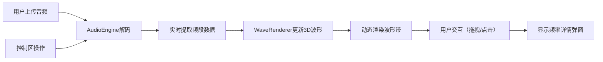

## 1. 产品概述

基于Web Audio API和Three.js的3D音乐可视化应用，用户上传音乐后自动生成沿时间轴延伸的动态3D波形景观带，支持交互式观察和实时数据展示。

- 核心价值：将抽象的音乐转化为具象的3D视觉艺术，提供沉浸式音乐欣赏体验
- 目标用户：音乐爱好者、视觉艺术家、创意工作者
- 技术亮点：浏览器端实时音频分析、60FPS流畅3D渲染、低延迟数据同步

## 2. 核心功能

### 2.1 用户角色

| 角色 | 注册方式 | 核心权限 |
|------|----------|----------|
| 访客用户 | 无需注册 | 上传音频、可视化播放、交互操作 |

### 2.2 功能模块

1. **音频上传解析**：支持本地音频文件上传，实时解析频谱数据
2. **3D波形渲染**：TubeGeometry时间轴波形带，动态高度、宽度、颜色变化
3. **交互式观察**：鼠标拖拽旋转、滚轮缩放、点击查看详情
4. **播放控制**：播放/暂停、进度跳转、音量调节、颜色模式切换

### 2.3 页面详情

| 页面名称 | 模块名称 | 功能描述 |
|----------|----------|----------|
| 主页面 | 3D场景区 | 全屏3D波形可视化，支持鼠标交互 |
| 主页面 | 底部控制栏 | 上传按钮、播放控制、进度条、音量滑块、颜色模式切换 |
| 主页面 | 信息弹窗 | 点击波形时显示该时间点的频率数据详情 |

## 3. 核心流程

用户上传音频文件 → 系统创建AudioContext解码音频 → 实时提取低/中/高频数据 → 3D渲染模块更新TubeGeometry截面 → 波形带随音乐动态变化 → 用户拖拽/缩放/点击交互 → 控制区操作反馈到音频引擎

## 4. 用户界面设计

### 4.1 设计风格

- **主色调**：深空蓝黑渐变背景（#0a0e27 → #1a1f44）
- **强调色**：霓虹发光色（高频红→低频蓝渐变）
- **按钮风格**：圆角矩形，半透明毛玻璃，悬停缩放动画，点击闪光反馈
- **字体**：Orbitron（科技感标题）+ Noto Sans SC（正文）
- **布局风格**：全屏3D场景 + 底部固定控制栏
- **视觉效果**：半透明发光材质、backdrop-filter毛玻璃、渐变进度条

### 4.2 页面设计概述

| 页面名称 | 模块名称 | UI元素 |
|----------|----------|--------|
| 主页面 | 3D场景区 | 深空渐变背景、TubeGeometry波形带、霓虹发光效果、轨道控制器 |
| 主页面 | 底部控制栏 | 毛玻璃半透明、播放/暂停按钮、可拖拽进度条、音量滑块、颜色模式开关、文件上传按钮 |
| 主页面 | 信息弹窗 | 半透明面板、频率数据图表、时间戳显示 |

### 4.3 响应式

- Desktop-first设计，控制栏适配不同屏幕宽度
- 移动端支持触摸拖拽和双指缩放
- 控制区在小屏幕上自动调整布局

### 4.4 3D场景指导

- **环境**：深空蓝黑渐变背景，无HDRI，营造科幻氛围
- **光照**：环境光（0.3强度）+ 点光源（跟随波形移动，产生发光效果）
- **相机**：PerspectiveCamera，初始位置距离波形带15单位，高度5单位
- **构图**：波形带沿Z轴延伸，占据场景中心，相机环绕观察
- **交互**：OrbitControls，限制极角避免翻转，开启阻尼效果
- **后处理**：Bloom泛光效果增强霓虹灯质感
- **性能**：单Mesh + 动态顶点更新，避免频繁创建销毁对象

## 5. 性能要求

- 60FPS流畅运行
- 频谱数据更新延迟 ≤ 50ms
- 内存占用 ≤ 200MB
- 支持10分钟以上音频完整可视化
