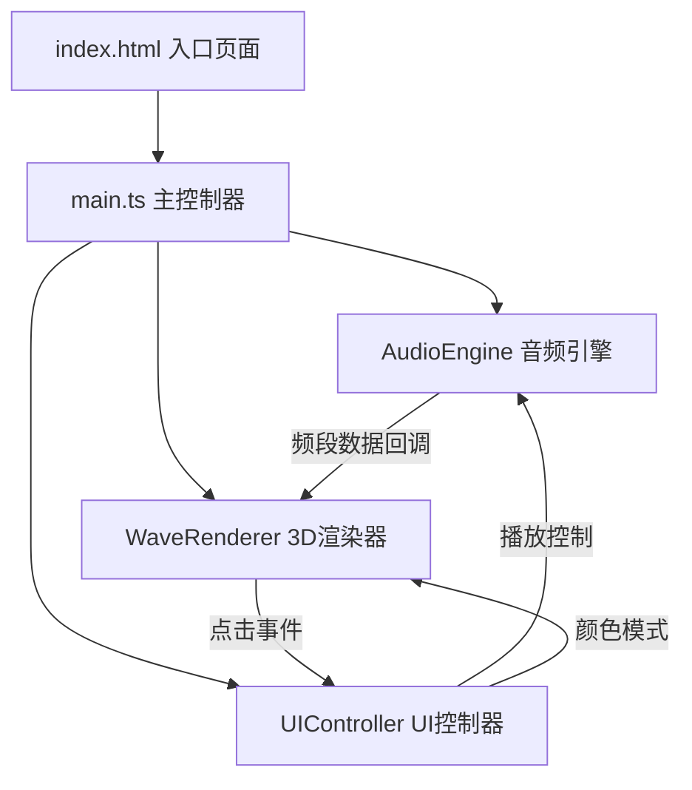

## 1. 架构设计



## 2. 技术栈说明

- **前端框架**：无（原生TypeScript + Three.js）
- **构建工具**：Vite 5.x
- **类型系统**：TypeScript 5.x（严格模式）
- **3D引擎**：Three.js 0.160.x + @types/three
- **音频处理**：Web Audio API（浏览器原生）
- **样式方案**：CSS3 + CSS变量

## 3. 目录结构

```
├── index.html              # 入口HTML
├── package.json            # 项目配置
├── vite.config.js          # Vite配置
├── tsconfig.json           # TypeScript配置
└── src/
    ├── main.ts             # 场景初始化、主循环、渲染管线
    ├── audioEngine.ts      # 音频解析模块
    ├── waveRenderer.ts     # 3D波形渲染模块
    └── uiController.ts     # 用户交互控制模块
```

## 4. 核心模块设计

### 4.1 AudioEngine (audioEngine.ts)

**职责**：处理音频文件加载、解码、实时频谱分析

**类型定义**：
```typescript
interface FrequencyData {
  timestamp: number;        // 当前播放时间（秒）
  low: number;              // 低频强度 0-255
  mid: number;              // 中频强度 0-255
  high: number;             // 高频强度 0-255
}

type AudioCallback = (data: FrequencyData) => void;
type ProgressCallback = (progress: number, duration: number) => void;
```

**核心方法**：
- `loadFile(file: File): Promise<void>` - 加载并解码音频文件
- `play(): void` - 播放音频
- `pause(): void` - 暂停音频
- `seek(time: number): void` - 跳转到指定时间
- `setVolume(volume: number): void` - 设置音量 0-1
- `onFrequency(callback: AudioCallback): void` - 注册频段数据回调
- `onProgress(callback: ProgressCallback): void` - 注册进度回调
- `getDuration(): number` - 获取音频总时长
- `getCurrentTime(): number` - 获取当前播放时间
- `isPlaying(): boolean` - 获取播放状态
- `destroy(): void` - 销毁资源

**实现要点**：
- 使用 `AudioContext` + `AnalyserNode` 进行频谱分析
- `fftSize = 256`，将频谱分为低（0-10）、中（11-43）、高（44-127）三个频段
- 使用 `requestAnimationFrame` 实时提取数据，保证60fps更新
- 通过 `ScriptProcessorNode` 或定时器回调推送数据

### 4.2 WaveRenderer (waveRenderer.ts)

**职责**：创建3D场景、TubeGeometry波形带、动态更新顶点和颜色

**类型定义**：
```typescript
type ColorMode = 'frequency' | 'rainbow';

interface WaveRendererOptions {
  container: HTMLElement;
  maxHistorySize?: number;  // 最大历史数据点数量
}

interface HitResult {
  time: number;             // 时间点（秒）
  low: number;
  mid: number;
  high: number;
}
```

**核心方法**：
- `constructor(options: WaveRendererOptions)` - 初始化场景
- `addFrequencyData(data: FrequencyData): void` - 添加频段数据用于渲染
- `update(deltaTime: number): void` - 每帧更新（在主循环中调用）
- `setColorMode(mode: ColorMode): void` - 设置颜色模式
- `onWaveClick(callback: (result: HitResult) => void): void` - 注册点击回调
- `resize(): void` - 窗口大小变化时调整
- `destroy(): void` - 销毁资源

**实现要点**：
- 使用 `THREE.TubeGeometry` 创建沿Z轴延伸的管道
- 自定义 `CustomCurve` 类，根据历史频段数据动态计算路径点
- 每个截面使用多个圆形顶点，低频控制Y轴高度，中频控制X/Z轴半径
- 使用 `ShaderMaterial` 实现霓虹发光效果，高频控制颜色渐变（蓝→红）
- `OrbitControls` 实现拖拽旋转和滚轮缩放，开启阻尼效果
- `Raycaster` 实现波形点击检测
- 顶点数据使用 `BufferGeometry` 动态更新，避免重复创建对象

### 4.3 UIController (uiController.ts)

**职责**：管理所有UI元素和用户交互，与其他模块联动

**类型定义**：
```typescript
interface UIControllerOptions {
  container: HTMLElement;
  audioEngine: AudioEngine;
  waveRenderer: WaveRenderer;
}

interface InfoBoxData {
  time: number;
  low: number;
  mid: number;
  high: number;
}
```

**核心方法**：
- `constructor(options: UIControllerOptions)` - 初始化UI
- `showInfoBox(data: InfoBoxData): void` - 显示频率详情弹窗
- `hideInfoBox(): void` - 隐藏弹窗
- `updateProgress(current: number, duration: number): void` - 更新进度条
- `destroy(): void` - 销毁事件监听

**实现要点**：
- 创建底部控制栏DOM结构，包含：
  - 文件上传按钮（隐藏input + 自定义按钮）
  - 播放/暂停切换按钮
  - 可拖拽进度条（input range 自定义样式）
  - 音量滑块
  - 颜色模式切换开关
- 所有控件添加悬停缩放动画（transform: scale(1.05)）
- 点击按钮添加闪光反馈（::after伪元素 + 缩放动画）
- 进度条使用渐变色填充动画（linear-gradient + background-position）
- 毛玻璃效果使用 `backdrop-filter: blur(12px)`
- 事件监听使用事件委托优化性能

### 4.4 main.ts (主控制器)

**职责**：整合所有模块，实现主循环和渲染管线

**核心流程**：
1. 初始化DOM容器
2. 实例化 `AudioEngine`、`WaveRenderer`、`UIController`
3. 建立模块间的回调连接：
   - AudioEngine → onFrequency → WaveRenderer.addFrequencyData
   - AudioEngine → onProgress → UIController.updateProgress
   - WaveRenderer → onWaveClick → UIController.showInfoBox + AudioEngine.pause
4. 启动 `requestAnimationFrame` 主循环：
   - 更新控制器
   - 更新渲染器
   - 渲染场景

## 5. 性能优化策略

### 5.1 音频处理
- 限制 `AnalyserNode.fftSize = 256`，减少计算量
- 频段数据使用 `Uint8Array` 而非 `Float32Array`，减少内存
- 每帧只做一次频谱分析，缓存结果供多处使用

### 5.2 3D渲染
- 使用 `BufferGeometry` 而非 `Geometry`，提升性能
- 动态更新顶点时只修改 `position` 和 `color` attribute
- 限制历史数据点数量（默认500点），避免几何体过大
- 使用 `FrustumCulling` 剔除不可见部分
- 材质复用，避免频繁创建材质对象

### 5.3 UI交互
- 进度条拖拽使用 `requestAnimationFrame` 节流
- 事件监听使用 passive 选项，提升滚动性能
- 弹窗动画使用 `transform` 和 `opacity`，触发GPU加速

## 6. 配置文件要点

### vite.config.js
- 设置 `server.port = 5173`
- 开启 `server.open = true` 自动打开浏览器
- 配置 `build.target = 'es2020'` 支持现代浏览器特性

### tsconfig.json
- `strict: true` 开启严格模式
- `target: 'ES2020'` 支持最新语法
- `moduleResolution: 'bundler'` 适配Vite
- `types: ['three']` 引入Three.js类型定义
