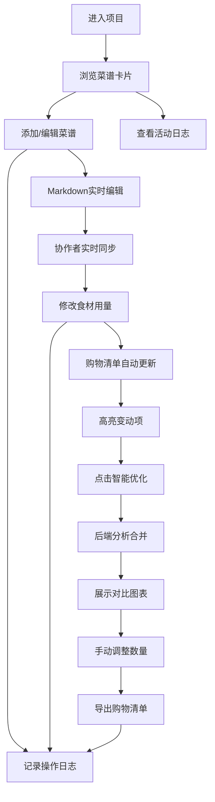

## 1. 产品概述

本产品是一个在线多人协作食谱编辑与智能购物清单生成应用，旨在解决家庭或小团队在计划烹饪时面临的食材信息分散、采买重复和分工混乱等问题。用户可以创建或加入菜谱项目，实时协作编辑菜谱内容，系统自动汇总并优化购物清单，提升烹饪计划效率。

- 核心目标：通过实时协作和智能分析，减少沟通成本，避免重复采购，优化购物体验
- 目标用户：家庭主妇/主夫、合租室友、小型团队聚餐组织者、美食爱好者
- 市场价值：填补了烹饪计划领域多人实时协作的空白，提供从菜谱规划到购物清单生成的一站式解决方案

## 2. 核心功能

### 2.1 用户角色

| 角色 | 加入方式 | 核心权限 |
|------|----------|----------|
| 项目创建者 | 创建新项目 | 管理项目成员、删除菜谱、导出购物清单 |
| 协作用户 | 通过项目链接加入 | 编辑菜谱、修改食材用量、查看活动日志 |

### 2.2 功能模块

1. **项目主页**：菜谱卡片网格展示、实时协作编辑区、购物清单抽屉、活动日志侧边栏
2. **菜谱管理**：创建/编辑/删除菜谱卡片，Markdown实时预览，渐进动画切换
3. **实时协作**：协作者光标位置显示、选中文本高亮、食材修改实时同步
4. **购物清单**：自动汇总食材、按类别分组、高亮变动项（3秒渐隐）、智能采购优化
5. **数据可视化**：优化前后对比条形图、食材用量统计
6. **活动日志**：时间线记录关键操作、用户头像展示、新条目滑入动画
7. **导出功能**：纯文本导出、PDF导出购物清单

### 2.3 页面详情

| 页面名称 | 模块名称 | 功能描述 |
|----------|----------|----------|
| 项目主页 | 顶部导航栏 | 项目名称显示、用户头像、购物清单切换按钮、加入项目链接复制 |
| 项目主页 | 菜谱编辑区 | 网格布局展示菜谱卡片、添加菜谱按钮、拖拽排序支持 |
| 项目主页 | 菜谱卡片 | 菜名显示、食材列表、烹饪步骤、预估用时、编辑/删除操作 |
| 项目主页 | 编辑模式 | Markdown编辑器、实时预览、协作者光标显示 |
| 项目主页 | 购物清单抽屉 | 右侧滑入、半透明遮罩、分类食材列表、优化按钮、导出按钮 |
| 项目主页 | 优化模块 | 智能合并用量、对比图表展示、手动调整、一键导出 |
| 项目主页 | 活动日志侧边栏 | 时间线布局、操作记录、用户头像、操作时间 |

## 3. 核心流程

用户进入项目后，可以浏览现有菜谱，点击添加或编辑按钮进入编辑模式。在编辑过程中，其他协作者可以实时看到光标位置和选中文本。当用户修改食材用量时，系统自动更新购物清单并高亮变动项。用户可以点击优化按钮，后端分析并合并重复食材，前端展示优化前后对比。用户可手动调整后导出购物清单。所有关键操作都会被记录到活动日志中。

## 4. 用户界面设计

### 4.1 设计风格

- **主色调**：暖橙色 #F4A460 - 营造温暖的饮食氛围，用于主要按钮、强调元素
- **辅助色**：奶油白 #FFF8E7 - 柔和的背景色，提升阅读舒适度
- **强调色**：草绿色 #6B8E23 - 用于成功状态、优化标记、健康食材标识
- **卡片风格**：柔和圆角12px，浅阴影box-shadow: 0 2px 8px rgba(0,0,0,0.08)，悬浮时阴影加深并上移2px，transition: all 0.3s ease
- **字体选择**：标题使用"Noto Serif SC"衬线字体体现温馨感，正文使用"Noto Sans SC"无衬线字体保证可读性
- **图标风格**：线性图标配合暖橙色填充，使用饮食相关emoji增强趣味性

### 4.2 页面设计概述

| 页面名称 | 模块名称 | UI元素 |
|----------|----------|--------|
| 项目主页 | 导航栏 | 固定顶部、渐变背景(#F4A460到#F5B87A)、白色文字、圆角按钮 |
| 项目主页 | 菜谱卡片 | 奶油白背景、12px圆角、hover上移动画、食材标签草绿色背景 |
| 项目主页 | 编辑区域 | 左右分栏（编辑区+预览区）、Markdown语法高亮、协作者彩色光标 |
| 项目主页 | 购物清单抽屉 | 右侧滑入(transform: translateX)、半透明黑色遮罩、分类折叠面板 |
| 项目主页 | 对比图表 | 横向条形图、暖色系列配色、动画加载、hover显示详情 |
| 项目主页 | 活动日志 | 左侧时间线(暖橙色)、圆形用户头像、新条目从底部滑入(animation: slideUp 0.3s) |
| 项目主页 | 高亮效果 | 食材变动时背景色从#FFE4B5渐变为透明，持续3秒 |

### 4.3 响应式设计

- **桌面端（>1200px）**：菜谱卡片4列网格、活动日志右侧固定300px宽、购物清单抽屉400px宽
- **平板端（768px-1200px）**：菜谱卡片2列网格、活动日志可折叠、购物清单抽屉350px宽
- **移动端（<768px）**：菜谱卡片1列堆叠、活动日志改为底部抽屉、购物清单全屏显示、触摸按钮最小44x44px
- **触摸优化**：所有可点击元素添加:active状态缩放效果、滚动区域添加惯性滚动

### 4.4 微交互设计

- **卡片悬浮**：transform: translateY(-4px) + box-shadow加深
- **按钮点击**：scale(0.95) 100ms后回弹
- **列表项添加**：height从0过渡到auto，opacity淡入
- **高亮动画**：@keyframes highlight { 0% { background: #FFE4B5; } 100% { background: transparent; } }
- **抽屉过渡**：transform: translateX(100%) → translateX(0)，300ms cubic-bezier(0.4, 0, 0.2, 1)
