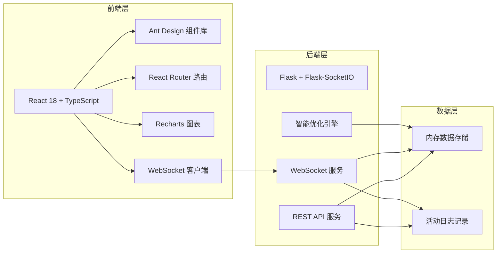
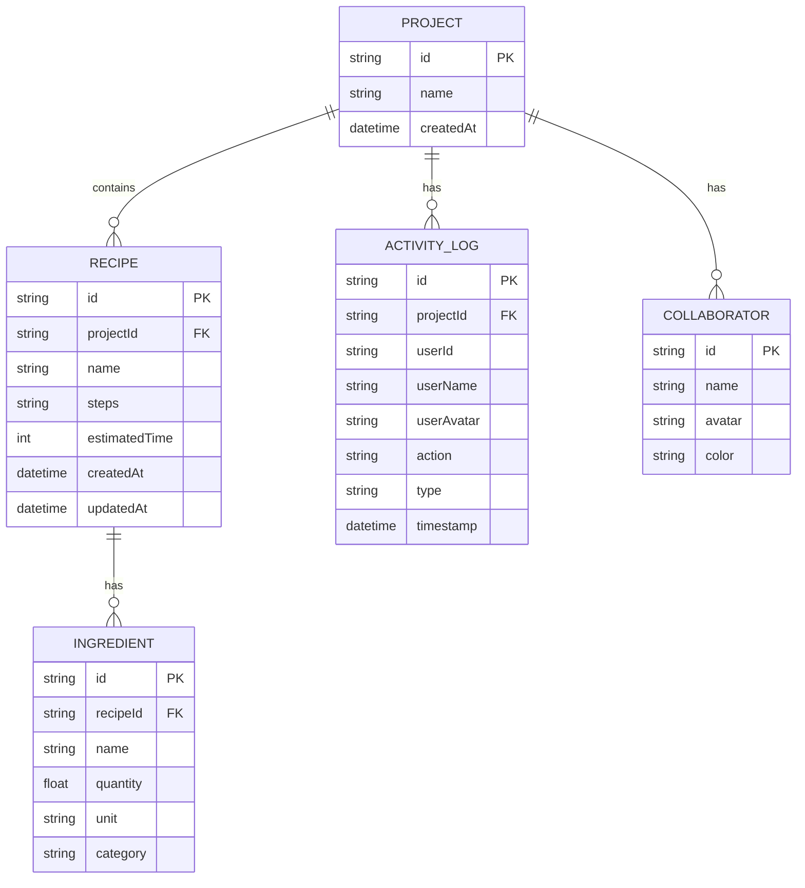

## 1. 架构设计

本应用采用前后端分离架构，前端使用React负责UI渲染和状态管理，后端使用Flask提供REST API和WebSocket实时通信服务。数据存储采用内存存储方案（开发阶段），便于快速迭代。



## 2. 技术描述

### 2.1 前端技术栈
- **核心框架**: React 18 + TypeScript 5.x - 类型安全的组件化开发
- **构建工具**: Vite 5.x - 快速热更新，开发体验优异
- **路由管理**: React Router DOM 6.x - 声明式路由
- **UI组件库**: Ant Design 5.x - 企业级组件，支持主题定制
- **HTTP客户端**: Axios 1.x - 拦截器、请求取消
- **实时通信**: Socket.IO Client 4.x - WebSocket实时同步
- **图表库**: Recharts 2.x - React友好的图表组件
- **PDF生成**: jsPDF 2.x - 客户端PDF导出
- **样式方案**: CSS Modules + Ant Design Theme - 组件级样式隔离

### 2.2 后端技术栈
- **Web框架**: Flask 3.x - 轻量级Python Web框架
- **WebSocket**: Flask-SocketIO 5.x - 实时双向通信
- **CORS处理**: Flask-CORS 4.x - 跨域资源共享
- **数据处理**: Python 3.10+ - 类型提示支持

## 3. 目录结构

```
auto29/
├── index.html                 # 应用入口HTML
├── package.json             # 前端依赖配置
├── vite.config.js        # Vite构建配置
├── tsconfig.json        # TypeScript配置
├── src/
│   ├── main.tsx         # React应用入口
│   ├── App.tsx         # 根组件
│   ├── pages/
│   │   └── ProjectPage.tsx  # 主项目页面
│   ├── components/
│   │   ├── RecipeCard.tsx      # 菜谱卡片组件
│   │   ├── ShoppingList.tsx  # 购物清单组件
│   │   └── ActivityLog.tsx  # 活动日志组件
│   ├── services/
│   │   └── api.ts           # API服务层
│   ├── types/
│   │   └── index.ts         # TypeScript类型定义
│   └── styles/
│       └── global.css       # 全局样式
└── server/
    ├── app.py               # Flask后端应用
    └── requirements.txt     # Python依赖
```

## 4. 路由定义

| 路由 | 页面/组件 | 用途 |
|-------|-----------|------|
| / | ProjectPage | 项目主页，包含所有功能模块 |
| /project/:id | ProjectPage | 指定ID的项目页面 |

## 5. API 接口定义

### 5.1 类型定义

```typescript
// 食材项
interface Ingredient {
  id: string;
  name: string;
  quantity: number;
  unit: string;
  category: string;
}

// 菜谱
interface Recipe {
  id: string;
  name: string;
  ingredients: Ingredient[];
  steps: string;
  estimatedTime: number;
  createdAt: string;
  updatedAt: string;
}

// 购物清单项
interface ShoppingItem {
  name: string;
  totalQuantity: number;
  unit: string;
  category: string;
  recipes: string[];
  isHighlighted?: boolean;
}

// 协作者
interface Collaborator {
  id: string;
  name: string;
  avatar: string;
  cursor?: {
    recipeId: string;
    position: number;
  };
  selection?: {
    recipeId: string;
    start: number;
    end: number;
  };
  color: string;
}

// 活动日志
interface ActivityLog {
  id: string;
  userId: string;
  userName: string;
  userAvatar: string;
  action: string;
  timestamp: string;
  type: 'recipe_add' | 'recipe_edit' | 'recipe_delete' | 'ingredient_edit' | 'shopping_export';
}

// 优化结果
interface OptimizationResult {
  before: ShoppingItem[];
  after: ShoppingItem[];
  savedItems: {
    name: string;
    saved: number;
  }[];
}
```

### 5.2 REST API 定义

| 方法 | 路径 | 描述 | 请求体 | 响应体 |
|------|------|------|--------|--------|
| GET | `/api/projects/:id` | 获取项目详情 | - | `{ recipes: Recipe[], logs: ActivityLog[] }` |
| POST | `/api/projects/:id/recipes` | 添加菜谱 | `Recipe` | `Recipe` |
| PUT | `/api/projects/:id/recipes/:rid` | 更新菜谱 | `Partial<Recipe>` | `Recipe` |
| DELETE | `/api/projects/:id/recipes/:rid` | 删除菜谱 | - | `{ success: boolean }` |
| GET | `/api/projects/:id/shopping-list` | 获取购物清单 | - | `ShoppingItem[]` |
| POST | `/api/projects/:id/optimize` | 智能优化购物清单 | `ShoppingItem[]` | `OptimizationResult` |
| GET | `/api/projects/:id/logs` | 获取活动日志 | - | `ActivityLog[]` |

### 5.3 WebSocket 事件定义

| 事件名 | 方向 | 数据 | 描述 |
|--------|------|------|------|
| `join_project` | 客户端→服务端 | `{ projectId, user }` | 用户加入项目 |
| `leave_project` | 客户端→服务端 | `{ projectId, userId }` | 用户离开项目 |
| `cursor_update` | 双向 | `{ userId, recipeId, position }` | 光标位置更新 |
| `selection_update` | 双向 | `{ userId, recipeId, start, end }` | 选中文本更新 |
| `recipe_update` | 双向 | `{ recipe, userId }` | 菜谱内容更新 |
| `ingredient_update` | 双向 | `{ recipeId, ingredient, userId }` | 食材用量更新 |
| `user_presence` | 服务端→客户端 | `Collaborator[]` | 在线用户列表 |
| `activity_log` | 服务端→客户端 | `ActivityLog` | 新活动日志 |

## 6. 性能指标

| 操作 | 响应时间要求 | 实现方案 |
|------|-------------|----------|
| 本地状态更新 | ≤200ms | React useState/useReducer 本地状态管理 |
| 实时同步延迟 | ≤500ms | WebSocket 即时推送 + 防抖节流优化 |
| 购物清单优化 | ≤300ms | 后端内存计算 + 结果缓存 |
| 页面首次加载 | ≤2s | 代码分割 + 懒加载 + 骨架屏 |

## 7. 数据模型


