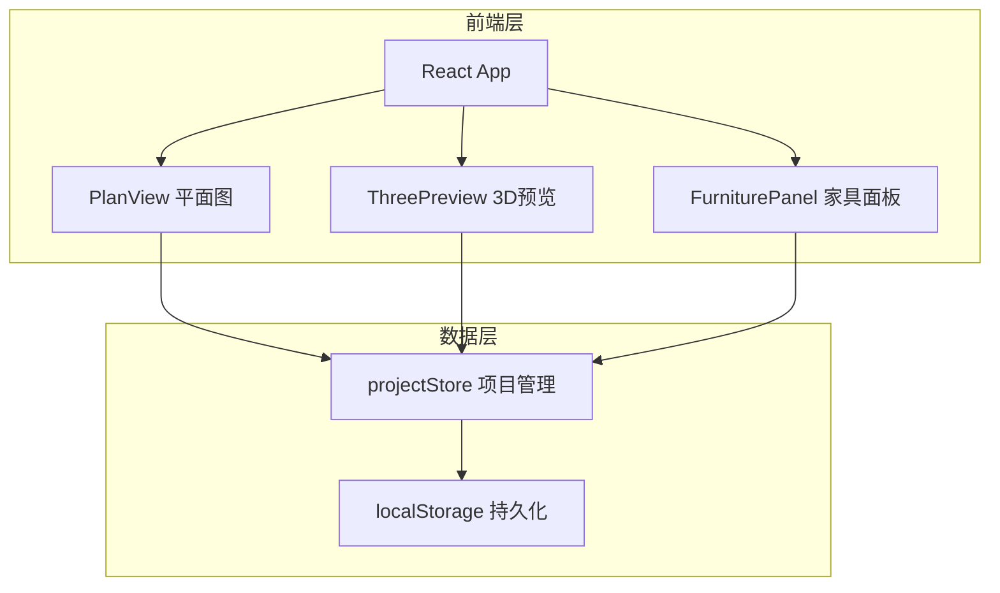
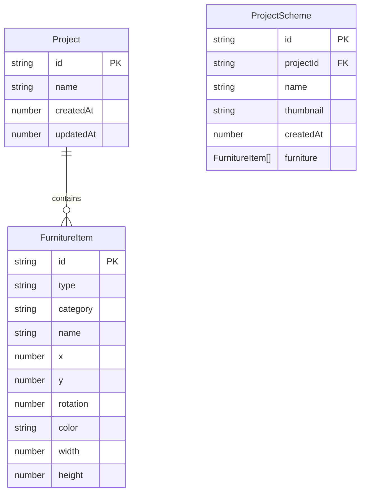

## 1. 架构设计

## 2. 技术说明

- 前端：React 18 + TypeScript + Vite
- 初始化工具：vite-init（react-ts 模板）
- 状态管理：Zustand（全局共享家具数据和项目状态）
- 样式：Tailwind CSS
- 后端：无（纯前端应用）
- 数据库：localStorage（JSON格式持久化）
- 3D渲染：CSS 3D变换实现等距视角（不使用 Three.js）

## 3. 路由定义

| 路由 | 用途 |
|------|------|
| / | 设计工作台（唯一页面，含平面图、3D预览、家具面板） |

## 4. 数据模型

### 4.1 数据模型定义

### 4.2 数据定义

- FurnitureItem：家具项，含唯一ID、类型、分类（seating/bedding/cabinet/lighting）、名称、位置(x,y)、旋转角度、颜色、尺寸
- ProjectScheme：设计方案，含唯一ID、项目ID、名称、缩略图(base64)、创建时间、家具列表快照
- 所有数据以 JSON 格式存储在 localStorage 中，键名为 `interior_design_projects`

## 5. 文件组织

| 文件 | 职责 |
|------|------|
| src/types.ts | 类型定义（FurnitureItem, ProjectScheme, Category等） |
| src/data/projectStore.ts | Zustand store，家具CRUD、方案管理、localStorage读写 |
| src/components/PlanView.tsx | Canvas网格渲染、家具拖拽吸附、旋转、多选、删除 |
| src/components/ThreePreview.tsx | CSS等距3D渲染、视角旋转缩放、漫游动画 |
| src/components/FurniturePanel.tsx | 家具分类列表、折叠展开、拖拽添加 |
| src/main.tsx | React根组件、应用初始化 |
| src/App.tsx | 主布局、顶栏、组合各子组件 |
