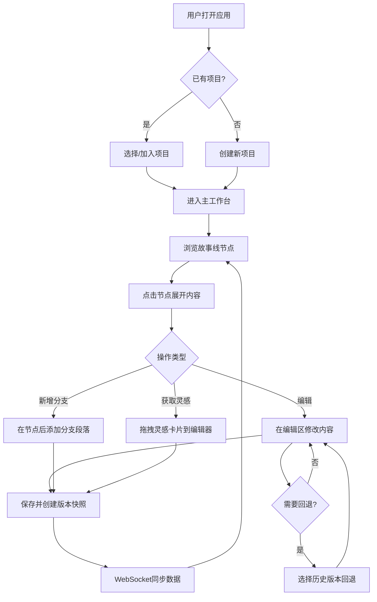

## 1. 产品概述

创意写作故事接龙与脑暴协作平台——为写作爱好者和小型创作团队打造的集体创作工具，解决思路中断、版本管理混乱、灵感记录零散三大痛点。通过可视化故事线、富文本编辑与版本快照、灵感卡片系统，让多人协作写作变得流畅有序。

- 目标用户：写作爱好者、小型创作团队、文学社团、创意写作课程师生
- 核心价值：将分散的集体创作过程结构化，提供从灵感到成稿的完整工作流

## 2. 核心功能

### 2.1 用户角色
| 角色 | 注册方式 | 核心权限 |
|------|----------|----------|
| 创作者 | 自由加入 | 创建/加入项目、编辑段落、使用灵感卡片 |
| 项目发起人 | 创建项目自动成为 | 除创作者权限外，可管理项目成员和主线设定 |

### 2.2 功能模块
1. **主工作台页面**：三面板布局——左侧故事线面板、中间编辑区、右侧灵感面板
2. **项目管理**：创建/加入故事项目，项目列表与切换

### 2.3 页面详情
| 页面名称 | 模块名称 | 功能描述 |
|----------|----------|----------|
| 主工作台 | 故事线面板(30%) | 时间线展示主故事线节点，支持分支可视化、点击展开节点、添加分支段落，分支用不同颜色线条连接 |
| 主工作台 | 编辑区(55%) | Notion风格块级富文本编辑器，支持标题/粗体/斜体/列表/引用块，字数统计与目标字数进度条，版本快照与回退(最多5个版本) |
| 主工作台 | 灵感面板(15%) | 灵感卡片瀑布流展示，支持关键词搜索和按类型(人物/场景/事件)筛选，拖拽卡片到编辑器自动插入内容 |
| 主工作台 | 顶部导航栏 | 项目名称、切换项目、成员头像组、在线状态指示 |

## 3. 核心流程

用户打开应用 → 创建/加入故事项目 → 在左侧故事线面板浏览时间线节点 → 点击节点在编辑区查看/编辑内容 → 在节点后方添加新分支段落 → 从右侧灵感面板拖拽卡片激发灵感 → 保存段落自动创建版本快照 → 需要时回退到历史版本 → 多用户通过WebSocket实时同步光标与数据

## 4. 用户界面设计

### 4.1 设计风格
- **主色调**：深色主题 `#1a1a2e`、`#16213e`、`#0f3460` 三级深蓝渐变
- **高亮色**：`#e94560` 暖红粉用于按钮和关键交互元素
- **分支颜色**：主线深蓝色 `#0f3460`，分支依次为橙色 `#e94560`、绿色 `#2ecc71`、紫色 `#9b59b6` 循环
- **按钮风格**：圆角8px，高亮色填充，hover时发光效果
- **字体**：正文使用 Noto Sans SC（中文优先），标题使用 Playfair Display（文学气质），代码/辅助信息使用 JetBrains Mono
- **布局风格**：三面板分栏，左侧面板可弹性收起，卡片式节点展示
- **图标风格**：线性图标（Lucide），1.5px描边

### 4.2 页面设计概览
| 页面名称 | 模块名称 | UI元素 |
|----------|----------|--------|
| 主工作台 | 故事线面板 | 竖向时间线布局，节点卡片左侧圆点+连线，分支用彩色弧线连接，弹性回弹滚动，节点hover微放大 |
| 主工作台 | 编辑区 | 块级编辑风格段落分割线，顶部工具栏（格式化按钮），底部字数统计条与进度条，版本快照下拉面板 |
| 主工作台 | 灵感面板 | 瀑布流卡片布局，顶部搜索框+类型筛选标签，卡片hover上浮阴影，拖拽时半透明跟随 |
| 主工作台 | 顶部导航 | 项目名称居左，成员头像组+在线指示居右，毛玻璃背景 |

### 4.3 响应式设计
- 桌面优先（≥1200px）：三面板完整展示
- 平板（900-1200px）：灵感面板收窄
- 移动端（<900px）：灵感面板折叠为右侧边缘悬浮按钮，点击弹出抽屉面板，过渡300ms cubic-bezier(0.4, 0, 0.2, 1)
- 节点添加/切换时内容从底部向上滑入动画
- 所有面板切换和展开/收起过渡300ms cubic-bezier(0.4, 0, 0.2, 1)

### 4.4 动画与交互
- 节点切换：内容区域从底部滑入（translateY 100% → 0，300ms）
- 灵感卡片拖入编辑器：淡入动画（opacity 0 → 1，200ms）
- 面板过渡：300ms cubic-bezier(0.4, 0, 0.2, 1)
- 滚动弹性回弹：overscroll-behavior-y: contain + 自定义弹性效果
- 版本快照切换：内容区域淡入淡出
