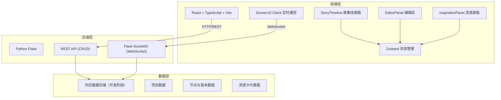
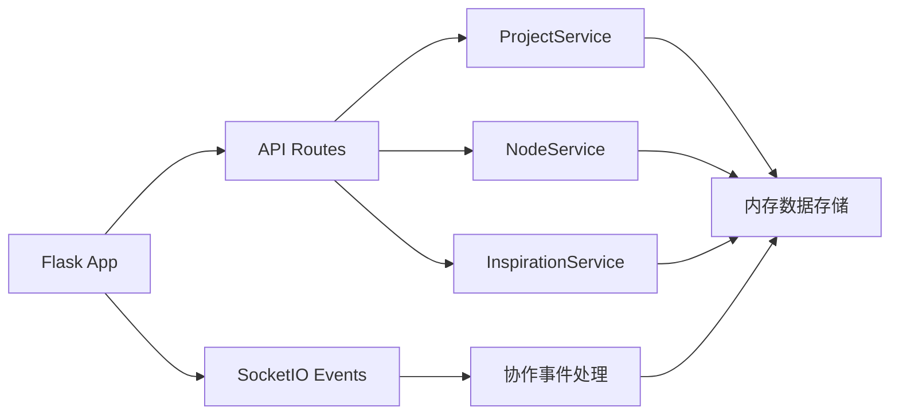
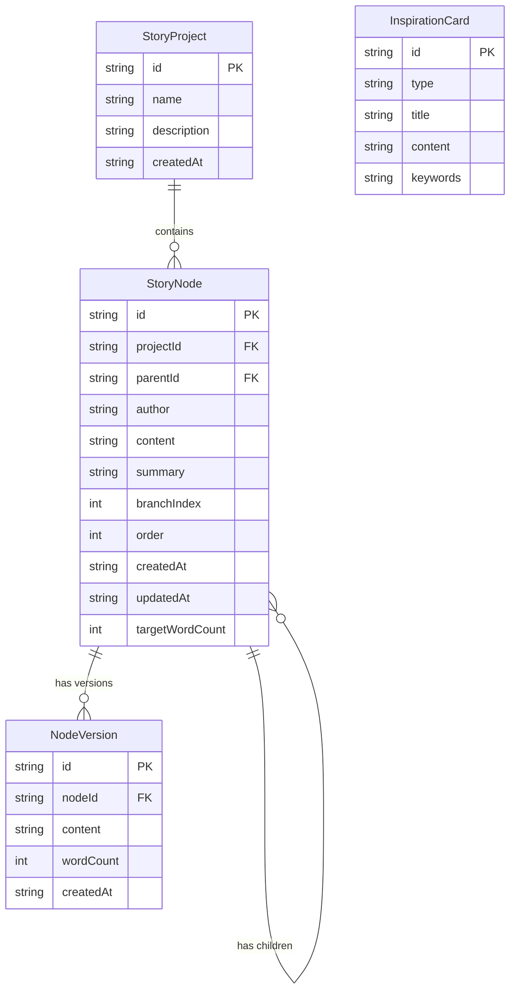

## 1. 架构设计



## 2. 技术说明
- **前端**：React 18 + TypeScript + Vite + TailwindCSS + Zustand
- **初始化工具**：vite-init（react-ts模板）
- **后端**：Python Flask + Flask-SocketIO + Flask-CORS
- **数据库**：开发阶段使用内存数据存储，后端启动时预置示例数据
- **富文本编辑器**：react-quill（基于Quill.js）
- **实时通信**：Socket.IO（前端socket.io-client，后端flask-socketio）

## 3. 路由定义
| 路由 | 用途 |
|------|------|
| / | 主工作台页面，包含三面板布局 |

## 4. API 定义

### REST API

#### 项目相关
| 方法 | 路径 | 描述 |
|------|------|------|
| GET | /api/projects | 获取所有项目列表 |
| POST | /api/projects | 创建新项目 |
| GET | /api/projects/:id | 获取项目详情（含所有节点） |

#### 节点相关
| 方法 | 路径 | 描述 |
|------|------|------|
| GET | /api/nodes/:projectId | 获取项目的所有节点 |
| POST | /api/nodes | 创建新节点 |
| PUT | /api/nodes/:id | 更新节点内容（自动创建版本快照） |
| GET | /api/nodes/:id/versions | 获取节点的版本历史 |

#### 灵感卡片相关
| 方法 | 路径 | 描述 |
|------|------|------|
| GET | /api/inspirations | 获取所有灵感卡片 |
| GET | /api/inspirations/random | 获取随机灵感卡片 |
| POST | /api/inspirations/generate | 生成新的灵感卡片 |

### WebSocket 事件
| 事件名 | 方向 | 描述 |
|--------|------|------|
| join_project | Client→Server | 加入项目房间 |
| leave_project | Client→Server | 离开项目房间 |
| cursor_update | Client→Server | 广播光标位置 |
| node_updated | Server→Client | 节点内容更新通知 |
| node_added | Server→Client | 新节点添加通知 |

### TypeScript 类型定义

```typescript
interface StoryNode {
  id: string;
  projectId: string;
  parentId: string | null;
  author: string;
  content: string;
  summary: string;
  branchIndex: number;
  order: number;
  createdAt: string;
  updatedAt: string;
  targetWordCount: number;
  versions: NodeVersion[];
}

interface NodeVersion {
  id: string;
  nodeId: string;
  content: string;
  wordCount: number;
  createdAt: string;
}

interface InspirationCard {
  id: string;
  type: 'character' | 'scene' | 'event';
  title: string;
  content: string;
  keywords: string[];
}

interface StoryProject {
  id: string;
  name: string;
  description: string;
  createdAt: string;
  nodes: StoryNode[];
  members: string[];
}
```

## 5. 服务器架构图



## 6. 数据模型

### 6.1 数据模型定义



### 6.2 前端文件结构
```
├── package.json
├── vite.config.js
├── tsconfig.json
├── index.html
├── server.py                  # Flask后端入口
├── src/
│   ├── main.tsx               # React应用入口
│   ├── App.tsx                # 主布局组件
│   ├── types.ts               # 类型定义
│   ├── api/
│   │   └── storyApi.ts        # API通信层
│   ├── components/
│   │   ├── StoryTimeline.tsx   # 故事线面板
│   │   ├── EditorPanel.tsx     # 编辑区
│   │   └── InspirationPanel.tsx # 灵感面板
│   └── store/
│       └── useStoryStore.ts    # Zustand状态管理
└── requirements.txt            # Python依赖
```
