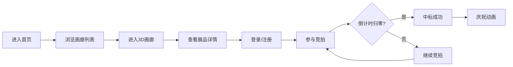

## 1. 产品概述

在线多人虚拟画廊展览与艺术品拍卖平台，为艺术爱好者提供沉浸式3D画廊浏览体验和实时艺术品竞拍功能。用户可创建个人虚拟画廊、上传艺术品、浏览他人作品，并参与实时拍卖。

- 核心价值：打破物理空间限制，让艺术品展示与交易在线上实现全球化、实时化
- 目标用户：艺术收藏家、艺术家、画廊经营者、艺术爱好者

## 2. 核心功能

### 2.1 用户角色

| 角色 | 注册方式 | 核心权限 |
|------|----------|----------|
| 普通用户 | 用户名密码注册 | 浏览画廊、参与竞拍、创建画廊、上传艺术品 |

### 2.2 功能模块

1. **画廊浏览**：公开画廊列表、3D画廊详情、展品详情模态框
2. **展览创建**：画廊创建表单、展品上传、实时预览
3. **拍卖大厅**：实时竞拍列表、出价操作、倒计时、价格动画
4. **用户中心**：个人资料、我的画廊、出价记录、收藏管理
5. **用户认证**：注册、登录、JWT令牌管理

### 2.3 页面详情

| 页面名称 | 模块名称 | 功能描述 |
|----------|----------|----------|
| 画廊列表 | GalleryList | 拉取50+画廊数据，缩略图网格展示，封面/标题/作者/展品数 |
| 画廊详情 | GalleryDetail | 3D旋转立方体展品排列，悬停放大，点击弹窗详情 |
| 展览创建 | GalleryCreate | 两列布局：表单面板+实时预览，卡片翻转动画 |
| 拍卖大厅 | AuctionRoom | 实时竞拍列表，倒计时升序排列，价格翻转动画，出价按钮 |
| 用户中心 | UserProfile | 卡片式布局，画廊管理，出价记录，资料编辑 |
| 登录注册 | AuthPage | 平滑滑入动画，错误渐变提示，JWT存储 |

## 3. 核心流程

用户进入首页 → 浏览公开画廊列表 → 点击进入3D画廊 → 查看展品详情 → 参与竞拍（需登录）→ 倒计时结束 → 出价最高者中标 → 弹窗庆祝

## 4. 用户界面设计

### 4.1 设计风格

- **主背景**：#1a1a2e（深蓝紫色）
- **次要背景**：#16213e（深海蓝）
- **强调色**：#e94560（玫红色）
- **辅助色**：#0f3460（深靛蓝）
- **字体**：系统默认无衬线字体
- **按钮**：圆角8px，悬停时从#e94560渐变为亮红色，点击缩放0.95倍
- **卡片**：圆角16px，微弱阴影，悬停阴影加深+上移5px，过渡0.3s ease
- **导航栏**：固定顶部，半透明毛玻璃效果，下划线高亮动画

### 4.2 页面设计概览

| 页面名称 | 模块名称 | UI元素 |
|----------|----------|--------|
| 画廊列表 | GalleryList | 搜索框、筛选器、缩略图网格、分页加载、旋转加载动画 |
| 画廊详情 | GalleryDetail | 3D立方体网格、背景星空效果、展品模态框（模糊背景+缩放动画） |
| 拍卖大厅 | AuctionRoom | 竞拍卡片、倒计时闪烁（最后5秒红色）、价格翻转动画、五彩纸屑庆祝 |
| 用户中心 | UserProfile | 头像卡片、画廊网格、出价记录列表、编辑表单 |
| 登录注册 | AuthPage | 表单滑入、错误红色渐变、输入框聚焦动画 |

### 4.3 响应式

- 桌面端优先设计，移动端自适应
- 视口<768px时：画廊详情3D转2D列表、拍卖大厅垂直布局、导航栏折叠
- 触摸优化：增大点击区域、移除悬停效果、添加触摸反馈

### 4.4 3D场景指导

- **环境**：深色渐变背景，微妙噪点纹理
- **立方体**：CSS 3D变换，6面展示展品缩略图，持续Y轴旋转
- **灯光**：CSS box-shadow模拟打光效果，悬停时增强阴影
- **相机**：perspective: 1000px，transform-style: preserve-3d
- **动画**：旋转动画8秒/圈，悬停暂停+scale(1.2)
- **性能**：低端设备降级为2D静态展示，requestAnimationFrame控制帧率
