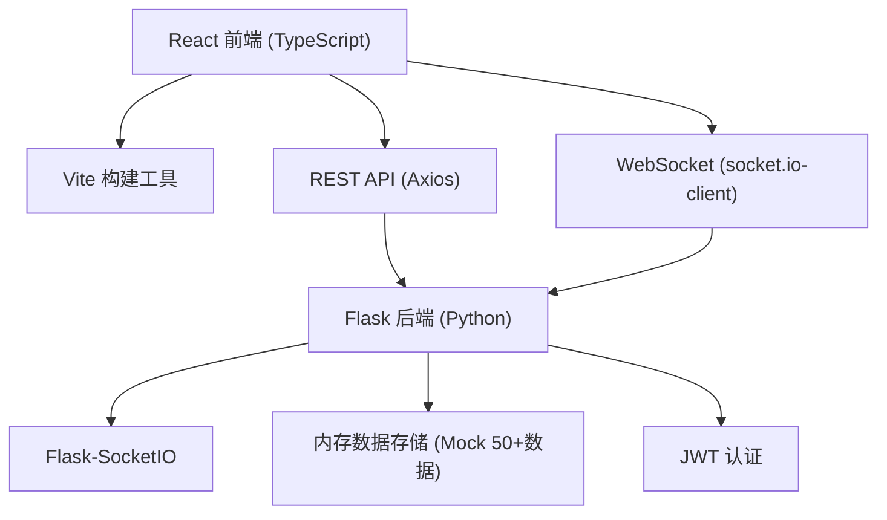
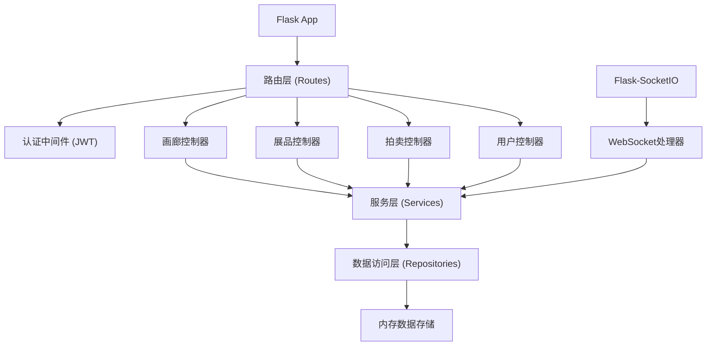
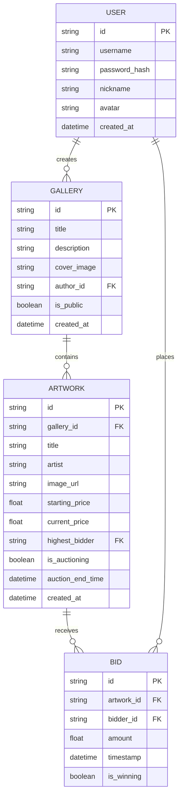

## 1. 架构设计



## 2. 技术栈描述

- **前端**：React 18 + TypeScript + Vite 5 + React Router 6 + Zustand
- **HTTP客户端**：Axios（带JWT拦截器）
- **实时通信**：socket.io-client
- **样式方案**：CSS Modules + CSS 变量
- **后端**：Python Flask + Flask-SocketIO + Flask-JWT-Extended
- **数据存储**：内存字典存储（Mock数据，演示用）
- **状态管理**：Zustand（轻量级，避免Redux复杂度）

## 3. 路由定义

| 路由 | 页面 | 组件 |
|------|------|------|
| / | 画廊列表 | GalleryList |
| /gallery/:id | 画廊详情 | GalleryDetail |
| /gallery/create | 创建画廊 | GalleryCreate |
| /auction | 拍卖大厅 | AuctionRoom |
| /profile | 用户中心 | UserProfile |
| /login | 登录 | AuthPage |
| /register | 注册 | AuthPage |

## 4. API 定义

### 4.1 TypeScript 类型定义

```typescript
interface User {
  id: string;
  username: string;
  nickname: string;
  avatar: string;
  galleriesCount: number;
  favoritesCount: number;
}

interface Gallery {
  id: string;
  title: string;
  description: string;
  coverImage: string;
  authorId: string;
  authorName: string;
  authorAvatar: string;
  artworksCount: number;
  isPublic: boolean;
  createdAt: string;
}

interface Artwork {
  id: string;
  galleryId: string;
  title: string;
  artist: string;
  imageUrl: string;
  startingPrice: number;
  currentPrice: number;
  highestBidder: string | null;
  isAuctioning: boolean;
  auctionEndTime: string | null;
  createdAt: string;
}

interface Bid {
  id: string;
  artworkId: string;
  artworkTitle: string;
  bidderId: string;
  bidderName: string;
  amount: number;
  timestamp: string;
  isWinning: boolean;
}
```

### 4.2 REST API 接口

| 方法 | 路径 | 描述 | 认证 |
|------|------|------|------|
| POST | /api/auth/register | 用户注册 | 否 |
| POST | /api/auth/login | 用户登录 | 否 |
| GET | /api/galleries | 获取画廊列表（50+） | 否 |
| GET | /api/galleries/:id | 获取画廊详情 | 否 |
| POST | /api/galleries | 创建画廊 | 是 |
| PUT | /api/galleries/:id | 更新画廊 | 是 |
| DELETE | /api/galleries/:id | 删除画廊 | 是 |
| GET | /api/artworks/:id | 获取展品详情 | 否 |
| POST | /api/artworks | 添加展品 | 是 |
| GET | /api/user/profile | 获取用户信息 | 是 |
| PUT | /api/user/profile | 更新用户信息 | 是 |
| GET | /api/user/galleries | 获取我的画廊 | 是 |
| GET | /api/user/bids | 获取我的出价记录 | 是 |
| GET | /api/auctions | 获取拍卖中展品 | 否 |

### 4.3 WebSocket 事件

| 事件名 | 方向 | 描述 |
|--------|------|------|
| join_auction | 客户端→服务端 | 加入拍卖房间 |
| leave_auction | 客户端→服务端 | 离开拍卖房间 |
| place_bid | 客户端→服务端 | 提交出价 |
| bid_update | 服务端→客户端 | 价格更新广播 |
| countdown_update | 服务端→客户端 | 倒计时更新 |
| auction_end | 服务端→客户端 | 拍卖结束通知 |

## 5. 后端架构



## 6. 数据模型

### 6.1 ER 图



### 6.2 Mock 数据生成

后端启动时生成50+条画廊Mock数据，每条画廊包含5-10件艺术品：

- 画廊名称：使用艺术风格+场景组合（如"印象派花园"、"现代都市画廊"）
- 艺术家名字：随机中西艺术家名
- 起拍价：1000-100000元随机
- 图片URL：使用 picsum.photos 随机图片
- 时间戳：最近30天内随机

## 7. 性能优化方案

| 优化点 | 方案 | 目标 |
|--------|------|------|
| 首屏渲染 | 代码分割、路由懒加载、骨架屏 | FCP < 1.2s |
| 3D动画 | CSS transform + will-change、低端设备降级2D | FPS ≥ 30 |
| WebSocket | 消息防抖、批量更新、本地状态缓存 | 延迟 < 200ms |
| 列表渲染 | 虚拟滚动（50+数据）、图片懒加载 | 首次渲染 < 1.5s |
| 动画性能 | transform/opacity动画、避免layout thrashing | 流畅60fps |

## 8. 目录结构

```
├── package.json
├── vite.config.js
├── tsconfig.json
├── index.html
├── src/
│   ├── main.tsx
│   ├── App.tsx
│   ├── store/
│   │   └── useAuthStore.ts
│   ├── modules/
│   │   ├── gallery/
│   │   │   ├── GalleryList.tsx
│   │   │   ├── GalleryDetail.tsx
│   │   │   └── GalleryCreate.tsx
│   │   ├── auction/
│   │   │   ├── AuctionRoom.tsx
│   │   │   └── AuctionService.ts
│   │   ├── user/
│   │   │   ├── UserProfile.tsx
│   │   │   └── AuthPage.tsx
│   │   └── common/
│   │       ├── Navbar.tsx
│   │       ├── ArtworkCube.tsx
│   │       ├── Modal.tsx
│   │       └── LoadingSpinner.tsx
│   ├── services/
│   │   └── api.ts
│   ├── utils/
│   │   └── helpers.ts
│   └── styles/
│       ├── globals.css
│       └── variables.css
├── server/
│   ├── app.py
│   ├── requirements.txt
│   ├── mock_data.py
│   ├── models.py
│   └── websocket.py
```
