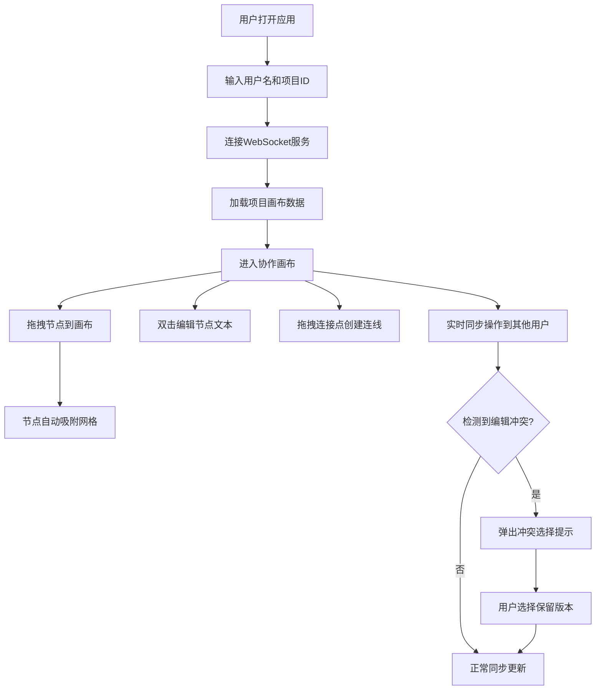

## 1. 产品概述

FlowCollab 是一款多人实时协作流程图绘制应用，解决团队在项目规划或架构设计时，传统白板画图难以同步、版本混乱且缺乏结构化保存的痛点。通过 WebSocket 实现毫秒级实时同步，提供无限画布和丰富的节点类型，支持多人同时编辑并智能处理版本冲突。

- 核心目标：为团队提供高效、流畅、实时的流程图协作体验
- 目标用户：产品经理、架构师、开发团队、项目管理者
- 市场价值：替代传统白板工具，提供结构化数据存储和版本管理

## 2. 核心功能

### 2.1 用户角色
| 角色 | 加入方式 | 核心权限 |
|------|----------|----------|
| 协作用户 | 通过项目ID加入 | 创建/编辑/删除节点和连线、实时查看其他用户操作 |

### 2.2 功能模块
1. **项目管理**：创建项目、加入项目
2. **无限画布**：拖拽平移、滚轮缩放、网格吸附
3. **节点系统**：6种节点类型、文本编辑、样式调整
4. **连线系统**：贝塞尔曲线、箭头指示、可调节弯曲度
5. **实时协作**：多用户光标显示、操作实时同步、冲突检测
6. **状态展示**：用户数统计、节点/连线数量、项目信息

### 2.3 页面详情
| 页面名称 | 模块名称 | 功能描述 |
|----------|----------|----------|
| 主画布页 | 无限画布区域 | 占界面90%以上，支持拖拽平移、滚轮缩放（0.3s缓动）、网格吸附（30px间距） |
| 主画布页 | 左侧工具栏 | 半透明悬浮面板（240px宽），展示6种节点类型，支持拖拽添加 |
| 主画布页 | 节点编辑器 | 双击节点弹出，支持粗体、斜体、字体大小（12-24px）调整 |
| 主画布页 | 底部状态栏 | 显示当前用户数、节点数、连线数 |
| 主画布页 | 左上角信息栏 | 显示项目名称和用户头像 |

## 3. 核心流程

## 4. 用户界面设计

### 4.1 设计风格
- **主色调**：深色主题，背景色 #1e1e2e，文字色 #cdd6f4
- **强调色**：蓝色 #89b4fa（选中状态、连线高亮）
- **中性色**：灰色 #6c7086（默认连线、边框）
- **节点样式**：6种几何形状（开始/结束圆形、矩形、菱形、平行四边形、圆角矩形、六边形）
- **动画效果**：节点添加放大出现、删除收缩消失、缩放0.3s缓动
- **字体**：现代无衬线字体，支持粗体和斜体样式

### 4.2 页面设计概览
| 页面名称 | 模块名称 | UI元素 |
|----------|----------|--------|
| 主画布页 | 画布区域 | 深色背景、网格点、节点（多种形状）、贝塞尔连线、用户光标（带用户名标签的半透明圆形+渐隐轨迹） |
| 主画布页 | 左侧工具栏 | 半透明背景、节点类型图标列表、拖拽效果、悬浮高亮 |
| 主画布页 | 节点编辑器 | 居中弹窗、文本输入区、粗体/斜体按钮、字体大小滑块、保存/取消按钮 |
| 主画布页 | 底部状态栏 | 半透明条、用户数图标、节点数、连线数 |
| 主画布页 | 左上角信息 | 项目名称文字、用户头像圆形 |

### 4.3 响应式
- 桌面端优先设计，最小宽度 768px
- 画布自动填满剩余空间
- 平板适配：工具栏保持悬浮，状态栏自适应宽度
- 触屏设备：支持双指缩放和平移

### 4.4 性能指标
- 50个节点 + 80条连线时保持 30fps 以上
- 缩放拖拽操作流畅无卡顿
- 实时同步延迟 < 100ms
