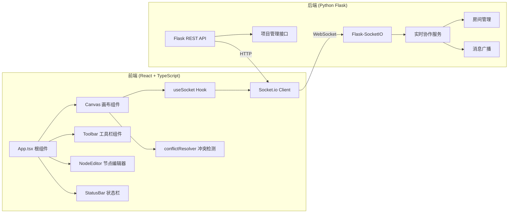

## 1. 架构设计



## 2. 技术栈说明

- **前端框架**：React 18 + TypeScript
- **构建工具**：Vite
- **实时通信**：Socket.io Client
- **HTTP请求**：Axios
- **后端框架**：Python Flask + Flask-CORS + Flask-SocketIO
- **异步服务**：Eventlet
- **状态管理**：React useState + useReducer（轻量级场景）
- **样式方案**：CSS Modules / 内联样式 + CSS 变量

## 3. 文件结构

### 前端
```
src/
├── main.tsx              # React 主入口
├── App.tsx               # 根组件，状态管理
├── components/
│   ├── Canvas.tsx        # 核心画布组件
│   ├── Toolbar.tsx       # 左侧工具栏
│   └── NodeEditor.tsx    # 节点编辑弹窗
├── hooks/
│   └── useSocket.ts      # WebSocket Hook
└── utils/
    └── conflictResolver.ts  # 冲突检测工具
```

### 后端
```
app.py                    # Flask 应用入口
```

## 4. 数据模型

### 4.1 节点 (Node)
```typescript
interface FlowNode {
  id: string;
  type: 'start' | 'process' | 'decision' | 'io' | 'subprocess' | 'preparation';
  x: number;
  y: number;
  width: number;
  height: number;
  text: string;
  fontSize: number;
  isBold: boolean;
  isItalic: boolean;
  version: number;
  lastModifiedBy: string;
  lastModifiedAt: number;
}
```

### 4.2 连线 (Edge)
```typescript
interface FlowEdge {
  id: string;
  sourceId: string;
  targetId: string;
  curveOffset: number;
  version: number;
}
```

### 4.3 项目 (Project)
```typescript
interface Project {
  id: string;
  name: string;
  nodes: FlowNode[];
  edges: FlowEdge[];
  users: User[];
}
```

### 4.4 用户 (User)
```typescript
interface User {
  id: string;
  name: string;
  color: string;
  cursorX: number;
  cursorY: number;
}
```

## 5. API 定义

### 5.1 RESTful API

| 方法 | 路径 | 描述 | 请求体 | 响应 |
|------|------|------|--------|------|
| POST | /api/projects | 创建项目 | `{ name: string, userId: string, userName: string }` | `{ projectId: string, project: Project }` |
| GET | /api/projects/:id | 获取项目数据 | - | `{ project: Project }` |
| POST | /api/projects/:id/join | 加入项目 | `{ userId: string, userName: string }` | `{ project: Project }` |

### 5.2 Socket.IO 事件

#### 客户端发送
- `join_project`: 加入项目房间 `{ projectId, userId, userName }`
- `leave_project`: 离开项目房间
- `cursor_move`: 光标移动 `{ x, y }`
- `node_add`: 新增节点 `{ node }`
- `node_update`: 更新节点 `{ node }`
- `node_delete`: 删除节点 `{ nodeId }`
- `edge_add`: 新增连线 `{ edge }`
- `edge_update`: 更新连线 `{ edge }`
- `edge_delete`: 删除连线 `{ edgeId }`

#### 服务端广播
- `user_joined`: 用户加入 `{ user }`
- `user_left`: 用户离开 `{ userId }`
- `cursor_update`: 光标更新 `{ userId, x, y }`
- `node_added`: 节点新增 `{ node }`
- `node_updated`: 节点更新 `{ node }`
- `node_deleted`: 节点删除 `{ nodeId }`
- `edge_added`: 连线新增 `{ edge }`
- `edge_updated`: 连线更新 `{ edge }`
- `edge_deleted`: 连线删除 `{ edgeId }`
- `conflict_detected`: 冲突检测 `{ nodeId, localVersion, remoteVersion, remoteUser }`

## 6. 核心算法

### 6.1 网格吸附
```
snapToGrid(value: number, gridSize: number): number
  return Math.round(value / gridSize) * gridSize
```

### 6.2 贝塞尔曲线计算
- 控制点计算：基于源点和目标点位置，自动计算贝塞尔曲线控制点
- 弯曲度调节：通过 curveOffset 参数调整控制点偏移量

### 6.3 冲突检测
- 基于版本号 (version) 的乐观锁机制
- 保存时比较本地版本与服务器版本
- 版本不一致时触发冲突提示，由用户选择保留版本

## 7. 性能优化

- 使用 CSS transform 进行画布平移缩放，启用 GPU 加速
- 节点和连线使用 CSS transitions 实现动画效果
- 光标位置节流发送（每 50ms 最多一次）
- 画布视口外的节点延迟渲染（可视区域优化）
- 使用 requestAnimationFrame 确保动画流畅
