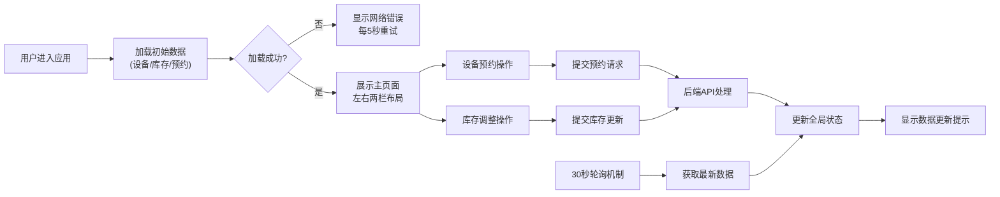

## 1. 产品概述

共享厨房资源调度与食材库存管理系统，解决多个小组同时使用社区共享厨房时的设备预约冲突和食材库存管理问题。通过实时协作工具协调资源，提高厨房使用效率。

- 核心目标：解决设备预约冲突、实时管理食材库存、提供历史记录追溯
- 目标用户：共享厨房各使用小组管理员及成员
- 市场价值：提升共享厨房资源利用率，减少浪费，增强社区协作体验

## 2. 核心功能

### 2.1 用户角色
| 角色 | 注册方式 | 核心权限 |
|------|----------|----------|
| 普通用户 | 无需注册，直接使用 | 查看设备状态、预约设备、管理库存、查看历史记录 |

### 2.2 功能模块
1. **设备预约面板**：设备类型标签页、时段网格展示、预约表单弹窗
2. **食材库存管理面板**：食材表格展示、库存调整、阈值警告
3. **历史预约记录**：折叠面板、按日期分组、设备类型过滤
4. **实时同步机制**：30秒轮询更新、数据变更提示

### 2.3 页面详情
| 页面名称 | 模块名称 | 功能描述 |
|---------|----------|----------|
| 主页面 | 设备预约面板 | 按设备类型分组展示可预约时段，30分钟间隔，点击空闲时段提交预约 |
| 主页面 | 库存管理面板 | 表格展示食材库存，支持折叠分类，加减按钮调整库存，进度条实时更新 |
| 主页面 | 历史记录面板 | 展示过去7天预约记录，支持按设备类型过滤，点击查看详情弹窗 |
| 主页面 | 数据同步提示 | 顶部提示条显示数据更新状态，3秒渐隐动画 |

## 3. 核心流程

用户进入应用后，系统自动从后端加载设备列表、库存数据和预约列表。用户可在左侧预约面板选择设备类型和日期，查看时段占用情况，点击空闲时段填写小组名和用途提交预约。在右侧库存面板查看和调整食材库存，库存低于阈值时显示警告。系统每30秒自动轮询更新数据，确保所有用户看到一致状态。

## 4. 用户界面设计

### 4.1 设计风格
- **主色调**：浅灰背景 #f5f5f5，深灰文字 #333
- **设备分类色块**：烤箱 #ff8c00、灶台 #e74c3c、微波炉 #3498db、冰箱 #2ecc71
- **字体**：'Inter' Sans-Serif，温暖自然的视觉体验
- **按钮样式**：圆角设计，hover时背景色加深10%，点击有波纹扩散效果
- **布局风格**：桌面端左右两栏布局，移动端垂直堆叠
- **图标风格**：使用Emoji作为食材图标，简洁直观

### 4.2 页面设计概述
| 页面名称 | 模块名称 | UI元素 |
|---------|----------|--------|
| 主页面 | 设备预约面板 | 横向标签页(设备类型)、日期选择器、时段网格(60x40px卡片，间距4px)、绿色空闲/红色已预约/灰色不可用 |
| 主页面 | 库存管理面板 | 分类折叠面板、食材表格(Emoji图标、名称、库存量、阈值、进度条)、加减按钮 |
| 主页面 | 预约表单弹窗 | 居中显示、圆角设计、半透明遮罩、中心放大过渡动画(0.25秒) |
| 主页面 | 历史记录面板 | 折叠展开、按日期分组、设备类型下拉过滤、详情弹窗 |
| 主页面 | 数据提示条 | 顶部固定、渐隐动画(3秒) |

### 4.3 响应式
- **桌面端**(>768px)：左右两栏布局，左侧预约面板，右侧库存面板
- **移动端**(<768px)：两面板垂直堆叠，设备标签页改为横向滚动容器，时段卡片缩小至45x30px
- **触控优化**：操作按钮增加触控区域，确保移动端体验流畅

### 4.4 动效设计
- 预约时段卡片：hover时阴影加深并上浮2px过渡
- 预约弹窗：从中心放大过渡动画(0.25秒)
- 库存数字调整：0.3秒缓动动画
- 数据更新提示：3秒渐隐动画
- 历史记录过滤：过渡显示/隐藏效果
- 库存警告：低于阈值时进度条变红并闪烁
