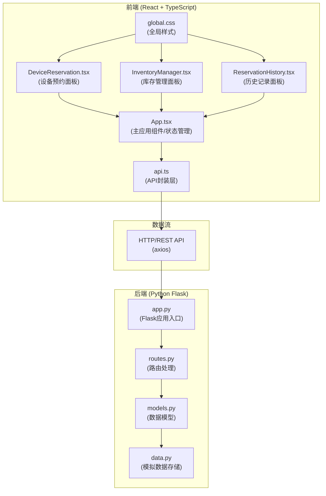
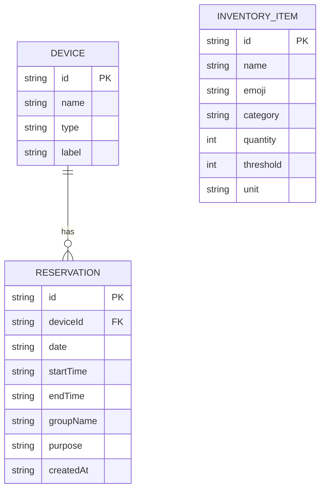

## 1. 架构设计



## 2. 技术描述

- **前端**：React@18 + TypeScript + Vite + axios
  - 状态管理：React useState/useEffect (轻量级全局状态)
  - 构建工具：Vite
  - HTTP客户端：axios
  - 样式：纯CSS (global.css)
- **后端**：Python Flask (RESTful API)
  - 轻量级Web框架，快速开发
  - 内存存储模拟数据库（便于演示）
  - CORS跨域支持
- **初始化工具**：vite-init (react-ts模板)
- **数据存储**：后端内存存储，前端状态管理

## 3. 项目文件结构

```
auto40/
├── .trae/documents/
│   ├── prd.md              # 产品需求文档
│   └── tech-arch.md        # 技术架构文档
├── backend/
│   ├── app.py              # Flask应用入口
│   ├── requirements.txt    # Python依赖
│   └── data.py             # 模拟数据和存储
├── src/
│   ├── components/
│   │   ├── DeviceReservation.tsx
│   │   ├── InventoryManager.tsx
│   │   └── ReservationHistory.tsx
│   ├── styles/
│   │   └── global.css
│   ├── App.tsx             # 主应用组件
│   ├── api.ts              # API调用封装
│   └── main.tsx            # 应用入口
├── index.html              # 入口HTML
├── package.json            # 前端依赖
├── vite.config.js          # Vite配置
└── tsconfig.json           # TypeScript配置
```

## 4. 文件调用关系和数据流向

1. **App.tsx → api.ts → 后端**
   - App.tsx 通过 useEffect 发起初始数据请求
   - api.ts 封装 getDevices/getInventory/getReservations 等函数
   - 数据返回后更新 App.tsx 状态，分发给子组件

2. **App.tsx → DeviceReservation.tsx**
   - 传入：设备列表 devices、预约列表 reservations
   - 返回：用户预约操作通过 api.createReservation → 后端 → 更新 App.tsx 状态

3. **App.tsx → InventoryManager.tsx**
   - 传入：库存列表 inventory
   - 返回：库存调整通过 api.updateInventory → 后端 → 更新 App.tsx 状态

4. **App.tsx → ReservationHistory.tsx**
   - 传入：历史预约记录
   - 返回：过滤操作更新本地显示

5. **轮询机制**：App.tsx 每30秒调用 api 获取最新数据，更新全局状态

## 5. API 定义

### TypeScript 类型定义
```typescript
interface Device {
  id: string;
  name: string;
  type: 'oven' | 'stove' | 'microwave' | 'fridge';
  label: string;
}

interface InventoryItem {
  id: string;
  name: string;
  emoji: string;
  category: 'vegetable' | 'meat' | 'seasoning';
  quantity: number;
  threshold: number;
  unit: string;
}

interface Reservation {
  id: string;
  deviceId: string;
  date: string;
  startTime: string;
  endTime: string;
  groupName: string;
  purpose: string;
  createdAt: string;
}

interface TimeSlot {
  time: string;
  available: boolean;
  reservationId?: string;
}
```

### API 端点
| 方法 | 路径 | 描述 | 请求参数 | 响应格式 |
|------|------|------|----------|----------|
| GET | /api/devices | 获取设备列表 | - | { devices: Device[] } |
| GET | /api/inventory | 获取食材库存 | - | { inventory: InventoryItem[] } |
| GET | /api/reservations | 获取预约列表 | date?: string | { reservations: Reservation[] } |
| GET | /api/reservations/history | 获取历史记录 | days?: number | { reservations: Reservation[] } |
| POST | /api/reservations | 创建预约 | deviceId, date, startTime, endTime, groupName, purpose | { success: boolean, reservation: Reservation, error?: string } |
| PUT | /api/inventory/:id | 更新库存 | quantity: number | { success: boolean, item: InventoryItem } |

### 数据模型 (ER图)


## 6. 性能约束实现方案

1. **首次加载时间 < 2秒**
   - Vite 构建优化，代码分割
   - 组件按需渲染
   - 初始数据并行请求（Promise.all）

2. **预约提交响应 < 500ms**
   - 后端内存存储，无IO延迟
   - 前端乐观更新（先更新UI，后同步后端）
   - axios 超时配置

3. **库存调整动画帧率 ≥ 50fps**
   - CSS transition 硬件加速
   - requestAnimationFrame 实现数字缓动
   - 避免布局抖动，使用 transform 和 opacity

4. **轮询性能优化**
   - 30秒长轮询间隔
   - 请求防抖处理
   - 后台标签页暂停轮询（Page Visibility API）

## 7. 前端路由定义

| 路由 | 用途 |
|------|------|
| / | 主页面（设备预约 + 库存管理 + 历史记录） |

本应用为单页面应用，无多路由需求，所有功能在首页实现。
