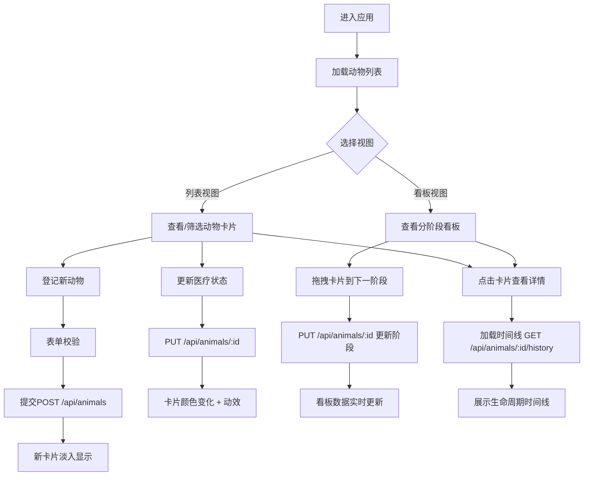

## 1. 产品概述

动物救助与领养进度追踪应用，旨在帮助宠物救助组织解决纸质表格和Excel数据不同步、缺乏可视化追踪的问题。通过数字化管理动物档案、医疗状态和领养流程，提升志愿者工作效率，实现数据实时同步和可视化监控。

- 主要用途：救助站动物档案管理、医疗状态追踪、领养流程可视化看板
- 解决问题：数据不同步、缺乏可视化、流程不透明
- 目标用户：宠物救助组织志愿者、管理员
- 产品价值：提升管理效率，实现领养全流程可追踪，促进动物领养率

## 2. 核心功能

### 2.1 用户角色

| 角色 | 注册方式 | 核心权限 |
|------|----------|----------|
| 志愿者 | 无需注册（内部系统） | 登记动物、更新医疗状态、查看看板、拖拽更新领养阶段 |
| 管理员 | 内部账号 | 所有志愿者权限 + 数据导出、用户管理 |

### 2.2 功能模块

1. **动物列表页**：动物卡片列表、按状态筛选、动物档案登记表单
2. **领养进度看板**：分阶段看板、拖拽更新阶段、计数徽章、跳转详情
3. **动物详情页**：生命周期时间线、状态变更历史、备注折叠/展开

### 2.3 页面详情

| 页面名称 | 模块名称 | 功能描述 |
|----------|----------|----------|
| 动物列表页 | 动物卡片列表 | 展示所有动物卡片，支持按医疗状态筛选，点击展开详情 |
| 动物列表页 | 动物档案登记表单 | 表单字段实时校验，提交后淡入动画显示新卡片 |
| 动物列表页 | 状态下拉菜单 | 5种医疗状态切换，边框颜色变化，卡片动效反馈 |
| 领养进度看板 | 分阶段纵列 | 5个阶段列（发现→救助→治疗→康复→领养），顶部计数徽章 |
| 领养进度看板 | 拖拽交互 | 卡片从一个阶段拖拽到下一阶段，鼠标跟随，松开更新状态 |
| 动物详情页 | 生命周期时间线 | 纵向时间线展示状态变更历史，节点渐变连接动画，备注折叠/展开 |

## 3. 核心流程

用户登录系统后，可在动物列表页查看所有救助动物，通过表单登记新动物，使用下拉菜单更新医疗状态。切换到看板视图可直观查看各阶段动物数量，通过拖拽操作推进领养流程。点击任意卡片可查看详情面板，展示该动物从救助到当前的完整生命周期时间线。

## 4. 用户界面设计

### 4.1 设计风格

- **主色调**：橙红色 #FF6B35（温暖活力，象征希望）
- **辅助色**：石绿色 #4ECDC4（清新治愈，象征健康）
- **背景色**：米白色 #FFF8F0（温馨柔和，体现关怀）
- **状态色**：待检查-灰色、治疗中-红色、康复中-橙色、可领养-绿色、已领养-蓝色
- **卡片风格**：圆角12px，轻微阴影，悬浮时阴影加深并上移4px
- **按钮风格**：胶囊形状筛选按钮，选中项底部滑块动画
- **字体**：采用温暖友好的无衬线字体，标题加粗，正文清晰易读
- **动效**：所有交互使用0.3s ease过渡，避免生硬跳变

### 4.2 页面设计概述

| 页面名称 | 模块名称 | UI元素 |
|----------|----------|--------|
| 动物列表页 | 顶部导航 | Logo、视图切换标签（列表/看板）、暖色调渐变背景 |
| 动物列表页 | 筛选按钮组 | 胶囊形状，6个筛选选项（全部+5种状态），选中底部滑块动画 |
| 动物列表页 | 登记表单 | 卡片式布局，字段实时校验反馈，提交按钮主色调 |
| 动物列表页 | 动物卡片网格 | 响应式网格布局，卡片圆角12px，状态标签有底色 |
| 领养进度看板 | 阶段纵列 | 5列自适应布局，列头显示阶段名称和计数徽章 |
| 领养进度看板 | 拖拽卡片 | 拖拽时半透明跟随，放下时弹性动画 |
| 动物详情页 | 详情面板 | 右侧滑入动画，展示动物基本信息 |
| 动物详情页 | 时间线 | 纵向排列，节点圆形标记，渐变连接线动画 |

### 4.3 响应式设计

- **桌面端**（≥1024px）：卡片网格3-4列，看板5列并排展示
- **平板端**（768px-1023px）：卡片网格2列，看板3-4列
- **移动端**（<768px）：卡片单列，看板水平滑动展示，触摸优化拖拽
- 所有图片使用占位符，确保加载性能

### 4.4 性能指标

- 首次加载20只动物渲染时间 ≤ 500ms
- 拖拽操作帧率稳定 ≥ 30fps
- 后端接口响应时间 ≤ 200ms
