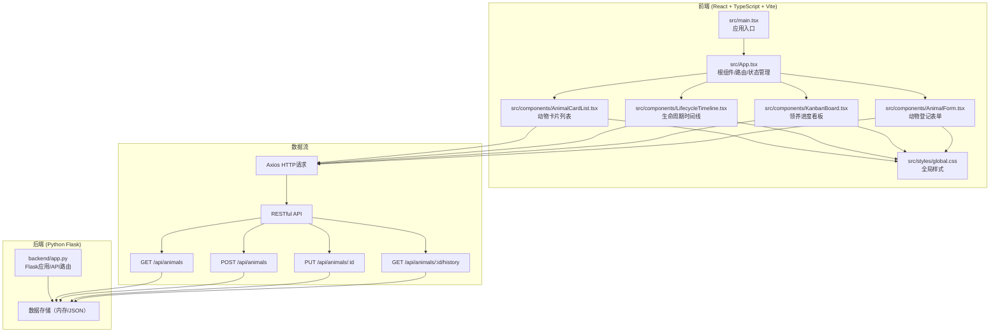
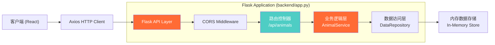
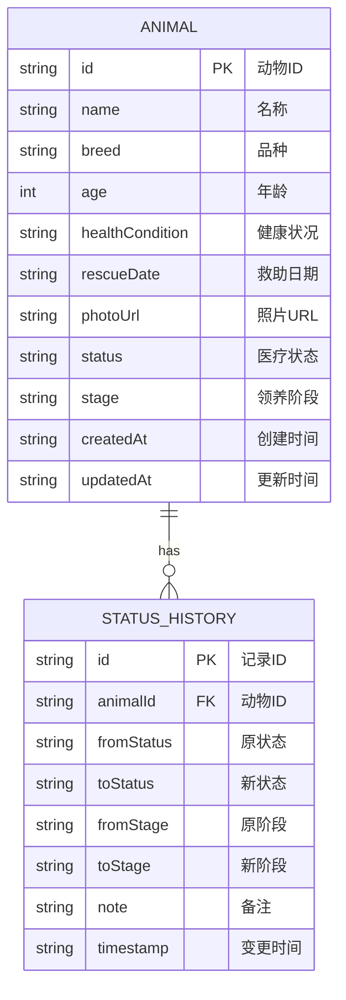

## 1. 架构设计



## 2. 技术描述

### 2.1 前端技术栈
- **框架**：React@18 + TypeScript@5
- **构建工具**：Vite@5 + @vitejs/plugin-react@4
- **HTTP客户端**：Axios@1
- **状态管理**：React useState/useEffect（轻量场景）
- **路由**：React Router DOM@6
- **样式方案**：原生CSS + CSS变量
- **拖拽方案**：原生HTML5 Drag & Drop API

### 2.2 后端技术栈
- **Web框架**：Flask@3
- **跨域支持**：Flask-CORS@4
- **数据存储**：内存存储（开发环境）
- **API规范**：RESTful API

### 2.3 项目初始化
- 前端：手动创建Vite + React + TypeScript项目结构
- 后端：Python Flask单文件应用

## 3. 路由定义

| 路由路径 | 页面组件 | 功能说明 |
|----------|----------|----------|
| `/` | AnimalCardList + AnimalForm | 动物列表页，展示所有动物卡片和登记表单 |
| `/kanban` | KanbanBoard | 领养进度看板，分阶段展示动物 |
| `/animal/:id` | AnimalDetail + LifecycleTimeline | 动物详情页，展示生命周期时间线 |

## 4. API 定义

### 4.1 类型定义

```typescript
// 动物状态枚举
type AnimalStatus = 'pending' | 'treatment' | 'recovery' | 'adoptable' | 'adopted';

// 领养阶段枚举
type AdoptionStage = 'found' | 'rescued' | 'treatment' | 'recovery' | 'adopted';

// 动物档案
interface Animal {
  id: string;
  name: string;
  breed: string;
  age: number;
  healthCondition: string;
  rescueDate: string;
  photoUrl: string;
  status: AnimalStatus;
  stage: AdoptionStage;
  createdAt: string;
  updatedAt: string;
}

// 状态变更历史记录
interface StatusHistory {
  id: string;
  animalId: string;
  fromStatus: AnimalStatus;
  toStatus: AnimalStatus;
  fromStage: AdoptionStage;
  toStage: AdoptionStage;
  note: string;
  timestamp: string;
}

// API响应
interface ApiResponse<T> {
  success: boolean;
  data: T;
  message?: string;
}
```

### 4.2 接口列表

| 方法 | 路径 | 请求体 | 响应 | 说明 |
|------|------|--------|------|------|
| GET | `/api/animals` | - | `ApiResponse<Animal[]>` | 获取所有动物列表 |
| POST | `/api/animals` | `{name, breed, age, healthCondition, rescueDate, photoUrl}` | `ApiResponse<Animal>` | 创建新动物档案 |
| PUT | `/api/animals/:id` | `{status?, stage?, note?}` | `ApiResponse<Animal>` | 更新动物状态/阶段 |
| GET | `/api/animals/:id/history` | - | `ApiResponse<StatusHistory[]>` | 获取动物状态变更历史 |

### 4.3 状态颜色映射

```typescript
const statusColors: Record<AnimalStatus, string> = {
  pending: '#9CA3AF',    // 灰色 - 待检查
  treatment: '#EF4444',  // 红色 - 治疗中
  recovery: '#F97316',   // 橙色 - 康复中
  adoptable: '#22C55E',  // 绿色 - 可领养
  adopted: '#3B82F6',    // 蓝色 - 已领养
};

const stageOrder: AdoptionStage[] = ['found', 'rescued', 'treatment', 'recovery', 'adopted'];
const stageNames: Record<AdoptionStage, string> = {
  found: '发现',
  rescued: '救助',
  treatment: '治疗',
  recovery: '康复',
  adopted: '领养',
};
```

## 5. 服务器架构图



## 6. 数据模型

### 6.1 ER图



### 6.2 前端状态管理

```
App.tsx (状态容器)
├── animals: Animal[]
├── selectedAnimalId: string | null
├── currentView: 'list' | 'kanban'
├── filterStatus: AnimalStatus | 'all'
│
├── AnimalCardList.tsx (props: animals, filterStatus)
│   └── AnimalCard.tsx (props: animal, onSelect, onStatusChange)
│
├── KanbanBoard.tsx (props: animals)
│   └── KanbanColumn.tsx (props: stage, animals)
│       └── KanbanCard.tsx (props: animal, onDragStart, onDragEnd)
│
├── AnimalForm.tsx (props: onSubmit)
│
└── AnimalDetail.tsx (props: animalId)
    └── LifecycleTimeline.tsx (props: animalId)
```

### 6.3 数据流向

1. **初始加载**：`App.tsx` → `useEffect` → `GET /api/animals` → `setAnimals(animals)` → 传递给子组件
2. **添加动物**：`AnimalForm` → 表单校验 → `POST /api/animals` → 成功 → `setAnimals([newAnimal, ...animals])` → 淡入动画
3. **更新状态**：`AnimalCard` → 下拉选择 → `PUT /api/animals/:id` → 成功 → `setAnimals(updatedAnimals)` → 边框颜色变化 + 动效
4. **拖拽更新阶段**：`KanbanCard` → `onDrop` → 阶段校验（只能前进）→ `PUT /api/animals/:id` → 成功 → 更新看板数据
5. **加载时间线**：`LifecycleTimeline` → `useEffect(animalId)` → `GET /api/animals/:id/history` → 渲染时间线
