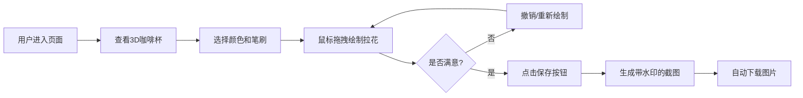

## 1. 产品概述

在线虚拟咖啡拉花设计工具，让用户在浏览器中通过鼠标操作，在3D咖啡杯模型表面绘制各种拉花图案，支持实时预览和保存设计。

- 主要用途：为咖啡爱好者和设计师提供一个创意拉花设计的虚拟体验平台
- 目标用户：咖啡爱好者、拉花艺术学习者、创意设计人群
- 产品价值：零成本体验咖啡拉花艺术，随时随地创作和分享拉花设计

## 2. 核心功能

### 2.1 功能模块

1. **3D咖啡杯渲染模块**：使用Three.js渲染带陶瓷质感的3D咖啡杯，支持实时显示用户绘制的拉花图案
2. **拉花绘制模块**：支持鼠标拖拽自由绘制，多种颜色和笔刷大小可选，带扩散流动效果
3. **保存与分享模块**：支持将设计保存为图片，带时间戳水印，自动下载

### 2.2 页面详情

| 页面名称 | 模块名称 | 功能描述 |
|---------|---------|---------|
| 主页面 | 3D预览区域 | 展示3D咖啡杯模型，实时显示拉花图案，支持有限角度旋转查看 |
| 主页面 | 控制面板 | 颜色选择、笔刷大小切换、撤销操作、保存按钮 |

## 3. 核心流程

用户进入页面 → 查看3D咖啡杯 → 在咖啡表面拖拽鼠标绘制拉花 → 调整颜色和笔刷大小 → 撤销不满意的笔画 → 保存设计为图片

## 4. 用户界面设计

### 4.1 设计风格

- **主色调**：深棕色(#3e2723)、奶油色(#fff8dc)、金色(#d4a574)、白色
- **背景**：暖色调咖啡馆风格渐变（从#2c1810到#8b4513）
- **按钮样式**：圆角设计，悬浮时有缩放和投影加深效果，0.2秒过渡
- **字体**：无衬线字体
- **整体风格**：木质暖色调，温暖舒适的咖啡馆氛围

### 4.2 页面设计概述

| 页面名称 | 模块名称 | UI元素 |
|---------|---------|-------|
| 主页面 | 3D预览区域 | 左侧占70%宽度，3D咖啡杯，暖色调渐变背景 |
| 主页面 | 控制面板 | 右侧占30%宽度，毛玻璃效果背景，颜色选择器、笔刷大小按钮、撤销按钮、保存按钮 |

### 4.3 控件细节

- **颜色选择器**：四个预设色块（纯白#ffffff、奶白#fff8dc、浅咖#d4a574）+ 自定义取色器
- **笔刷大小按钮**：三个圆形图标，激活时有金色发光边框效果
- **撤销按钮**：带红色圆形badge显示剩余步数（最多15步），支持Ctrl+Z快捷键
- **保存按钮**：点击时有波纹展开动画（0.3秒）
- **所有控件**：鼠标悬浮时有0.2秒的缩放和投影加深效果

### 4.4 3D场景指南

- **环境**：暖色调咖啡馆风格渐变背景
- **光照**：柔和的环境光 + 方向性光源，模拟室内咖啡馆灯光
- **相机设置**：俯视45度视角，OrbitControls限制旋转角度30-60度
- **材质**：杯身陶瓷质感（暖白色#f5e6d3，带轻微反射），液体表面浅棕色
- **动画**：绘制时笔触缓入效果（0.1秒），松开鼠标后扩散动画（0.5秒，半径增大20%）

### 4.5 响应式

- 桌面端优先设计
- 左侧3D区域70%，右侧控制面板30%
- 控制面板最小宽度保证可用性
