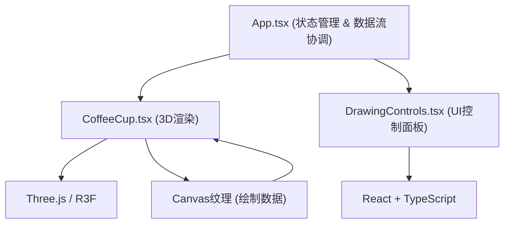

## 1. 架构设计



## 2. 技术描述

- **前端框架**：React@18 + TypeScript
- **构建工具**：Vite
- **3D渲染**：Three.js + @react-three/fiber + @react-three/drei
- **状态管理**：React useState/useRef (轻量级，无额外状态管理库)
- **绘制技术**：Canvas2D API 生成纹理，映射到3D液体表面
- **样式方案**：CSS Modules / 内联样式 (不引入额外CSS框架)

## 3. 文件结构

```
├── package.json
├── vite.config.js
├── tsconfig.json
├── index.html
└── src/
    ├── App.tsx              # 主组件，状态管理和数据流协调
    ├── CoffeeCup.tsx        # 3D咖啡杯渲染组件
    └── DrawingControls.tsx  # 右侧UI控制面板
```

## 4. 核心数据结构

### 4.1 绘制数据

```typescript
interface DrawStroke {
  points: { x: number; y: number }[];
  color: string;
  size: number;
  timestamp: number;
}
```

### 4.2 应用状态

```typescript
interface AppState {
  strokes: DrawStroke[];
  currentStroke: DrawStroke | null;
  selectedColor: string;
  brushSize: number;
  isDrawing: boolean;
}
```

## 5. 关键技术方案

### 5.1 3D渲染方案

- 使用 `@react-three/fiber` 声明式构建Three.js场景
- 使用 `CylinderGeometry` 创建杯体和液体表面
- 使用 `CanvasTexture` 将2D绘制内容映射到液体表面
- 使用 `OrbitControls` 限制相机旋转角度（30-60度）

### 5.2 绘制交互方案

- 在液体表面平面上进行射线检测，获取绘制坐标
- 使用Canvas2D API绘制笔触
- 使用requestAnimationFrame确保绘制流畅（<16ms延迟）

### 5.3 扩散动画方案

- 松开鼠标后，使用Canvas2D的模糊/渐变效果模拟扩散
- 扩散持续0.5秒，半径增大20%
- 使用requestAnimationFrame逐帧更新

### 5.4 保存截图方案

- 使用Canvas2D API合成截图（1280x720分辨率）
- 在右上角添加时间戳水印（12px Arial，半透明灰色#888888）
- 使用canvas.toDataURL()生成图片，创建下载链接

## 6. 性能优化

- 绘制纹理按需更新，避免每帧重绘
- 使用离屏Canvas进行绘制操作
- 3D场景仅在必要时更新
- 笔触数据使用引用优化，避免不必要的重渲染

## 7. 性能指标

- 绘制延迟：低于16ms
- 3D场景帧率：稳定60fps
- 撤销操作：最多15步历史记录
