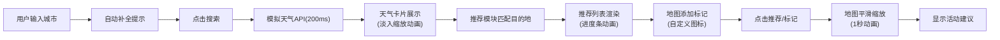

## 1. 产品概述

在线动态天气预报与全球旅行目的地推荐应用，用户输入城市名称后可查看实时天气数据，并根据当前天气自动推荐匹配的旅行目的地和活动建议。

- **核心价值**：将天气信息与旅行推荐结合，为用户提供个性化的出行决策参考
- **目标用户**：旅行爱好者、规划出行的普通用户
- **解决问题**：帮助用户快速了解目的地天气，并根据天气发现适合的旅行地点

## 2. 核心功能

### 2.1 用户角色

| 角色 | 注册方式 | 核心权限 |
|------|---------|---------|
| 普通用户 | 无需注册 | 搜索天气、查看推荐、浏览地图、管理搜索历史 |

### 2.2 功能模块

1. **天气搜索模块**：城市搜索框、自动补全提示、天气预报卡片
2. **推荐引擎模块**：目的地推荐列表、匹配度评分、推荐理由
3. **地图展示模块**：世界地图、目的地标记、信息弹窗
4. **历史记录模块**：搜索历史、快速搜索、删除功能

### 2.3 页面详情

| 页面名称 | 模块名称 | 功能描述 |
|---------|---------|---------|
| 首页 | 天气搜索栏 | 城市输入框、自动补全(5+预设城市)、搜索按钮、涟漪动画 |
| 首页 | 天气预报卡片 | 温度、湿度、风速、天气图标、毛玻璃效果、淡入缩放动画 |
| 首页 | 目的地推荐列表 | 3-5个推荐卡片、匹配度进度条、推荐理由、点击跳转地图 |
| 首页 | 地图区域 | Leaflet世界地图、自定义天气图标标记、信息弹窗 |
| 首页 | 搜索历史面板 | 最近10条记录、时间倒序、滑动删除动画、快速搜索 |

## 3. 核心流程

用户在搜索框输入城市名称 → 系统匹配自动补全提示 → 用户点击搜索 → 模拟API获取天气数据(200ms延迟) → 天气卡片展示(温度淡入缩放动画) → 推荐模块根据天气匹配目的地 → 推荐列表渲染(进度条动画) → 地图模块添加标记 → 用户点击推荐卡片/地图标记 → 地图平滑缩放定位 → 显示详细活动建议

## 4. 用户界面设计

### 4.1 设计风格

- **主色调**：深蓝渐变背景 (#0b3d91 → #74b9ff)
- **强调色**：金色 #fdcb6e (输入框聚焦、进度条高光)
- **卡片风格**：半透明白色 rgba(255,255,255,0.1)、圆角 12px、柔和阴影 box-shadow: 0 8px 32px rgba(0,0,0,0.2)
- **毛玻璃效果**：背景模糊 12px、边框 1px solid rgba(255,255,255,0.2)
- **字体**：现代无衬线字体，清晰易读
- **图标风格**：天气图标(☀️🌧️❄️) + emoji表情符号

### 4.2 页面设计概览

| 页面名称 | 模块名称 | UI元素 |
|---------|---------|-------|
| 首页 | 整体布局 | 左侧面板(天气+推荐) + 右侧地图，移动端堆叠单列 |
| 首页 | 搜索框 | 圆角输入框、聚焦金色发光、自动补全下拉、涟漪按钮 |
| 首页 | 天气卡片 | 毛玻璃效果、温度大字、天气图标、湿度风速信息 |
| 首页 | 推荐卡片 | 目的地名称、推荐理由、匹配度进度条(蓝到红渐变) |
| 首页 | 地图 | 全屏高度、自定义标记(晴金⭐/雨蓝💧/雪白❄️)、圆角弹窗 |
| 首页 | 历史记录 | 列表项、删除按钮、滑动删除动画 |

### 4.3 响应式

- **设计原则**：桌面端优先，移动端自适应
- **断点**：768px 以下切换为单列布局
- **移动端优化**：地图高度自适应、触摸友好的按钮尺寸、横向滑动删除

### 4.4 动画与交互

- **温度数字**：淡入缩放动画 0.3秒
- **进度条**：从0到目标值的填充动画
- **地图缩放**：平滑过渡 1秒
- **按钮点击**：涟漪效果 0.3秒
- **输入框聚焦**：金色发光边框
- **历史项删除**：滑动消失动画 0.2秒
- **加载状态**：旋转云朵图标
