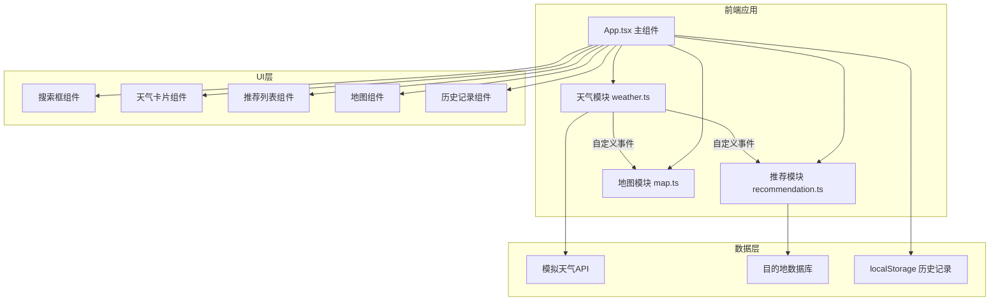

## 1. 架构设计



## 2. 技术描述

- **前端框架**：React 18 + TypeScript
- **构建工具**：Vite 5 + @vitejs/plugin-react
- **地图库**：Leaflet + react-leaflet
- **图表库**：Recharts (用于进度条/数据可视化)
- **HTTP请求**：Axios
- **样式方案**：原生CSS + CSS变量 + CSS动画
- **状态管理**：React useState/useEffect (轻量级，无需额外状态库)
- **模块通信**：自定义事件 (CustomEvent)
- **数据持久化**：localStorage

## 3. 项目文件结构

```
.
├── package.json
├── vite.config.js
├── tsconfig.json
├── index.html
└── src/
    ├── App.tsx              # 主组件，整合所有模块
    ├── weather.ts           # 天气模块：模拟API、自定义事件
    ├── recommendation.ts    # 推荐模块：目的地匹配、评分
    ├── map.ts               # 地图模块：Leaflet封装
    ├── types.ts             # TypeScript类型定义
    ├── data/
    │   └── destinations.ts  # 目的地数据库
    ├── components/
    │   ├── SearchBar.tsx    # 搜索框组件
    │   ├── WeatherCard.tsx  # 天气卡片组件
    │   ├── RecommendList.tsx # 推荐列表组件
    │   ├── MapView.tsx      # 地图视图组件
    │   └── HistoryList.tsx  # 历史记录组件
    └── styles/
        └── index.css        # 全局样式与动画
```

## 4. 类型定义

### 4.1 天气数据类型

```typescript
interface WeatherData {
  city: string;
  temperature: number;
  humidity: number;
  windSpeed: number;
  weatherType: 'sunny' | 'rainy' | 'snowy';
  weatherIcon: string;
  description: string;
}
```

### 4.2 目的地类型

```typescript
interface Destination {
  id: string;
  name: string;
  country: string;
  lat: number;
  lng: number;
  weatherTypes: ('sunny' | 'rainy' | 'snowy')[];
  tempRange: [number, number];
  reason: string;
  activities: string[];
  image?: string;
}

interface Recommendation extends Destination {
  matchScore: number;
}
```

### 4.3 历史记录类型

```typescript
interface HistoryItem {
  id: string;
  city: string;
  timestamp: number;
}
```

## 5. 模块通信机制

### 5.1 自定义事件

- **事件名称**：`weatherUpdated`
- **事件详情**：`CustomEvent<WeatherData>`
- **触发时机**：天气模块获取新数据后
- **监听方**：推荐模块、地图模块

### 5.2 模块职责

| 模块 | 职责 | 输入 | 输出 |
|------|------|------|------|
| weather.ts | 模拟API调用、数据格式化、事件分发 | 城市名称 | WeatherData + 自定义事件 |
| recommendation.ts | 目的地匹配、评分排序 | WeatherData | Recommendation[] |
| map.ts | 地图渲染、标记管理、弹窗 | 目的地列表 | 地图实例、交互回调 |

## 6. 性能优化策略

- **模拟延迟**：天气API固定200ms延迟，确保用户感知响应
- **地图标记**：使用Leaflet原生标记，20+标记时保持30fps以上
- **动画优化**：使用CSS transform和opacity动画，避免重排重绘
- **历史记录**：限制最多10条，localStorage读写优化
- **组件拆分**：按需渲染，避免不必要的重渲染

## 7. 预设城市列表

| 城市 | 国家 | 纬度 | 经度 |
|------|------|------|------|
| 北京 | 中国 | 39.9042 | 116.4074 |
| 上海 | 中国 | 31.2304 | 121.4737 |
| 东京 | 日本 | 35.6762 | 139.6503 |
| 纽约 | 美国 | 40.7128 | -74.0060 |
| 伦敦 | 英国 | 51.5074 | -0.1278 |
| 巴黎 | 法国 | 48.8566 | 2.3522 |
| 悉尼 | 澳大利亚 | -33.8688 | 151.2093 |

## 8. 运行方式

```bash
npm install
npm run dev
```

开发服务器默认启动在 `http://localhost:5173`
