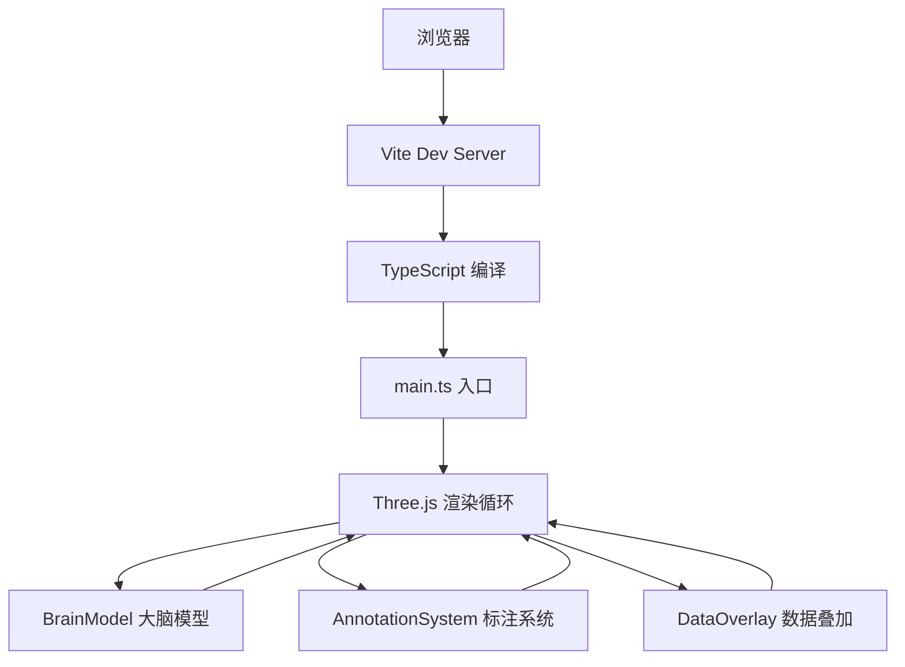

## 1. 架构设计


## 2. 技术栈
- 前端框架：无原生框架，纯 TypeScript
- 3D渲染：Three.js r160+
- 构建工具：Vite 5.x
- 语言：TypeScript 5.x（严格模式）
- 目标浏览器：ES2020+
- 样式：原生 CSS

## 3. 模块定义
| 模块文件 | 职责 | 导出内容 |
|----------|------|----------|
| src/main.ts | 应用入口，创建场景/相机/灯光/渲染器/控制器，初始化各模块，UI绑定 | 无（立即执行） |
| src/BrainModel.ts | 生成大脑几何体（左右半球+脑干），提供表面坐标方法 | BrainModel 类 / getModelGroup / getSurfacePoint |
| src/AnnotationSystem.ts | 管理标注点、闪烁动画、距离计算与显示 | AnnotationManager 类 |
| src/DataOverlay.ts | 热力斑块管理、脉动动画、数据加载更新 | OverlayManager 类 |

## 4. 类与接口定义

### 4.1 AnnotationManager
```typescript
interface AnnotationPoint {
  id: number;
  position: THREE.Vector3;
  mesh: THREE.Mesh;
  region: string;
}

interface DistanceLine {
  start: AnnotationPoint;
  end: AnnotationPoint;
  line: THREE.Line;
  arrow: THREE.ArrowHelper;
  label: THREE.CSS2DObject | HTMLDivElement;
}

class AnnotationManager {
  constructor(scene: THREE.Scene, camera: THREE.Camera, rendererDom: HTMLElement);
  addPoint(position: THREE.Vector3): AnnotationPoint;
  removePoint(id: number): void;
  clearAll(): void;
  updateDistances(): void;
  animate(time: number): void;
  getPoints(): AnnotationPoint[];
}
```

### 4.2 OverlayManager
```typescript
interface FunctionData {
  id: string;
  name: string;
  region: string;
  position: THREE.Vector3;
  intensity: number; // 0-100
}

interface HeatPatch {
  data: FunctionData;
  mesh: THREE.Mesh;
  baseScale: number;
}

class OverlayManager {
  constructor(scene: THREE.Scene, brainModel: THREE.Group);
  loadPresetData(type: string): void;
  setIntensity(id: string, value: number): void;
  clearAll(): void;
  animate(time: number): void;
}
```

### 4.3 BrainModel
```typescript
class BrainModel {
  private group: THREE.Group;
  constructor();
  generate(): THREE.Group;
  getGroup(): THREE.Group;
  getSurfacePoint(normalizedPoint: THREE.Vector3): THREE.Vector3;
  predictRegion(position: THREE.Vector3): string;
}
```

## 5. 区域预判规则
根据三维坐标位置预判大脑区域：
- **额叶 (Frontal Lobe)**: z > 1.0
- **顶叶 (Parietal Lobe)**: -0.5 < z ≤ 1.0 且 |y| > 0.5
- **颞叶 (Temporal Lobe)**: z < -0.5 且 y < 0.3
- **枕叶 (Occipital Lobe)**: z < -1.0 且 y > 0
- **脑干 (Brain Stem)**: |x| < 0.6 且 y < -1.2
- **左半球/右半球**: x < 0 / x > 0 前缀

## 6. 预设功能数据
```typescript
const PRESET_DATA: Record<string, FunctionData[]> = {
  language: [
    { id: 'broca', name: "布洛卡区", region: "左额叶", position: new THREE.Vector3(-1.5, 0.5, 1.2), intensity: 75 },
    { id: 'wernicke', name: "韦尼克区", region: "左颞叶", position: new THREE.Vector3(-1.8, -0.3, -0.8), intensity: 85 },
  ],
  motor: [
    { id: 'motor_left', name: "右侧运动皮层", region: "左顶叶", position: new THREE.Vector3(-1.2, 1.1, 0.2), intensity: 90 },
    { id: 'motor_right', name: "左侧运动皮层", region: "右顶叶", position: new THREE.Vector3(1.2, 1.1, 0.2), intensity: 88 },
  ],
  visual: [
    { id: 'v1', name: "初级视觉皮层", region: "枕叶", position: new THREE.Vector3(0, 0.5, -2.0), intensity: 95 },
    { id: 'v2', name: "视觉联合区", region: "枕叶", position: new THREE.Vector3(0.8, 0.3, -1.7), intensity: 70 },
  ]
};
```

## 7. 性能优化策略
- 复用几何体与材质
- 标注点使用 InstancedMesh 或简单 SphereGeometry
- 距离计算在 requestAnimationFrame 中节流
- CSS2DObject 替代大量 DOM 操作
- 热力斑块使用简单几何体，避免复杂 shader
