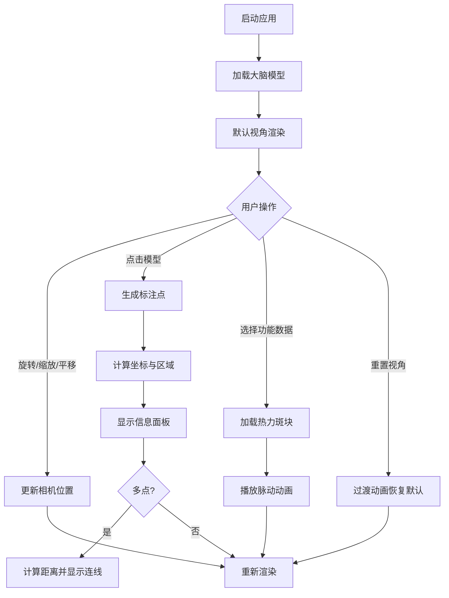

## 1. 产品概述
3D大脑交互式解剖标注与数据可视化应用，面向医学教学和科研场景，解决静态3D模型难以灵活标记重点区域、测量尺寸以及叠加功能数据的问题。
- 目标用户：医学院师生、神经科学研究者、临床医生
- 产品价值：提供沉浸式交互式3D大脑解剖学习与研究工具，支持标注、测量、功能数据可视化

## 2. 核心功能

### 2.2 功能模块
1. **3D模型渲染区**：大脑模型展示、旋转、平移、缩放交互
2. **解剖标注系统**：点击标注、区域识别、坐标显示、多点距离测量
3. **功能数据叠加**：预设功能数据加载、热力斑块显示、脉动动画
4. **控制面板**：模型视角控制、数据切换、标注管理

### 2.3 功能详情
| 页面模块 | 子模块 | 功能描述 |
|-----------|-------------|---------------------|
| 3D模型渲染区 | 基础操作 | 鼠标旋转（阻尼0.1）、平移、滚轮缩放（0.5x-3x）、默认正面45度视角 |
| 3D模型渲染区 | 大脑模型 | 淡粉色（#f5d6c6）、左右半球+脑干组合造型 |
| 解剖标注系统 | 单点标注 | 点击生成半透明红色标记点（半径0.3）、1秒周期闪烁动画 |
| 解剖标注系统 | 信息面板 | 显示三维坐标、根据坐标预判区域名称（额叶/颞叶等） |
| 解剖标注系统 | 距离测量 | 多点间自动计算欧几里得距离、带箭头连线、数值标签（虚拟厘米） |
| 功能数据叠加 | 数据选择 | 语言区、运动区、视觉区激活强度选择（0-100） |
| 功能数据叠加 | 热力显示 | 半透明彩色斑块（红高蓝低）、平滑过渡 |
| 功能数据叠加 | 脉动动画 | 缩放幅度0.1、周期2秒 |
| 控制面板 | 视角重置 | 一键恢复默认视角、0.3秒淡入淡出过渡 |
| 控制面板 | 标注管理 | 清除所有标注 |
| 控制面板 | 折叠功能 | 可折叠侧边栏 |

## 3. 核心流程

## 4. 用户界面设计

### 4.1 设计风格
- 主色调：深灰蓝（#1a2332）背景
- 强调色：浅蓝（#4a90d9）点缀
- 文字色：柔和白色
- 按钮样式：圆角矩形（8px）、悬停升起阴影（box-shadow: 0 2px 8px rgba(0,0,0,0.3)）
- 过渡效果：0.3秒 ease-in-out 淡入淡出
- 字体：现代无衬线字体，层次分明

### 4.2 页面设计
| 模块 | 区域 | UI元素 |
|-----------|-------------|-------------|
| 3D渲染区 | 左侧60% | Canvas画布、浮动标注面板、距离标签 |
| 控制面板 | 右侧40% | 标题栏（折叠按钮）、视角控制区、功能数据选择区、标注管理区 |
| 标注面板 | 模型上悬浮 | 坐标显示、区域名称、关闭按钮 |
| 距离显示 | 模型上悬浮 | 带箭头连线、距离数值标签 |

### 4.3 响应式设计
- 桌面端（>768px）：左右分栏布局（60%/40%）
- 平板端（≤768px）：上下布局，控制面板可折叠覆盖在渲染区上方

### 4.4 3D场景设计
- 环境：深灰蓝背景，无雾效，突出大脑模型
- 灯光：环境光（强度0.6）+ 方向光（强度0.8，右上方45度）+ 补光（强度0.3）
- 相机：PerspectiveCamera，默认位置(0, 2, 8)，视角45度，lookAt(0,0,0)
- 材质：MeshPhongMaterial，淡粉色半哑光
- 性能：目标帧率50fps+，标注点≤50个时流畅
