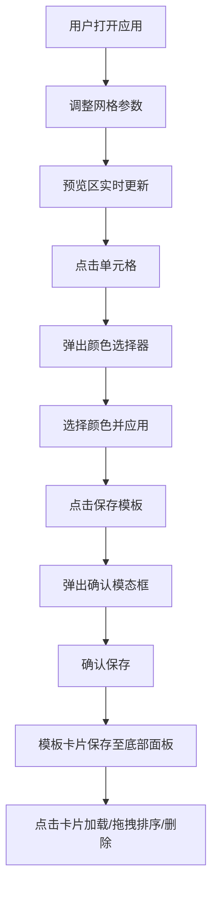

## 1. 产品概述

动态CSS网格布局模板创建与预览工具，为前端开发者提供可视化的响应式网格布局设计体验，无需反复修改CSS代码即可实时预览不同断点下的布局效果。

- 解决前端开发者在设计响应式网格布局时，需要反复修改CSS代码、难以直观对比不同断点下布局效果的痛点
- 目标用户为前端开发者、UI设计师，核心价值在于提升网格布局设计效率，提供直观的可视化预览能力

## 2. 核心功能

### 2.1 功能模块

1. **控制面板（左侧）**: 网格参数调整（列数、行高、列间距、行间距）
2. **预览区域（右侧）**: CSS Grid实时预览、单元格索引显示、单元格颜色设置
3. **颜色选择器（弹出式）**: 饱和度/透明度滑块、最近10种颜色历史记录
4. **模板面板（底部）**: 已保存模板卡片列表、卡片缩略图、点击加载、拖拽排序、删除

### 2.3 页面详情

| 页面名称 | 模块名称 | 功能描述 |
|-----------|-------------|---------------------|
| 主页面 | 控制面板 | 列数滑块(2-12,步1)、行高滑块(50-200px,步10)、列间距滑块(0-40px,步4)、行间距滑块(0-40px,步4) |
| 主页面 | 预览区域 | CSS Grid动态渲染、0.2s平滑过渡动画、单元格行列索引显示、单元格点击触发颜色选择、悬停边框高亮与缩放图标 |
| 主页面 | 颜色选择器 | 弹出式面板、饱和度滑块、透明度滑块、最近10种使用颜色历史 |
| 主页面 | 模板面板 | 卡片列表展示(缩略图+名称)、最多保存20个模板、点击加载配置、拖拽排序、删除、保存时模态框确认 |

## 3. 核心流程

用户打开应用 → 调整左侧控制面板参数 → 右侧预览区实时更新网格布局 → 点击单元格设置颜色 → 点击保存模板 → 弹出确认模态框 → 确认后模板以卡片形式保存到底部面板 → 点击卡片加载配置/拖拽调整顺序/删除模板

## 4. 用户界面设计

### 4.1 设计风格

- **主色调**: 暗色主题，背景 #1e1e2e，面板 #282840
- **强调色**: 亮蓝色 #4fc3f7（边框高亮），#3a3a5a（悬停背景）
- **边框色**: 默认 #4a4a6a
- **圆角**: 8px
- **字体**: 现代无衬线字体，数字使用等宽字体增强代码感
- **动效**: 0.2s网格过渡、0.15s控件悬停淡入、0.3s面板滑入滑出、模态框0.3s遮罩淡入+0.2s中心缩放

### 4.2 页面设计概述

| 页面名称 | 模块名称 | UI元素 |
|-----------|-------------|-------------|
| 主页面 | 控制面板 | 深色面板、圆角控件、滑块+数值显示、悬停高亮过渡 |
| 主页面 | 预览区域 | CSS Grid布局、1px细边框单元格、行列索引文字、悬停蓝色边框+缩放图标 |
| 主页面 | 颜色选择器 | 弹出面板、颜色预览条、饱和度渐变区域、透明度滑块、历史颜色色块 |
| 主页面 | 模板面板 | 底部横向滚动卡片列表、Canvas缩略图、模板名称文字、拖拽指示、删除按钮 |
| 主页面 | 模态框 | 半透明遮罩、中心缩放出现、确认/取消按钮 |

### 4.3 响应式

- Desktop-first设计
- 窗口宽度 < 768px 时预览区域自动切换为单列布局
- 移动端触控优化

## 5. 性能要求

- 网格参数调整后预览更新响应时间 ≤ 50ms
- 超过20个模板卡片时滚动帧率 ≥ 30FPS
