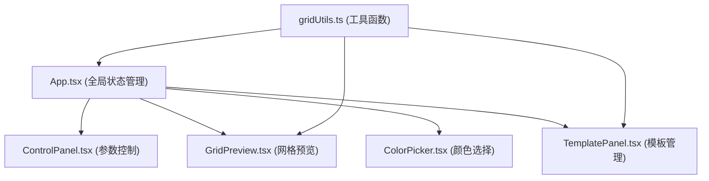

## 1. 架构设计



## 2. 技术说明

- **前端框架**: React 18 + TypeScript
- **构建工具**: Vite
- **状态管理**: React useState (轻量级状态，无需外部状态库)
- **样式方案**: 原生CSS + CSS Modules (inline styles配合)
- **缩略图生成**: HTML Canvas API
- **拖拽实现**: HTML5 Drag and Drop API

## 3. 文件结构

```
src/
├── App.tsx              # 主组件，全局状态管理
├── components/
│   ├── ControlPanel.tsx # 左侧控制面板
│   ├── GridPreview.tsx  # 右侧网格预览
│   ├── ColorPicker.tsx  # 颜色选择器
│   └── TemplatePanel.tsx# 底部模板面板
└── utils/
    └── gridUtils.ts     # 工具函数
```

## 4. 数据模型

### 4.1 网格参数 (GridConfig)

```typescript
interface GridConfig {
  columns: number;      // 列数 2-12
  rowHeight: number;    // 行高 50-200px
  columnGap: number;    // 列间距 0-40px
  rowGap: number;       // 行间距 0-40px
  rows: number;         // 行数（根据列数自动计算或默认值）
  cellColors: Record<string, string>; // 单元格颜色 key: "row,col"
}
```

### 4.2 模板 (Template)

```typescript
interface Template {
  id: string;
  name: string;
  config: GridConfig;
  thumbnail: string;  // base64 data URL
  createdAt: number;
}
```

### 4.3 颜色历史

```typescript
type ColorHistory = string[]; // 最多10个颜色
```

## 5. 核心工具函数

- `getDefaultGridConfig(): GridConfig` - 获取默认网格参数
- `serializeTemplate(config: GridConfig, name: string, thumbnail: string): Template` - 模板序列化
- `deserializeTemplate(template: Template): GridConfig` - 模板反序列化
- `captureThumbnail(element: HTMLElement, width?: number, height?: number): Promise<string>` - Canvas缩略图截取
- `generateCellKey(row: number, col: number): string` - 生成单元格key
- `parseCellKey(key: string): { row: number; col: number }` - 解析单元格key
