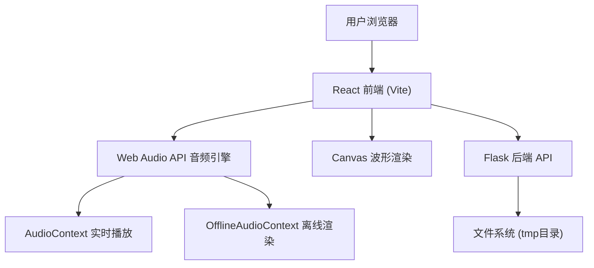
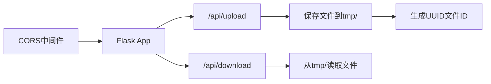

## 1. 架构设计



## 2. 技术栈说明

- **前端框架**：React 18 + TypeScript 5
- **构建工具**：Vite 5（devServer端口5173）
- **音频处理**：Web Audio API（AudioContext、OfflineAudioContext）
- **波形绘制**：HTML5 Canvas 2D
- **HTTP客户端**：Axios
- **后端框架**：Python Flask 3.x
- **跨域处理**：flask-cors
- **状态管理**：React Hooks + useReducer（全局状态在App.tsx）
- **拖拽实现**：原生HTML5 Drag and Drop API + 自定义动画

## 3. 目录结构

```
auto63/
├── package.json
├── vite.config.js
├── tsconfig.json
├── index.html
├── src/
│   ├── App.tsx              # 根组件，全局状态管理
│   ├── types.ts             # TypeScript类型定义
│   ├── hooks/
│   │   └── useAudioEngine.ts # Web Audio API封装
│   ├── components/
│   │   ├── TrackList.tsx    # 音轨列表组件
│   │   └── MixConsole.tsx   # 混音控制台组件
│   └── utils/
│       └── exportMix.ts     # 导出混音工具函数
└── server/
    ├── app.py               # Flask后端
    └── requirements.txt     # Python依赖
```

## 4. 类型定义（types.ts）

```typescript
export interface Track {
  id: string;
  name: string;
  audioBuffer: AudioBuffer | null;
  waveformData: number[];
  volume: number;
  muted: boolean;
  solo: boolean;
  effects: Effect[];
  startTime: number;
}

export interface Effect {
  id: string;
  type: 'reverb' | 'delay' | 'lowpass';
  params: {
    decayTime?: number;
    feedback?: number;
    cutoff?: number;
  };
  enabled: boolean;
}

export interface PlaybackState {
  isPlaying: boolean;
  currentTime: number;
  duration: number;
  zoom: number;
}
```

## 5. API 接口定义

### 5.1 文件上传

**请求**：`POST /api/upload`
- Content-Type: `multipart/form-data`
- 参数：`file` (WAV/MP3, ≤10MB)

**响应**：
```json
{
  "success": true,
  "fileId": "uuid-string",
  "fileName": "track.wav",
  "fileUrl": "/api/download/uuid-string"
}
```

### 5.2 文件下载

**请求**：`GET /api/download/:fileId`

**响应**：音频文件流，Content-Type 根据文件类型设置

## 6. 核心模块说明

### 6.1 useAudioEngine Hook

封装 Web Audio API 核心逻辑：
- `initAudioContext()`: 初始化 AudioContext
- `decodeAudioFile(file: File)`: 解码音频文件为 AudioBuffer
- `addTrack(track: Track)`: 添加音轨到音频图
- `removeTrack(trackId: string)`: 移除音轨
- `applyEffect(trackId: string, effect: Effect)`: 应用/更新滤镜
- `startPlayback(startTime: number)`: 开始播放
- `stopPlayback()`: 停止播放
- `connectTrackGraph(track: Track)`: 构建音轨音频节点链

### 6.2 TrackList 组件

功能：
- 渲染音轨列表，每条包含Canvas波形
- 拖拽排序（HTML5 DnD + placeholder动画）
- 静音/独奏按钮（状态切换动画）
- 音量滑块（实时数值显示）
- 滤镜卡片展示与参数调节

### 6.3 MixConsole 组件

功能：
- 时间轴渲染与网格线自适应
- 播放头动画（requestAnimationFrame 60FPS）
- 播放/暂停/停止按钮控制
- 滚轮缩放（0.5x - 4x）
- 点击时间轴定位播放头

### 6.4 exportMix 工具函数

功能：
- 创建 OfflineAudioContext（44100Hz采样率）
- 按时间对齐所有音轨
- 应用所有滤镜参数
- 渲染为16位PCM WAV格式
- 触发浏览器下载
- 进度回调更新UI

## 7. 性能优化策略

1. **波形渲染**：音频解码后预计算波形峰值数据，Canvas使用requestAnimationFrame批量绘制
2. **播放头更新**：使用requestAnimationFrame而非setInterval，确保60FPS
3. **滤镜参数调节**：使用节流（throttle）限制参数更新频率，确保延迟<200ms
4. **音频节点复用**：调节参数时复用现有AudioNode，避免频繁重建
5. **内存管理**：移除音轨时调用AudioBuffer.disconnect()和stop()释放资源

## 8. 后端服务架构



后端职责：
- 文件上传接收与存储（tmp目录）
- 文件下载服务
- 跨域请求处理
- 文件大小限制（10MB）
- 文件类型校验（.wav, .mp3）
