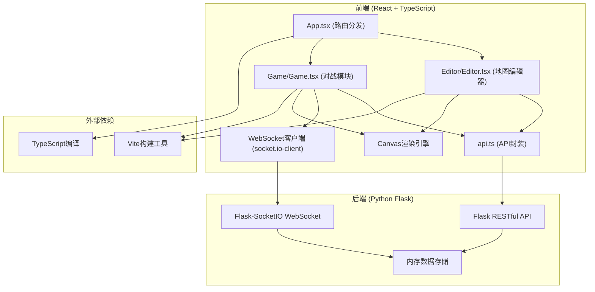
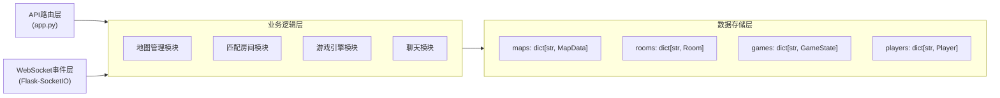
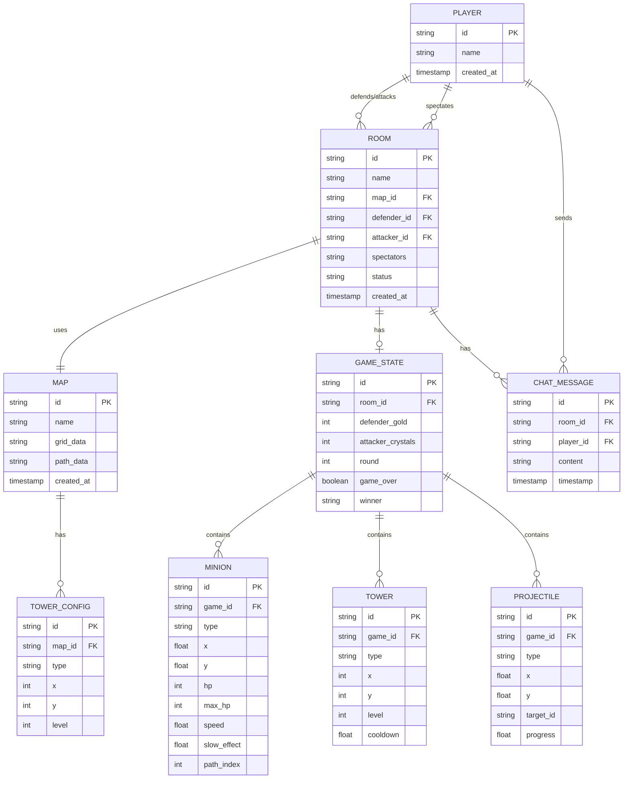

## 1. 架构设计



## 2. 技术描述

- **前端框架**：React 18 + TypeScript
- **构建工具**：Vite 5
- **HTTP客户端**：Axios
- **实时通信**：Socket.IO Client
- **后端框架**：Flask + Flask-CORS + Flask-SocketIO
- **数据存储**：内存字典存储（演示用途，可扩展为SQLite/Redis）
- **渲染技术**：HTML5 Canvas 2D
- **状态管理**：React useState + useReducer（本地状态）

## 3. 路由定义

| 路由 | 页面/组件 | 用途 |
|------|----------|------|
| `/` | Home | 首页导航，选择进入编辑器、对战或观战 |
| `/editor` | Editor | 地图编辑器，20x20网格编辑，防御塔配置 |
| `/editor/:mapId` | Editor | 加载指定ID的地图进行编辑 |
| `/lobby` | Lobby | 对战大厅，创建/加入房间，匹配等待 |
| `/game/:roomId` | Game | 游戏对战界面，实时攻防 |
| `/spectate/:roomId` | Game | 观战模式，45度俯视视角 |

## 4. API 定义

### 4.1 TypeScript 类型定义

```typescript
// 单元格类型
type CellType = 'path' | 'empty' | 'obstacle' | 'tower_base';

// 防御塔类型
type TowerType = 'cannon' | 'laser' | 'ice';

// 小兵类型
type MinionType = 'normal' | 'fast' | 'heavy';

// 玩家阵营
type PlayerSide = 'defender' | 'attacker' | 'spectator';

// 地图数据
interface MapData {
  id: string;
  name: string;
  grid: CellType[][];  // 20x20
  towers: TowerConfig[];
  path: { x: number; y: number }[];
  createdAt: number;
}

// 防御塔配置
interface TowerConfig {
  id: string;
  type: TowerType;
  x: number;
  y: number;
  level: number;
}

// 防御塔属性
interface TowerStats {
  range: number;
  damage: number;
  fireRate: number;
  cost: number;
  upgradeCost: number;
}

// 小兵数据
interface MinionData {
  id: string;
  type: MinionType;
  x: number;
  y: number;
  hp: number;
  maxHp: number;
  speed: number;
  slowEffect: number;  // 0-1，减速百分比
  pathIndex: number;
}

// 游戏状态
interface GameState {
  roomId: string;
  defenderId: string;
  attackerId: string;
  defenderGold: number;
  attackerCrystals: number;
  minions: MinionData[];
  towers: TowerConfig[];
  projectiles: ProjectileData[];
  round: number;
  gameOver: boolean;
  winner: PlayerSide | null;
}

// 弹道数据
interface ProjectileData {
  id: string;
  type: TowerType;
  x: number;
  y: number;
  targetId: string;
  progress: number;
  startX: number;
  startY: number;
  endX: number;
  endY: number;
}

// 房间数据
interface Room {
  id: string;
  name: string;
  mapId: string;
  defenderId: string | null;
  attackerId: string | null;
  spectators: string[];
  status: 'waiting' | 'playing' | 'finished';
}

// 聊天消息
interface ChatMessage {
  id: string;
  sender: string;
  content: string;
  timestamp: number;
  roomId: string;
}
```

### 4.2 RESTful API 端点

| 方法 | 端点 | 请求体 | 响应 | 描述 |
|------|------|--------|------|------|
| POST | `/map` | `{ name: string, grid: CellType[][], towers: TowerConfig[], path: {x,y}[] }` | `{ id: string }` | 保存地图 |
| GET | `/map/:id` | - | `MapData` | 加载指定地图 |
| GET | `/maps` | - | `MapData[]` | 获取所有地图列表 |
| POST | `/match` | `{ playerId: string, mapId: string, side: 'defender' \| 'attacker' \| 'any' }` | `{ roomId: string }` | 创建或加入匹配房间 |
| GET | `/rooms` | - | `Room[]` | 获取所有房间列表 |
| POST | `/room/:id/join` | `{ playerId: string, side: PlayerSide }` | `{ success: boolean }` | 加入房间 |
| POST | `/room/:id/leave` | `{ playerId: string }` | `{ success: boolean }` | 离开房间 |

### 4.3 WebSocket 事件

| 事件名 | 方向 | 数据 | 描述 |
|--------|------|------|------|
| `join_room` | 客户端→服务端 | `{ roomId: string, playerId: string, side: PlayerSide }` | 加入游戏房间 |
| `leave_room` | 客户端→服务端 | `{ roomId: string, playerId: string }` | 离开游戏房间 |
| `room_update` | 服务端→客户端 | `Room` | 房间状态更新 |
| `game_start` | 服务端→客户端 | `GameState` | 游戏开始 |
| `game_state` | 服务端→客户端 | `GameState` | 游戏状态同步（每100ms） |
| `place_tower` | 客户端→服务端 | `{ roomId: string, tower: TowerConfig }` | 防守方放置防御塔 |
| `upgrade_tower` | 客户端→服务端 | `{ roomId: string, towerId: string }` | 防守方升级防御塔 |
| `spawn_minion` | 客户端→服务端 | `{ roomId: string, minionType: MinionType }` | 进攻方召唤小兵 |
| `chat_message` | 客户端→服务端 | `ChatMessage` | 发送聊天消息 |
| `chat_broadcast` | 服务端→客户端 | `ChatMessage` | 广播聊天消息 |

## 5. 服务器架构



## 6. 数据模型

### 6.1 ER 图



### 6.2 内存数据结构（Python）

```python
# 地图存储
maps = {
    "map_id_1": {
        "id": "map_id_1",
        "name": "Test Map",
        "grid": [["empty", "path", ...], ...],  # 20x20
        "towers": [...],
        "path": [{"x": 0, "y": 0}, ...],
        "createdAt": 1234567890
    }
}

# 房间存储
rooms = {
    "room_id_1": {
        "id": "room_id_1",
        "name": "Room 1",
        "mapId": "map_id_1",
        "defenderId": "player_1",
        "attackerId": "player_2",
        "spectators": ["player_3"],
        "status": "playing",
        "createdAt": 1234567890
    }
}

# 游戏状态存储
games = {
    "room_id_1": {
        "roomId": "room_id_1",
        "defenderId": "player_1",
        "attackerId": "player_2",
        "defenderGold": 200,
        "attackerCrystals": 200,
        "minions": [...],
        "towers": [...],
        "projectiles": [...],
        "round": 1,
        "gameOver": False,
        "winner": None
    }
}

# 玩家存储
players = {
    "player_1": {
        "id": "player_1",
        "name": "Player 1",
        "currentRoom": "room_id_1",
        "side": "defender"
    }
}
```

## 7. 性能优化策略

### 7.1 前端优化
- **Canvas渲染**：使用requestAnimationFrame循环，脏矩形重绘
- **对象池**：复用小兵、弹道对象，避免频繁GC
- **状态节流**：游戏状态更新节流到100ms一次
- **虚拟渲染**：超出画布视口的对象跳过渲染
- **WebWorker**：复杂路径计算移至Worker线程

### 7.2 后端优化
- **内存存储**：使用Python字典，避免IO延迟
- **状态增量更新**：仅同步变化的字段，减少数据传输
- **事件批处理**：100ms窗口内的事件合并发送
- **连接池**：Socket.IO连接复用
