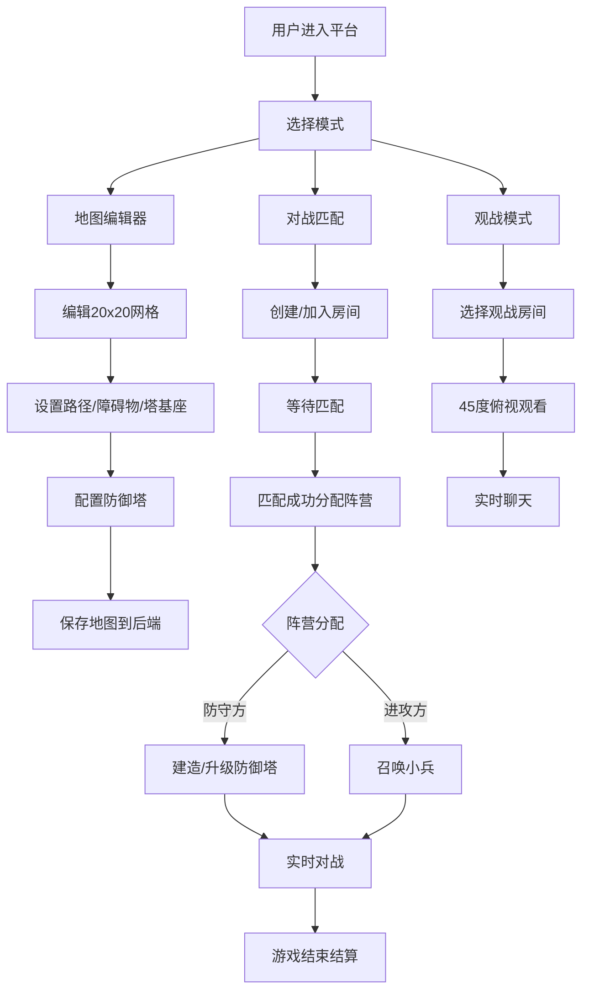

## 1. 产品概述

在线多人合作塔防游戏编辑器与对战平台，用户可自定义地图、放置防御塔，并与其他玩家进行实时攻防对战。平台提供完整的地图编辑工具、实时对战系统和观战功能，为塔防游戏爱好者提供创作与竞技的一体化体验。

- **核心价值**：将地图创作权交给用户，结合实时PVP对战，打造高自由度的塔防竞技生态
- **目标用户**：塔防游戏爱好者、游戏创作者、休闲竞技玩家

## 2. 核心功能

### 2.1 用户角色

| 角色 | 注册方式 | 核心权限 |
|------|----------|----------|
| 玩家 | 自动分配匿名ID | 创建/编辑地图、匹配对战、观战 |
| 防守方 | 匹配分配 | 放置/升级防御塔、使用金币资源 |
| 进攻方 | 匹配分配 | 召唤小兵、使用水晶资源 |
| 观战者 | 主动选择 | 观看对战、发送聊天消息 |

### 2.2 功能模块

1. **地图编辑器**：20x20网格编辑、单元格类型切换、防御塔配置、地图保存加载
2. **游戏对战**：实时攻防对战、防御塔攻击动画、小兵移动AI、资源系统
3. **匹配系统**：房间创建、玩家匹配、自动分配阵营
4. **观战系统**：45度俯视视角、实时观看、聊天面板
5. **实时同步**：WebSocket状态同步、低延迟消息传输

### 2.3 页面详情

| 页面名称 | 模块名称 | 功能描述 |
|----------|----------|----------|
| 首页 | 导航模块 | 快速入口：编辑器、对战、观战 |
| 地图编辑器 | 网格编辑模块 | 20x20网格绘制、单元格类型切换（路径/空地/障碍物/塔基座）、缩放平移、悬停高亮 |
| 地图编辑器 | 防御塔面板 | 三种防御塔配置（加农炮/激光塔/冰冻塔）、塔放置动画、升级面板 |
| 对战大厅 | 房间列表 | 创建/加入房间、匹配状态显示 |
| 对战界面 | 游戏画布 | 双方阵营渲染、防御塔攻击动画、小兵移动、血条显示 |
| 对战界面 | 资源面板 | 金币/水晶显示、数字变化动画 |
| 对战界面 | 操作面板 | 防守方建塔/升级、进攻方召唤小兵 |
| 观战界面 | 观战画布 | 45度俯视视角、无操作权限 |
| 通用 | 聊天面板 | 右侧悬浮、毛玻璃背景、实时消息 |

## 3. 核心流程

## 4. 用户界面设计

### 4.1 设计风格
- **主色调**：深蓝灰色 #1e2a3a
- **强调色**：亮青色 #00d4ff，渐变边框 #00d4ff → #0066ff
- **网格颜色**：路径 #3a3a3a，空地 #f0ead6，障碍物 #2d4a2d，塔基座 #c7956b
- **特效颜色**：激光 #ff3333，冰冻 #66ccff
- **按钮风格**：渐变边框、悬停上浮（translateY(-2px)）、发光阴影、点击涟漪
- **布局风格**：左中右三栏、毛玻璃半透明面板、模糊背景
- **字体**：搭配现代科技感字体，主体使用清晰易读的无衬线字体

### 4.2 页面设计概览

| 页面名称 | 模块名称 | UI元素 |
|----------|----------|--------|
| 地图编辑器 | 左栏工具面板 | 单元格类型选择器、防御塔列表、毛玻璃背景（blur 10px）、边框 rgba(0,212,255,0.3) |
| 地图编辑器 | 中间画布 | 20x20网格、缩放0.5x-2x、拖拽平移、网格线宽自适应、悬停半透明高亮 |
| 地图编辑器 | 右栏信息面板 | 地图信息、保存按钮、操作日志 |
| 对战界面 | 顶部资源面板 | 金币/水晶数字、变化时放大缩小动画（0.15s） |
| 对战界面 | 左栏操作面板 | 防守方：防御塔列表/升级；进攻方：小兵召唤列表 |
| 对战界面 | 中间游戏区 | Canvas渲染、防御塔攻击动画、小兵16x16像素精灵、头顶血条 |
| 对战界面 | 右栏聊天面板 | 白色透明背景、blur 8px、实时消息 |
| 观战界面 | 中间画布 | 45度俯视固定视角、无控制UI |

### 4.3 动画效果
- **塔放置**：0.3秒上升缓动动画
- **资源变化**：0.15秒放大缩小动画
- **按钮悬停**：translateY(-2px)、box-shadow: 0 0 10px #00d4ff
- **按钮点击**：0.2秒涟漪动画
- **防御塔攻击**：塔身闪烁、子弹/光束射出
- **加农炮**：抛物线轨迹，0.4秒飞行时间
- **激光塔**：持续光束效果
- **冰冻塔**：冰晶粒子效果
- **小兵**：行走/攻击帧动画，≥30FPS

### 4.4 响应式
- **设计原则**：桌面端优先，自适应屏幕尺寸
- **画布区域**：根据窗口大小自动调整，保持网格比例
- **面板**：最小宽度限制，过小屏幕可折叠
- **触控优化**：支持移动端触控编辑和观看

## 5. 性能要求
- **编辑器响应**：单元格点击响应 < 50ms
- **游戏帧率**：30小兵+15防御塔时 ≥ 30FPS
- **UI延迟**：界面更新 < 100ms
- **网络延迟**：WebSocket消息 < 200ms
