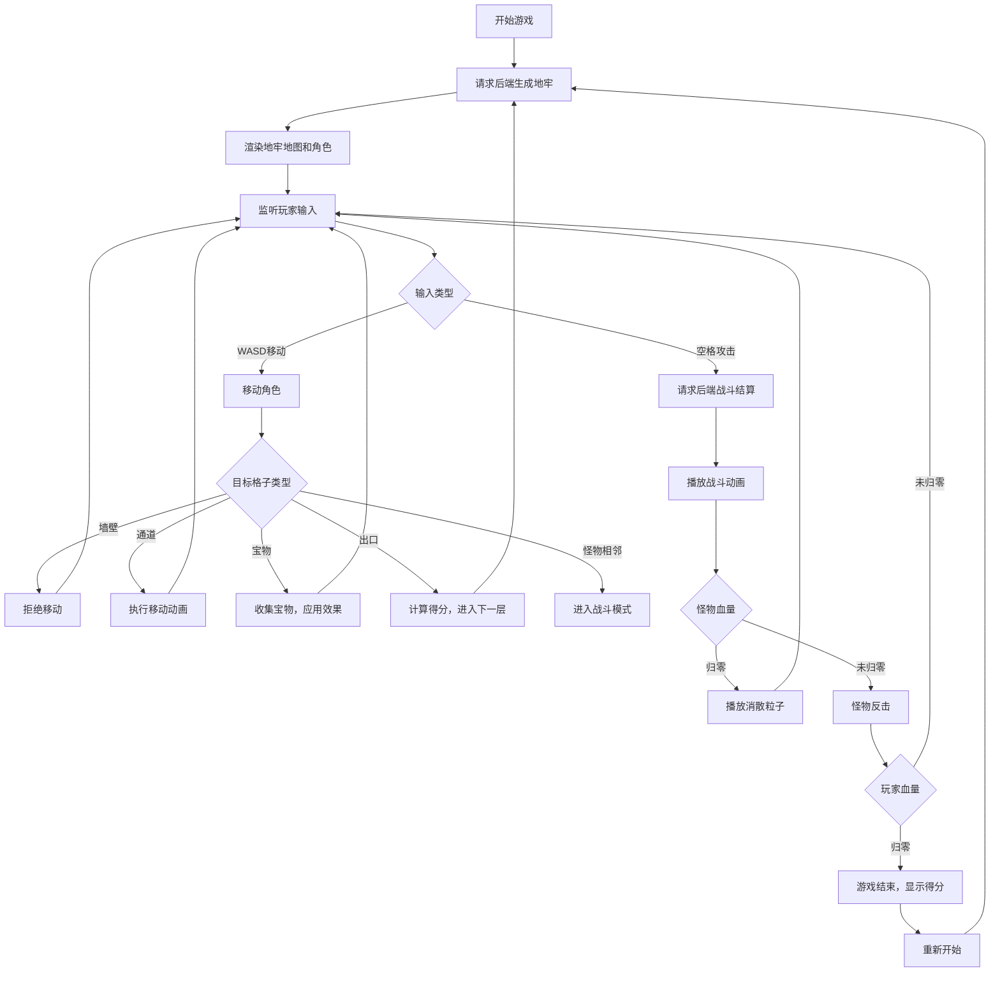

## 1. 产品概述

程序化地牢探险游戏模拟器是一款为独立游戏开发者设计的工具，用于快速生成多样化的地牢探险游戏体验。玩家控制像素风角色在随机生成的迷宫中探索、战斗和收集宝物，每次游戏都有独特的关卡布局。

- **核心价值**：提供可复用的程序化关卡生成和战斗系统框架，帮助开发者快速迭代游戏内容
- **目标用户**：独立游戏开发者、像素游戏爱好者
- **市场定位**：轻量级地牢探险游戏原型，可作为完整游戏的基础框架

## 2. 核心功能

### 2.1 用户角色

| 角色 | 注册方式 | 核心权限 |
|------|----------|----------|
| 玩家 | 无需注册，直接游玩 | 控制角色移动、攻击、收集宝物、挑战地牢楼层 |

### 2.2 功能模块

1. **地牢生成模块**：程序化生成10x10网格迷宫，确保连通性
2. **角色控制模块**：WASD键盘控制，平滑移动动画
3. **战斗系统模块**：前后端协作的战斗结算，攻击动画和粒子效果
4. **宝物收集模块**：随机宝物生成，收集动画和效果
5. **状态UI模块**：实时显示血量、攻击力、楼层、宝物数量
6. **回合计时与得分模块**：游戏计时、警告提示、得分结算

### 2.3 页面详情

| 页面名称 | 模块名称 | 功能描述 |
|---------|----------|----------|
| 游戏主界面 | 地牢渲染 | Canvas绘制10x10网格地牢，包含墙壁、通道、入口、出口 |
| 游戏主界面 | 角色渲染 | 16x16像素英雄角色，蓝色调，攻击闪烁效果 |
| 游戏主界面 | 怪物渲染 | 怪物显示，血量条，战斗动画 |
| 游戏主界面 | 宝物渲染 | 金色宝箱图标，收集动画 |
| 游戏主界面 | UI面板 | 血量、攻击力、楼层、计时、宝物数量显示 |
| 游戏主界面 | 虚拟按键 | 触屏设备方向键和攻击按钮 |
| 结算界面 | 得分面板 | 显示得分详情，重新开始按钮 |
| 结算界面 | 游戏结束 | 渐入动画，最终得分展示 |

## 3. 核心流程

## 4. 用户界面设计

### 4.1 设计风格

- **主色调**：暗色地牢主题，背景色 `#1a1a2e`
- **墙壁**：深灰色 `#3a3a3a`，砖块纹理感
- **通道**：浅灰色 `#aaaaaa`
- **入口**：绿色高亮
- **出口**：金色闪烁动画（周期0.5秒）
- **UI强调色**：霓虹蓝色 `#00d4ff`
- **像素风格**：16x16像素角色，2x2像素块模拟砖块纹理

### 4.2 页面设计概述

| 页面名称 | 模块名称 | UI元素 |
|---------|----------|--------|
| 游戏主界面 | 地牢画布 | 1:1比例Canvas，最大600px，响应式适配 |
| 游戏主界面 | 左上角计时 | MM:SS格式，白色字体，超时红色边框警告 |
| 游戏主界面 | 右上角状态 | 红色心形血量（<30%心跳闪烁），剑形攻击力 |
| 游戏主界面 | 左下角信息 | 楼层数，已收集宝物数量 |
| 游戏主界面 | 虚拟按键 | 半透明圆形方向键，攻击按钮 |
| 游戏主界面 | 控制按钮 | "新地牢"按钮，霓虹蓝色，悬停缩放1.05倍 |
| 结算界面 | 得分面板 | 渐入动画（0.5秒），详细得分信息，重新开始按钮 |

### 4.3 动画效果

- **角色移动**：0.15秒平滑过渡动画
- **角色攻击**：闪烁白色0.1秒
- **出口闪烁**：金色呼吸效果，周期0.5秒
- **低血量警告**：心跳闪烁动画
- **宝物收集**：缩放弹跳0.3秒
- **怪物死亡**：5个粒子扩散0.5秒
- **按钮悬停**：缩放1.05倍，0.2秒过渡
- **游戏结束**：0.5秒从暗到亮渐入
- **超时警告**：屏幕边缘闪烁红色边框1秒

### 4.4 响应式设计

- **桌面优先**：最大600px方形画布
- **移动适配**：保持1:1比例，根据屏幕宽度调整
- **触屏支持**：虚拟方向键（半透明圆形按钮）和攻击按钮
- **鼠标支持**：点击格子移动，点击怪物攻击

## 5. 性能约束

- **游戏帧率**：稳定30FPS
- **单帧绘制**：≤20ms
- **API响应**：单次请求≤500ms
- **地牢生成**：10x10网格≤100ms
