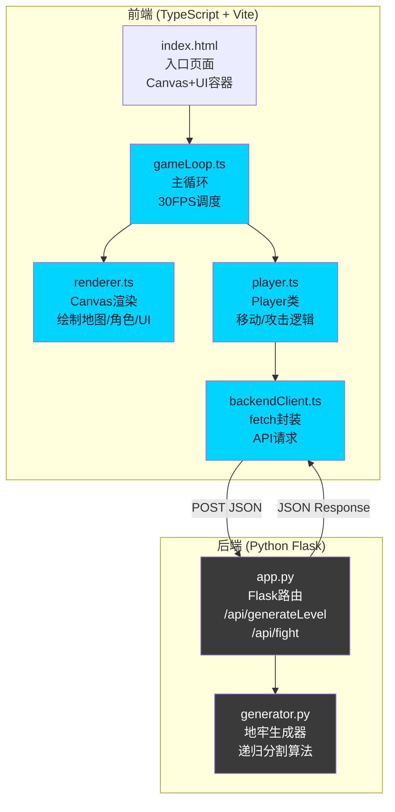
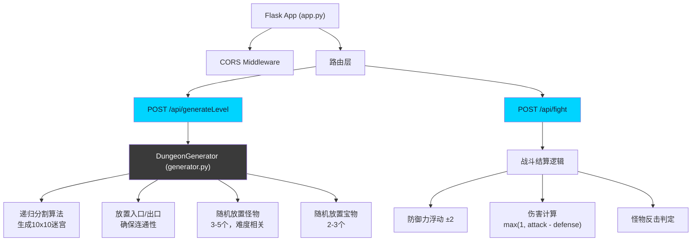

## 1. 架构设计



**数据流向说明：**
1. `gameLoop.ts` 作为主控，每帧调用 `renderer.ts` 绘制，监听输入更新 `player.ts` 状态
2. `player.ts` 发起攻击时调用 `backendClient.ts` 发送战斗请求
3. `backendClient.ts` 通过 fetch 与 `app.py` 通信，发送/接收 JSON 数据
4. `app.py` 调用 `generator.py` 生成地牢数据，或处理战斗结算逻辑
5. 响应数据回流到 `player.ts` 更新状态，`gameLoop.ts` 触发 `renderer.ts` 重绘

## 2. 技术描述

### 前端技术栈
- **语言**：TypeScript (严格模式)
- **构建工具**：Vite 5.x
- **目标环境**：ES2020
- **渲染**：Canvas 2D API
- **模块解析**：Bundler模式

### 后端技术栈
- **语言**：Python 3.9+
- **Web框架**：Flask 3.x
- **跨域支持**：flask-cors
- **算法**：递归分割算法生成迷宫

### 项目结构
```
auto66/
├── package.json              # 前端依赖和脚本
├── vite.config.js            # Vite构建配置
├── tsconfig.json             # TypeScript配置
├── index.html                # 入口HTML
├── src/
│   ├── gameLoop.ts           # 游戏主循环
│   ├── renderer.ts           # Canvas渲染器
│   ├── player.ts             # 玩家类
│   └── backendClient.ts      # 后端API客户端
└── server/
    ├── app.py                # Flask应用入口
    └── generator.py          # 地牢生成器
```

**调用关系：**
- `gameLoop.ts` → `renderer.ts` (调用 render 方法)
- `gameLoop.ts` → `player.ts` (调用 move/attack 方法)
- `player.ts` → `backendClient.ts` (调用 generateLevel/fight)
- `backendClient.ts` → `app.py` (HTTP请求)
- `app.py` → `generator.py` (调用 DungeonGenerator)

## 3. 核心数据类型定义

```typescript
// 地牢格子类型
type CellType = 'wall' | 'floor' | 'entrance' | 'exit';

// 位置坐标
interface Position {
  x: number;
  y: number;
}

// 怪物定义
interface Monster {
  id: string;
  position: Position;
  hp: number;
  maxHp: number;
  attack: number;
  defense: number;
  name: string;
}

// 宝物定义
interface Treasure {
  id: string;
  position: Position;
  type: 'heal' | 'attack';
  value: number;
  collected: boolean;
}

// 地牢数据
interface DungeonData {
  grid: CellType[][];           // 10x10 网格
  entrance: Position;
  exit: Position;
  monsters: Monster[];
  treasures: Treasure[];
  seed: number;
  difficulty: number;
}

// 玩家状态
interface PlayerState {
  position: Position;
  hp: number;
  maxHp: number;
  attack: number;
  baseAttack: number;
  floor: number;
  treasuresCollected: number;
  score: number;
}

// 游戏状态
interface GameState {
  dungeon: DungeonData;
  player: PlayerState;
  monsters: Monster[];
  treasures: Treasure[];
  elapsedTime: number;          // 秒
  isInCombat: boolean;
  targetMonster: Monster | null;
  gameOver: boolean;
  victory: boolean;
  // 动画状态
  animations: {
    playerMoving: boolean;
    playerAttacking: boolean;
    exitBlinkPhase: number;     // 0-1 出口闪烁相位
    lowHealthBlink: boolean;
    warningBorder: boolean;
    particles: Particle[];
  };
}

// 粒子效果
interface Particle {
  id: string;
  x: number;
  y: number;
  vx: number;
  vy: number;
  life: number;
  maxLife: number;
  color: string;
  size: number;
}

// 战斗请求
interface FightRequest {
  playerAttack: number;
  monsterDefense: number;
  monsterHp: number;
}

// 战斗响应
interface FightResponse {
  damage: number;
  monsterHp: number;
  monsterDefeated: boolean;
  counterDamage: number;
  playerHp: number;
  playerDefeated: boolean;
}

// 生成地牢请求
interface GenerateLevelRequest {
  seed?: number;
  difficulty: number;
  floor: number;
}
```

## 4. API 定义

### 4.1 POST /api/generateLevel

生成地牢关卡数据。

**请求体：**
```typescript
interface GenerateLevelRequest {
  seed?: number;           // 随机种子，可选
  difficulty: number;      // 难度系数 1-5
  floor: number;           // 当前楼层
}
```

**响应体：**
```typescript
interface DungeonData {
  grid: CellType[][];      // 10x10 二维数组
  entrance: Position;      // 入口坐标
  exit: Position;          // 出口坐标
  monsters: Monster[];     // 怪物列表 3-5个
  treasures: Treasure[];   // 宝物列表 2-3个
  seed: number;            // 使用的种子
  difficulty: number;      // 难度系数
}
```

### 4.2 POST /api/fight

战斗结算。

**请求体：**
```typescript
interface FightRequest {
  playerAttack: number;    // 玩家攻击力
  monsterDefense: number;  // 怪物防御力
  monsterHp: number;       // 怪物当前血量
  playerHp: number;        // 玩家当前血量
  monsterAttack: number;   // 怪物攻击力
}
```

**响应体：**
```typescript
interface FightResponse {
  damage: number;          // 玩家造成的伤害
  monsterHp: number;       // 怪物剩余血量
  monsterDefeated: boolean;// 怪物是否被击败
  counterDamage: number;   // 怪物反击伤害
  playerHp: number;        // 玩家剩余血量
  playerDefeated: boolean; // 玩家是否被击败
  defenseVariation: number;// 防御力浮动值 ±2
}
```

**错误响应：**
```typescript
interface ApiError {
  error: string;
  message: string;
}
```

## 5. 后端服务架构



## 6. 性能优化策略

### 前端优化
1. **帧率控制**：`gameLoop.ts` 使用 `requestAnimationFrame` + 时间戳计算，稳定30FPS
2. **渲染优化**：`renderer.ts` 分层绘制，仅重绘变化区域
3. **动画状态机**：所有动画使用状态管理，避免每帧重复计算
4. **对象池**：粒子效果复用对象，减少GC开销

### 后端优化
1. **迷宫生成缓存**：相同种子返回缓存结果
2. **算法优化**：递归分割算法时间复杂度 O(n²)，10x10网格 < 100ms
3. **响应压缩**：Flask启用gzip压缩
4. **CORS预检缓存**：设置合理的 `Access-Control-Max-Age`

## 7. 配置文件说明

### package.json
- **依赖**：typescript, vite, @types/node
- **启动脚本**：`npm run dev` 启动开发服务器
- **构建脚本**：`npm run build` 生产构建

### vite.config.js
- **打包目标**：ES2020
- **开发服务器端口**：5173
- **代理配置**：`/api` → `http://localhost:5000`

### tsconfig.json
- **严格模式**：启用
- **target**：ES2020
- **moduleResolution**：bundler
- **类型声明**：包含 node 类型
